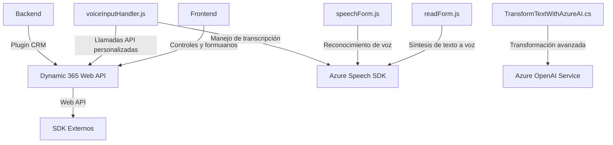

### Análisis técnico del repositorio

#### 1. Tipo de solución
La solución se trata de una *implementación híbrida centrada en la integración con servicios externos*. Específicamente, destaca el uso de:
- **Frontend:** Configurado para interactuar de manera directa con formularios en un CRM (probablemente **Dynamics 365**). Incluye funciones para sintetizar texto a voz y reconocimiento de voz, utilizando el SDK de Azure Speech.
- **Backend:** Representado por un **plugin CRM** creado en C# que se conecta con Azure OpenAI para transformar texto y devolver contenido procesado al entorno CRM.
- **API personalizada**: En el caso del archivo `speechForm.js`, incluye llamadas a APIs alojadas en Dynamics 365, coordinando la interacción entre usuarios, texto transcrito y campos del sistema.

#### 2. Tecnologías, frameworks y patrones usados
##### Tecnologías:
- **Frontend JavaScript**:
  - **Azure Speech SDK (versión web)** para reconocimiento y síntesis de voz.
  - **Dynamics 365 Web API (Xrm.WebApi)** para acceder al contexto del formulario CRM.
- **Backend C#**:
  - `Microsoft.Xrm.Sdk` para la integración del plugin CRM.
  - `Newtonsoft.Json` y `System.Text.Json` para manejo de datos en formato JSON.
  - **Azure OpenAI (GPT-4)** para operaciones avanzadas de transformación de texto.
  - **HTTP client integrado en .NET** para solicitudes API.

##### Patrones:
- **Integración de servicios externos:** Implementado tanto en frontend (Azure Speech SDK) como en backend (Azure OpenAI Service).
- **Modularidad:** El código en JavaScript está dividido en funciones separadas según las responsabilidades específicas (síntesis de voz, reconocimiento de voz, mapeo de campos, etc.).
- **Plugin CRM:** Extiende eventos del sistema CRM mediante un patrón basado en `IPlugin`.
- **Callback handling:** Utilizado para verificar la disponibilidad del SDK antes de ejecutar las funciones principales.
- **Event-driven architecture:** Los archivos de frontend están altamente influenciados por eventos contextuales del formulario (`executionContext/formContext`).

#### 3. Arquitectura
La solución utiliza una **arquitectura híbrida basada en servicios distribuidos**, con componentes desacoplados y dependencias externas. Los elementos clave incluyen:
- **Frontend:** Modular y diseñado para interactuar dinámicamente con el contexto del formulario mediante eventos (arquitectura orientada al cliente).
- **Backend:** Plugin CRM que actúa como un microservicio sincronizado con Azure OpenAI, mostrando características ligeras de microservicios.
- **Integración con APIs:** Tanto en frontend como en backend, la arquitectura habilita la conexión con servicios externos de Microsoft Azure para aprovechar capacidades como Speech SDK y OpenAI GPT.

En términos de patrones de diseño:
- El frontend sigue un enfoque tipo **n-capas** donde diferentes funciones se ocupan de tareas específicas como captura de datos, procesamiento y visualización (voz/texto).
- El backend implementa un **plugin basado en eventos** para ampliar los límites del sistema CRM con servicios avanzados de transformación.

#### 4. Dependencias y componentes externos
Las dependencias principales son:
- **SDKs y servicios Azure:**
  - **Azure Speech SDK** (Frontend): Para síntesis y reconocimiento de voz.
  - **Azure OpenAI Service** (Backend): Para operaciones avanzadas de texto.
- **Dynamics 365 Web API:** Para interactuar con los formularios y campos en el CRM.
- **Librerías adicionales:** `Newtonsoft.Json`, `System.Text.Json` para manipular respuestas en formato JSON.
- **Servicio de Lookup en Dynamics 365:** Utilizado para búsqueda y mapeo de campos relacionados con otros registros.
- **HTTP Client:** Configuración en plugins para comunicación con Azure OpenAI.

#### 5. Diagrama **Mermaid** compatible con GitHub

---

### Conclusión final
Esta solución plantea una **arquitectura modular y distribuida** que combina un frontend altamente configurable con un backend potente basado en plugins de Dynamics 365. Aprovecha servicios de Azure como Speech SDK y OpenAI para agregar funcionalidades avanzadas (voz, reconocimiento y transformación de texto). La integración efectiva entre distintos componentes muestra un enfoque orientado a servicios externalizados y accesibilidad. Es una solución ideal para contextos empresariales que requieren trabajar con sistemas CRM avanzados y capacidades de inteligencia artificial para procesamiento de datos.