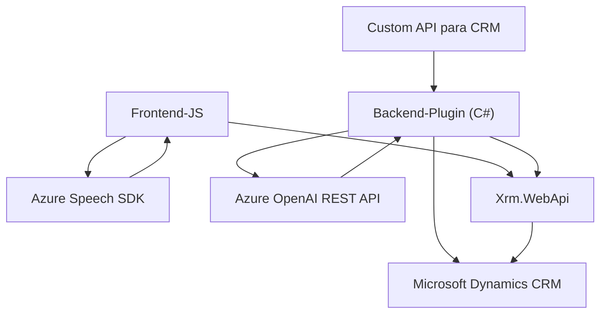

### Breve resumen técnico:
El repositorio parece centrarse en extender las capacidades de Microsoft Dynamics CRM utilizando tecnologías relacionadas con Azure, específicamente **Azure Speech SDK** y **Azure OpenAI**, para agregar funcionalidades de reconocimiento, síntesis de voz y procesamiento de texto. Incluye archivos para un frontend en JavaScript y plugins en C# que integran las capacidades descritas.

---

### Descripción de arquitectura:
La arquitectura empleada es una mezcla de **n capas** y **plugin modular**:
1. **Frontend:** Utilizando componentes JavaScript que actúan como la capa interactiva del usuario. Se basa en modularidad y patrones como Facade y MVC implícito.
2. **Backend:** Usando plugins C# capaces de trabajar como extensiones de Dynamics CRM con carga dinámica de SDK y comunicación con servicios REST externos como Azure OpenAI.
3. **Azure Speech SDK:** Facilita una arquitectura de integración, donde las funcionalidades se cargan dinámicamente en el navegador para sintetizar y reconocer voz.
4. **Microservicios Azure OpenAI:** La parte encargada de transformar texto está claramente separada como un servicio REST al que los plugins se comunican.

---

### Tecnologías usadas:
- **JavaScript (Browser-based):** Para la capa interactiva del frontend.
- **C# (.NET plugins):** Extensiones del modelo SDK de Dynamics CRM.
- **Azure Speech SDK:** Para síntesis y reconocimiento de voz.
- **Azure OpenAI:** Para procesar texto.
- **REST API:** Interacción entre los plugins y servicios externos.
- **Newtonsoft.Json**: Librería para manipulación avanzada de datos JSON en C#.
- **System.Text.Json:** Alternativa para trabajar con JSON nativamente en .NET.
- **Microsoft Dynamics CRM SDK:** Dependencias internas para extender el sistema.

---

### Dependencias externas presentes:
1. **Azure Speech SDK:** Cargado dinámicamente en el frontend para voz.
2. **Azure OpenAI REST API:** Utilizada por los plugins para transformar texto.
3. **Newtonsoft.Json y System.Text.Json:** Librerías estándar para manipulación de JSON.
4. **Xrm.WebApi:** API interna de Dynamics CRM para interactuar con entidades y recuperar datos.
5. **CSSpeech SDK:** Conexión de reconocimiento y síntesis de voz.
6. **HTTP Client Libraries:** Comunicación entre el plugin y APIs externas.

---

### Diagrama Mermaid:

---

### Conclusión final:
El repositorio presenta una solución híbrida para Microsoft Dynamics CRM integrada con IA avanzada y capacidades de voz. La arquitectura combina funcionalidades de frontend y backend en una estructura **n capas** y modular, adecuada para escenarios corporativos que buscan extender funcionalidades a medida utilizando servicios en la nube.

Se destaca el uso de tecnologías modernas como **Azure Speech SDK** y **Azure OpenAI**, patrones bien estructurados como **Facade** y **MVC implícito**, y un enfoque en la carga dinámica para optimizar el rendimiento.