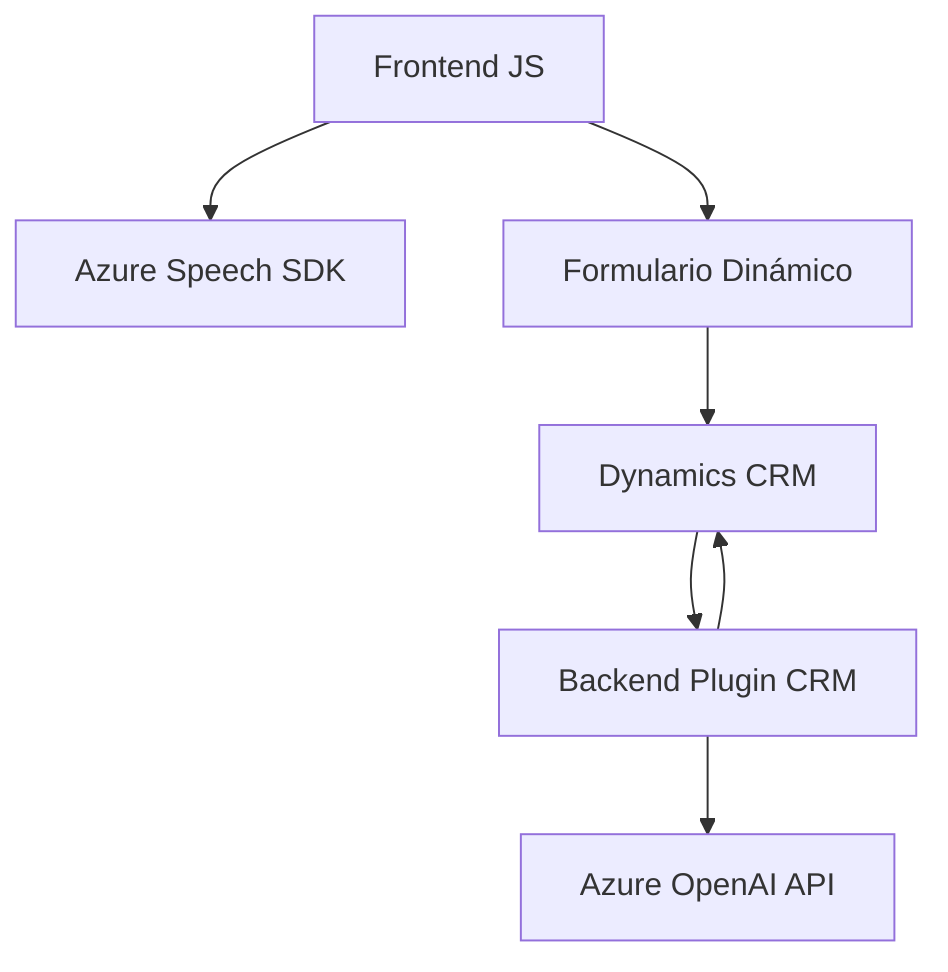

### Breve resumen técnico
El repositorio presenta tres componentes principales: 
- **Frontend**: Integración de funcionalidades de voz utilizando el **Azure Speech SDK** para mejorar la accesibilidad de formularios dinámicos, enfocándose en entrada y salida de datos en voz.
- **Backend (Plugins)**: Plugin para Microsoft Dynamics CRM que emplea **Azure OpenAI** para transformar texto en JSON estructurado según especificaciones.
- Los componentes están fuertemente basados en integración con tecnologías **Azure AI**, con procesamiento local y en la nube.

---

### Descripción de arquitectura
La arquitectura es un modelo **mono-multi capa** con integración de servicios:
1. **Frontend (Navegador)**: Implementa una capa interactiva que gestiona entrada por voz y síntesis de voz, enlazada por funciones que procesan datos desde el cliente por medio de formularios.
2. **Backend**: Una lógica de negocio que sirve como plugin en Dynamics CRM, actuando sobre datos de entrada desde los formularios CRM y delegando algunos de sus procesos más complejos (p. ej., transformación de texto) hacia **Azure OpenAI API**.

Patrones utilizados:
- Modularidad, separación de responsabilidades y DRY para promover mantenibilidad/legibilidad.
- **Integración de servicios externos**: Azure Speech SDK y Azure OpenAI API son usados para computación en la nube, delegando capacidades avanzadas fuera de la solución local.
- **MVC adaptado**: En el frontend se contiene data-binding (entre modelo y formulario) mientras que el backend procesa la lógica relacionada con transformación textual.

---

### Tecnologías usadas
1. **Lenguajes**:
   - **JavaScript**: Para la lógica del frontend.
   - **C#.NET**: Para implementar el plugin en Dynamics CRM.
2. **Frameworks/SDKs**:
   - **Azure Speech SDK**: Procesamiento de audio (entrada y síntesis de voz).
   - **Azure OpenAI API**: Uso de IA para transformaciones avanzadas.
3. **Plataforma**:
   - **Dynamics CRM**: Framework empresarial para gestor de clientes y formularios.

---

### Dependencias o componentes externos presentes
1. **Azure Speech SDK**: Usado en frontend para entrada/salida de voz.
2. **Azure OpenAI API (GPT)**: Plugin de CRM que transforma los datos textuales en JSON válido mediante IA.
3. **Microsoft.Xrm.Sdk**: Biblioteca esencial para desarrollo de plugins en Dynamics CRM.
4. **System.Text.Json** y **Newtonsoft.Json.Linq**: Manejo de estructuras JSON en el backend.

---

### Diagrama Mermaid

---

### Conclusión final
La solución se compone de integración **voice-to-data** en la capa frontend y manipulación avanzada del texto mediante AI en un **backend CRM**. La arquitectura se presenta como *cliente-servidor* dentro de una solución Microsoft Dynamics CRM extendida, pero se apoya en un modelo mixto donde servicios como Azure Speech SDK y OpenAI amplían las capacidades con IA en la nube.

Ventajas:
- Modificar y extender funcionalidades en frontend (interactividad) y backend (transformación avanzada de datos).
- Modularidad y separación de responsabilidades para mantenimiento.

Consideraciones:
- Los valores de configuración deben ser manejados mediante un gestor de secretos en lugar de un hardcoded en el plugin para mayor seguridad.
- Puede beneficiarse de una arquitectura Hexagonal para desacoplar dependencias con APIs externas (interfaz designada).