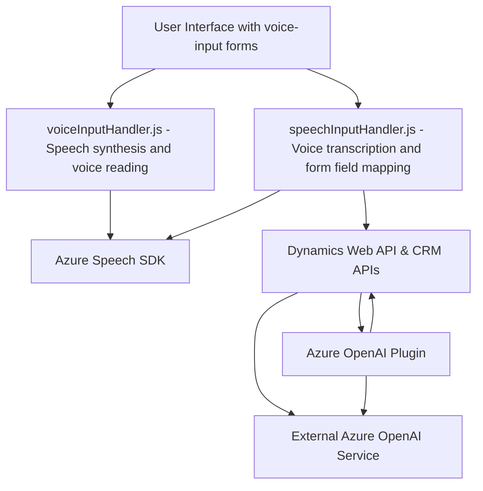

### Breve resumen técnico
Los archivos del repositorio reflejan una solución altamente orientada a la interacción entre interfaces de usuario (usando JavaScript para procesos en frontend) y servicios externos avanzados de IA (Azure Speech SDK, Azure OpenAI). Es una solución híbrida que combina accesibilidad en formularios y asistencia por voz con la transformación de texto y procesamiento mediante herramientas avanzadas de AI.

---

### Descripción de arquitectura
La arquitectura parece seguir un enfoque **n-capas** orientado a integraciones con servicios externos:
1. **Capa de presentación (frontend):** Los archivos en la carpeta `FRONTEND/JS` implementan funcionalidades para accesibilidad y entrada de datos por voz.
2. **Capa lógica/servicios:** La lógica principal para transformar texto se encuentra en el archivo C# `TransformTextWithAzureAI.cs`, que actúa como un plugin en el servidor de Dynamics CRM.
3. **Capa externa (servicios de terceros):** La solución interactúa con servicios de Azure (como Azure Speech y Azure OpenAI) para realizar sintetización de voz y el procesamiento de texto a contenido estructurado.

---

### Tecnologías usadas
1. **Frontend (JavaScript):**
   - **Azure Speech SDK:** Para síntesis de voz y entrada de voz.
   - Interacción con formularios de Dynamics mediante el objeto `executionContext`.
2. **Backend (C# Plugin):**
   - **Microsoft Dynamics Extensions:** Uso de `IPlugin` y `Xrm.Sdk` para lógica en CRM.
   - **Azure OpenAI API:** Para la transformación avanzada de texto.
   - Dependencias como `Newtonsoft.Json` y `System.Net.Http` para manejar JSON y solicitudes HTTP.
3. **Integración de servicios:** 
   - Llamadas dinámicas a la API de Azure Speech para cargar y usar el SDK.
   - Interacción con Dynamics Web API para buscar información de fórmulas y asignar valores.

---

### Diagrama Mermaid válido para **GitHub Markdown**

---

### Conclusión final
La solución es una integración avanzada de herramientas de IA y servicios de CRM, diseñada para mejorar la accesibilidad y eficiencia en la gestión de datos en Dynamics CRM mediante entrada y lectura de voz. Combina patrones de **n-capas** con modularidad en la lógica de negocio y emplea servicios externos como Azure Speech SDK y Azure OpenAI para ofrecer capacidades enriquecidas. Esta arquitectura segmentada permite un escalado adicional y facilita la actualización/reemplazo de tecnologías.