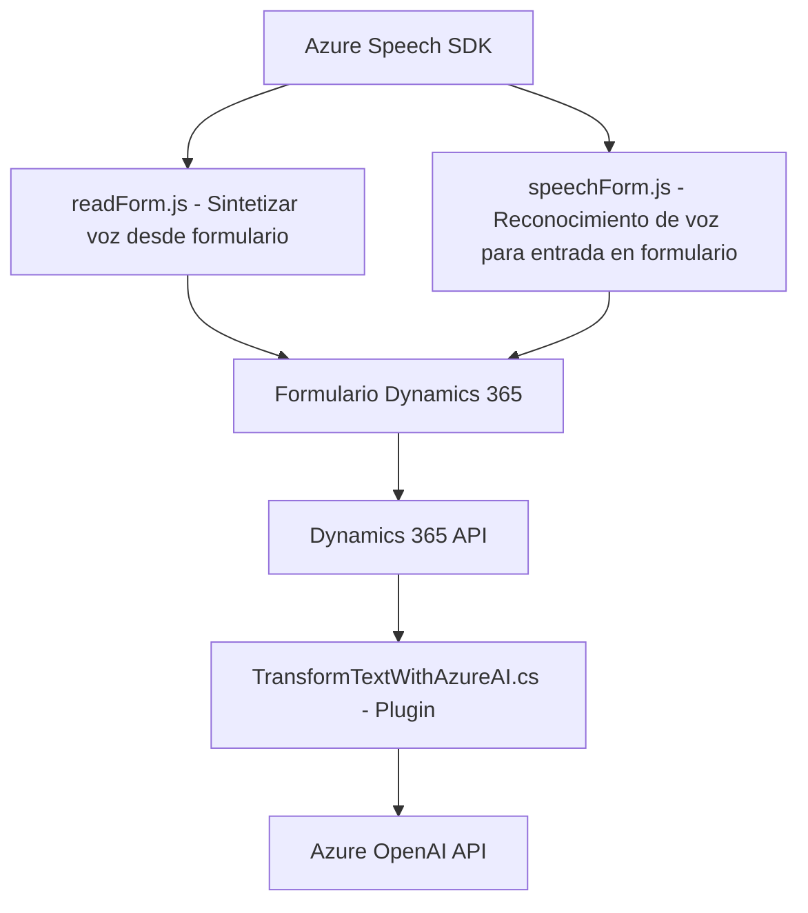

## Breve resumen técnico
El repositorio implementa funcionalidades orientadas al manejo de formularios en Dynamics CRM mediante Azure Speech SDK y servicios de Azure OpenAI. Incluye tres tipos de archivos:
1. **Frontend**: Scripts en JavaScript para el manejo de síntesis y reconocimiento de voz integrados con Dynamics 365.
2. **Plugin**: Código en `.NET` para transformar texto en JSON estructurado utilizando Azure OpenAI.

---

## Descripción de arquitectura
Se observa una arquitectura **modular** con enfoque de separación de responsabilidades:
- **Frontend:** Scripts basados en JavaScript para la captura de datos y procesamiento por voz con SDK externo (Azure SDK). Este se acopla al cliente Dynamics 365.
- **Plugin:** Un componente `IPlugin` para Dynamics CRM, que se conecta al servicio Azure OpenAI vía API de REST para realizar transformaciones estructuradas del texto.

La solución puede clasificarse como **modelo híbrido**:
- En el frontend se observa un patrón desacoplado que carga un SDK externo dinámicamente y utiliza APIs del cliente. Este esquema se asemeja a una arquitectura de capas.
- El plugin tiene una estructura independiente con integración directa a Dynamics CRM y un servicio REST externo, lo que lo hace funcionalmente parte del ecosistema CRM.

---

## Tecnologías usadas
1. **Frontend:**
   - **JavaScript** para la lógica del cliente.
   - **Azure Speech SDK**: Para síntesis de voz y reconocimiento por voz.
   - **Dynamics 365 API**: Interacción con formularios dentro del cliente CRM.
2. **Plugin:**
   - **.NET Framework** (C#) para desarrollo del plugin.
   - **Newtonsoft.Json** y **System.Text.Json**: Para manejo de JSON estructurado.
   - **Azure OpenAI GPT**: Para transformación avanzada de texto.

---

## Dependencias o componentes externos
1. **Azure Speech SDK:**
   - Dinámicamente cargado para la conversión de texto a voz y reconocimiento por voz.
2. **Dynamics 365 API:**
   - Para operar sobre formularios, buscar entidades, y consumir APIs personalizadas.
3. **Azure OpenAI GPT:**
   - Consumido como servicio REST para transformación del texto en JSON estructurado según normas predefinidas.

---

## Diagrama Mermaid (válido para GitHub Markdown)

---

## Conclusión final
La solución integra servicios avanzados de Microsoft Azure (Speech SDK y OpenAI) con Dynamics CRM mediante un modelo híbrido:
- **Frontend:** Scripts de JavaScript modulares para la interacción con cliente Dynamics y funcionalidades de voz.
- **Plugin:** Un componente oficial de Dynamics CRM que extiende la funcionalidad base mediante procesamientos avanzados con IA.

Se podría considerar esta arquitectura como **modular y multicapa**, ya que cada componente está diseñado para cumplir una responsabilidad específica, pero con fuerte dependencia del ecosistema Dynamics CRM y Azure.