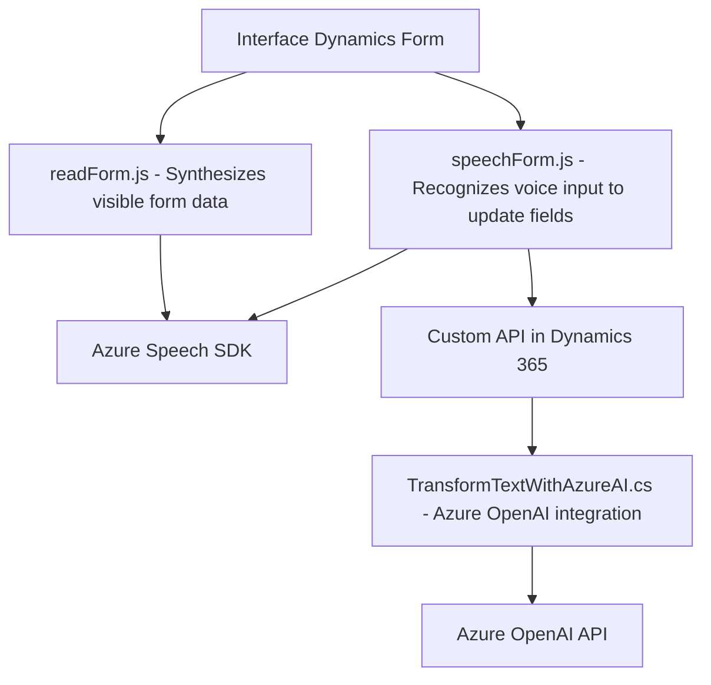

### Breve resumen técnico

El repositorio describe una solución compuesta de archivos **JavaScript** y **C#** que integran funcionalidades entre un **frontend** de Dynamics 365 y servicios externos como **Azure Speech SDK** y **Azure OpenAI**. Su propósito principal es automatizar formularios de Dynamics 365 mediante reconocimiento de voz, síntesis de texto y enriquecimiento de datos con inteligencia artificial.

### Descripción de arquitectura

La arquitectura empleada sigue principalmente un enfoque **modular** y orientado a servicios. Los componentes identificados pueden clasificarse como:
1. **Frontend** basado en JavaScript: Maneja la lógica de interacción del usuario y conecta la interfaz de Dynamics 365 con los servicios de reconocimiento de voz (Azure Speech SDK) y las **Custom APIs** utilizadas para IA.
2. **Backend plugin (C#)**: Extiende la lógica del sistema CRM mediante un plugin que invoca servicios de Azure OpenAI para procesamiento y transformación avanzada de texto.

La solución usa una arquitectura de **n capas**:
- **Capa de presentación**: Archivos de frontend que interactúan con el usuario y gestionan los formularios.
- **Capa de lógica de negocio**: Funcionalidades contenidas en los plugins de Dynamics 365 y las operaciones en las APIs externas.
- **Capa de servicios externos**: Integraciones con Azure Speech SDK y Azure OpenAI.

### Tecnologías usadas

1. **Frontend**:
   - **JavaScript**: Para manipulación del DOM y lógica en formularios de Dynamics 365.
   - **Azure Speech SDK**: Reconocimiento de voz y conversión de texto a voz.
   - **Dynamic 365 JS SDK**: Acceso a datos del CRM y manipulación de formularios.

2. **Backend**:
   - **C# Plugin**:
     - **Microsoft Dynamics CRM SDK**: Implementación del plugin para extender funcionalidades.
     - **Azure OpenAI API (GPT-4)**: Transformación de texto en JSON avanzado.
     - **Newtonsoft.Json / System.Text.Json**: Procesamiento de JSON en el plugin.

### Diagrama Mermaid

### Conclusión final

La solución demuestra una eficiente integración de servicios de terceros (Azure Speech SDK y Azure OpenAI) para automatización y enriquecimiento de formularios en Dynamics 365. La arquitectura es modular con separación de capas y uso extensivo de APIs externas, lo que asegura escalabilidad y flexibilidad en su implementación. Sin embargo, hay ciertos puntos de mejora como la configuración de credenciales de Azure en un archivo seguro y la optimización de patrones de dependencia para reducir acoplamiento y riesgos de seguridad.