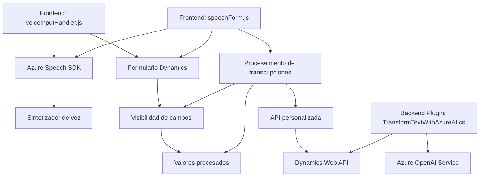

### Breve resumen técnico:
El conjunto de archivos en el repositorio forma parte de un sistema enfocado en la interacción entre usuarios y formularios por medio de **síntesis de voz y transcripción** utilizando Azure Speech SDK y Azure OpenAI. Además, se integran capacidades dentro de la plataforma de Dynamics CRM, haciendo uso de su interfaz de extensibilidad para plugins y personalización.

---

### Descripción de arquitectura:
La arquitectura está diseñada bajo un enfoque **orientado a servicios (SOA)**, facilitando la integración de componentes externos como Azure Speech SDK y Azure OpenAI en una solución basada en Dynamics CRM. También podría categorizarse como **n capas**, considerando que se separan las capas de presentación (JavaScript frontend), lógica de negocio (plugins y servicios), y acceso a datos (formulario y API de Dynamics).

---

### Tecnologías usadas:
1. **Frontend (JavaScript)**:
   - **Frameworks y librerías**: Azure Speech SDK (sintetizador de voz y reconocimiento de voz en navegador).
   - **Patrones observados**:
     - Modularidad y encapsulación funcional.
     - Procesamiento asincrónico (Promesas, callbacks).
     - Cargador dinámico de dependencias.

2. **Datos y lógica de negocio**:
   - **Dynamics CRM Plugins**: Extiende la funcionalidad del CRM mediante `Microsoft.Xrm.Sdk`.
   - **Azure OpenAI**: Procesamiento de texto avanzado y respuesta estructurada en JSON.
   - **CQRS**: Separación de lógica de comandos y consultas en niveles independientes.

3. **Integración tecnológica**:
   - Servicio externo: Azure Speech SDK cargado dinámicamente.
   - Servicio AI: Azure OpenAI para procesamiento de texto.

4. **Dependencias backend**:
   - .NET Framework (Microsoft Dynamics CRM SDK).
   - HttpClient para comunicación con servicios externos.
   - Newtonsoft.Json y System.Text.Json para manejo de datos JSON.

---

### Diagrama Mermaid:
A continuación, se presenta un diagrama compatible con GitHub Markdown:

---

### Conclusión final:
El sistema representa una solución **orientada a servicios** que integra múltiples herramientas de Microsoft (Dynamics CRM, Azure Speech SDK, Azure OpenAI) para enriquecer formularios con funcionalidades avanzadas como **reconocimiento de voz**, **síntesis de voz**, y **procesamiento de lenguaje natural**. La arquitectura es flexible y modular, lo que facilita la extensión futura con otros servicios o funcionalidades.

Aunque está bien estructurado, el uso de texto plano para almacenar claves API puede ser un riesgo de seguridad. Se recomienda emplear soluciones como Azure Key Vault o un almacén seguro de secretos para garantizar la confidencialidad. Por otro lado, combinar transcripción por voz, inteligencia artificial, y manipulación de datos dinámicos refleja una arquitectura moderna diseñada para mejorar la experiencia de usuario y habilitar capacidades de interacción humano-sistema en tiempo real.