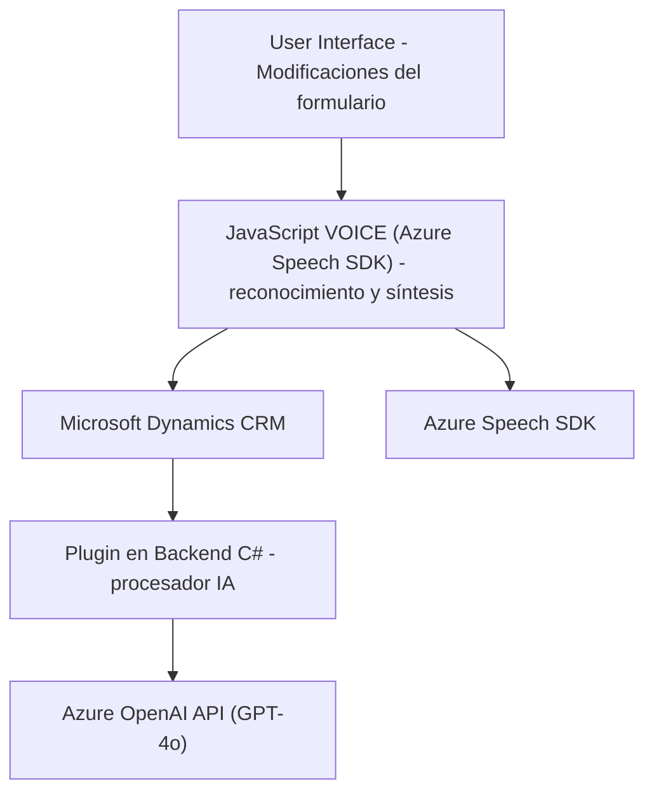

### Breve resumen técnico:
El repositorio abarca distintos componentes de una solución que parece estar diseñada para trabajar en un entorno Microsoft Dynamics CRM, integrando reconocimiento de voz y procesamiento de datos mediante Azure Speech SDK y Azure OpenAI API. Constan tres áreas principales:

1. **Frontend**: Archivos como `readForm.js` y `speechForm.js` gestionan la relación del cliente con el usuario final y los servicios de voz. 
2. **Backend Plugin**: El archivo C# (`TransformTextWithAzureAI.cs`) actúa como un agente en el entorno CRM para transformar texto en estructuras JSON a través del modelo GPT proporcionado por Azure OpenAI.

La solución está orientada hacia la interacción dinámica entre voz, inteligencia artificial y plataformas API con capacidad para integrarse en un ecosistema de CRM.

---

### Descripción de arquitectura:
La solución se organiza de manera modular con una separación de responsabilidades clara:

1. **Frontend**:
   - Actúa como la capa de presentación en un patrón de arquitectura **n-capas**.
   - Interactúa exclusivamente con usuarios mediante formularios y voz.
   - Procesa los datos transcritos y realiza llamadas a APIs para obtener respuestas de servicios externos como Azure Speech SDK.

2. **Backend (CRM Plugins)**:
   - Implementa un **plugin architecture** típico de Microsoft Dynamics CRM para trabajar dentro del sistema, usando la interfaz estándar `IPlugin`.
   - Procesa información avanzada con Azure OpenAI a través de llamadas a APIs, reforzando un patrón basado en integración de microservicios/servicios de terceros.

En conjunto, el sistema sigue mayormente un patrón de **Arquitectura n-capas** en el sentido tradicional, con separación entre frontend (presentación) y backend (lógica y procesamiento). Sin embargo, el plugin en C# complementa el sistema como una extensión del CRM en estilo **event-driven**.

---

### Tecnologías usadas:
- **Frontend**:
  - Javascript como lenguaje principal.
  - **Azure Speech SDK** para procesamiento y síntesis de voz.
  - APIs del CRM (Xrm.WebApi.online) para interacciones con Microsoft Dynamics.
  - Event-driven programming mediante callbacks y promesas (Promise).

- **Backend** (plugin en C#):
  - **Microsoft Dynamics CRM SDK** para gestionar interacciones dentro del CRM.
  - **Azure OpenAI API** (modelo GPT4) para procesamiento basado en IA, con peticiones HTTP de RESTful services.
  - JSON serialización/deserialización mediante `System.Text.Json` y `Newtonsoft.Json.Linq`.

---

### Diagrama Mermaid:

---

### Conclusión final:
Este repositorio presenta una solución que extiende las capacidades de procesamiento de datos en un entorno Microsoft Dynamics CRM mediante tecnología avanzada de reconocimiento/voz (Azure Speech SDK) e inteligencia artificial (Azure OpenAI). La arquitectura basada en una combinación de **n-capas** en el frontend y la integración de plugins en el backend permite cumplir tareas específicas como la transcripción de voz, síntesis, y transformación de texto en JSON estructurado.

El diseño modular y event-driven refuerza una solución extensible y adaptable para escenarios CRM con funcionalidades avanzadas de IA y voz.