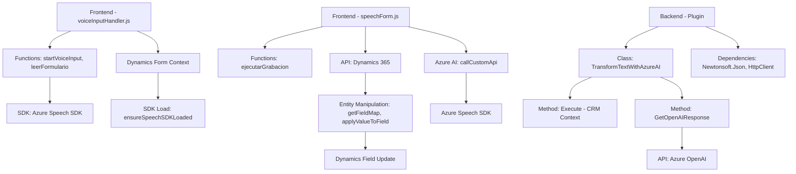

### Breve resumen técnico

Este repositorio es parte de una solución que integra **Azure Speech SDK** y **Azure OpenAI** con Dynamics 365 para funciones avanzadas como síntesis y reconocimiento de voz, transformación de texto mediante IA, y actualización dinámica de formularios en tiempo real. Las funcionalidades están distribuidas entre dos capas principales: una frontend basada en JavaScript para interactuar con los formularios y escuchar/sintetizar voz, y una capa backend con plugins que procesan los datos y utilizan Azure OpenAI para transformación de texto según ciertas normas.

---

### Descripción de arquitectura

Este proyecto utiliza un **modelo híbrido de arquitectura en capas combinado con arquitectura orientada a servicios (SOA)**. La estructura incluye:

1. **Frontend/JS**:
   - Componente diseñado para interactuar directamente con formularios en Dynamics 365.
   - Funciones asincrónicas que manejan la carga dinámica del SDK de Azure y manipulan entradas de voz para ser procesadas en tiempo real.
   - Modularidad en el procesamiento de los datos (lectura del formulario, transcripción de voz, comandos específicos).

2. **Backend/plugins**:
   - Plugin que implementa la interfaz estándar `IPlugin` de Dynamics CRM, sirviendo como middleware para la transformación de texto mediante Azure OpenAI.
   - Interfaz directa entre Dynamics 365 y servicios de ML (Machine Learning) basados en Azure.

La arquitectura combina capas funcionales **n-tier** (Frontend -> Backend -> Dynamics 365) con dependencias de **servicios externos**, manteniendo una estructura orientada a **responsabilidades específicas** en cada componente.

---

### Tecnologías usadas

1. **Frontend:**
   - **JavaScript (ES6+):** Desarrollo de funciones asincrónicas para manejar eventos del formulario y servicios de voz.
   - **Azure Speech SDK:** Para síntesis y reconocimiento de voz.
   - **Dynamics 365 context (Xrm API):** Manipulación de formularios y acceso a datos.

2. **Backend:**
   - **Microsoft Dynamics CRM SDK (.NET):**
     - Implementación de plugins mediante `IPlugin`.
     - Integración directa con servicios Dynamics.
   - **Azure OpenAI API (GPT-4):** Procesamiento avanzado de texto con machine learning.
   - **Newtonsoft.Json:** Para serialización/deserialización de datos JSON.
   - **HttpClient:** Para comunicación con APIs.

3. **Servicios externos:**
   - **Azure Speech Service:** Reconocimiento y síntesis de voz.
   - **Azure OpenAI (GPT-4):** Transformación del texto de entrada.
   - **Dynamics 365 API:** Interacción con las entidades del sistema.

---

### Diagrama Mermaid para GitHub

---

### Conclusión final

Este proyecto crea una solución integradora para procesamiento y automatización de datos en Dynamics 365 mediante tecnologías avanzadas como reconocimiento de voz y transformación de texto con IA. La arquitectura está diseñada pensando en **escalabilidad, modularidad y desacoplamiento**, integrando servicios externos con Dynamics 365 de manera eficiente. La implementación es adecuada para proyectos que necesitan procesar e interpretar datos en tiempo real.