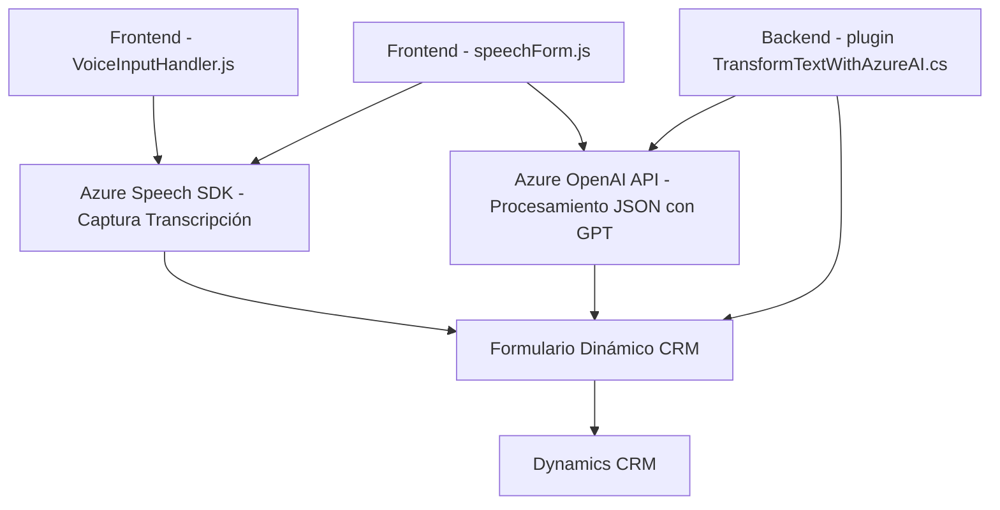

## Breve resumen técnico

El proyecto en cuestión es **una solución basada en una plataforma de Dynamics 365**, implementando extensión funcional para:
1. Manejo interactivo de formularios por voz para capturar datos y aplicarlos.
2. Procesamiento de transcripciones con integración de servicios de IA avanzados (Azure Speech SDK y Azure OpenAI).
3. Aplicación de un plugin en Dynamics CRM para transformar y estructurar los datos en formato JSON.

## Descripción de arquitectura

La solución está construida sobre la plataforma **Dynamics CRM**, lo que sugiere un enfoque basado en **una arquitectura de n capas** debido a la dependencia explícita de su ecosistema. Mientras que los archivos `readForm.js` y `speechForm.js` operan sobre el frontend del formulario dinámico (cliente), el archivo `TransformTextWithAzureAI.cs` actúa como un plugin backend que extiende las operaciones de Dynamics CRM utilizando APIs externas.

Los puntos clave de arquitectura son:
- **Frontend modular** para interactuar con servicios de voz como el Azure Speech SDK, transformando la experiencia del usuario mediante entrada y salida de datos por voz.
- **Backend como plugin**, extensiones dentro del marco de Dynamics CRM con soporte para Azure mediante el OpenAI API.
- La arquitectura combina patrones como **Facade**, **Dynamic Resource Loading** y **encapsulación**, favoreciendo la separación de responsabilidades.

## Tecnologías, frameworks y patrones usados

### Tecnologías y frameworks
1. **Frontend**:
   - JavaScript.
   - Dynamics 365 API para formularios (`executionContext`, `Xrm.WebApi`).
   - **Azure Speech SDK**: Captura y síntesis de voz.
   - JSON para manipulación de datos.
2. **Backend**:
   - C# (.NET Framework).
   - `Newtonsoft.Json` para manejo de JSON.
   - Azure OpenAI API para procesamiento estructurado basado en GPT.

### Patrones y estrategias
1. **Dynamic Resource Loading**: Carga dinámica de SDK (Azure Speech) en el frontend.
2. **Facade Pattern**: Organización de funciones para simplificar y encapsular flujos complejos.
3. **Plugin Pattern**: Extensión de sistemas CRM mediante implementación de la interfaz `IPlugin`.
4. **Service Integration Pattern**: Llamadas HTTP POST a APIs externas para obtener datos procesados (GPT).
5. **Contextual Dependency**: Extenso uso de `formContext` y APIs internas de Dynamics.

## Diagrama Mermaid para GitHub

## Conclusión final

La solución está diseñada para convivir y ampliar las capacidades de **Dynamics CRM** aprovechando servicios cognitivos de Azure y una arquitectura modular de n capas. Incluye funcionalidades tanto para mejorar la experiencia de usuario vía voz en el frontend como para estructurar la información en el backend usando tecnologías basadas en cloud computing (Azure Speech SDK y Azure OpenAI).

### Aspectos destacables
1. **Ventajas**:
   - Uso eficiente de servicios cloud (Azure).
   - Modularidad tanto en frontend como backend.
   - Escalabilidad del plugin para integrarse con Dynamics 365.

2. **Oportunidades de mejora**:
   - Implementar un sistema de gestión segura para API Keys (ej. Azure Key Vault).
   - Desacople de normas y reglas del plugin para lograr mayor versatilidad y reusabilidad.
   - Considerar conversión hacia integración basada en microservicios, facilitando ampliaciones y mantenimiento a largo plazo.