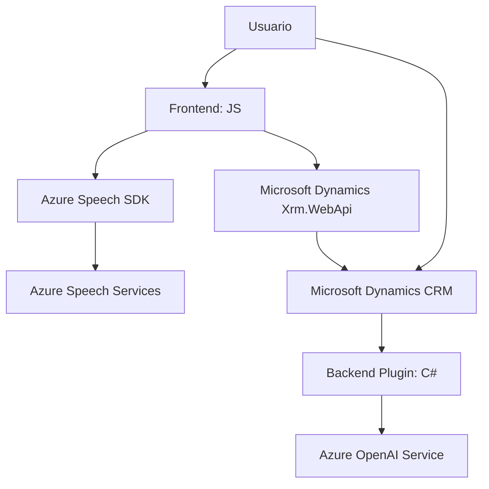

### Breve resumen técnico
El repositorio presenta componentes de un sistema que integra **Azure Speech SDK** y **Microsoft Dynamics CRM** para implementar funcionalidades específicas: entrada de voz, síntesis de texto a voz y transformación de texto estructurado mediante **Azure OpenAI Service**. Está compuesto por un frontend (JavaScript) y un plugin backend (C#) para CRM.

### Descripción de arquitectura
La solución sigue una arquitectura **n capas**: 
1. **Frontend (JavaScript, Azure Speech SDK)**: Se encarga de la interacción con formularios y servicios de voz para leer y sintetizar texto según los datos del formulario.
2. **Backend Plugin (C#)**: Implementa una funcionalidad para transformar texto en JSON estructurado utilizando Azure OpenAI.
3. **Servicios externos**: El sistema utiliza APIs de Azure (Speech y OpenAI) y se integra con Microsoft Dynamics CRM como base de datos y plataforma de operaciones.

Los patrones incluyen:
- **Modularidad**: Cada capa implementa su propia lógica independiente.
- **Integración externa**: Dependencias como Azure Speech y OpenAI están integradas mediante APIs.
- **Asynchronous patterns**: Amplio uso de promesas y asincronismo para operaciones de red.

### Tecnologías usadas
1. **Frontend:**
   - **JavaScript**: Base para las funciones de interacción con formularios.
   - **Azure Speech SDK**: Text-to-Speech y Speech Recognition.
   - **Microsoft Dynamics CRM API (Xrm.WebApi)**: Para sincronizar datos del formulario.

2. **Backend:**
   - **C# (.NET)**: Lenguaje para el plugin de Dynamics CRM.
   - **Azure OpenAI Service**: Utilizado para transformar texto en JSON estructurado.
   - **Dynamics SDK**: Plugins e interacción directa con el CRM.

3. **APIs REST**:
   - **Azure Speech**.
   - **Azure OpenAI**.

### Dependencias o componentes externos
1. **Azure Services**:
   - **Speech SDK**: Text-to-speech y speech recognition.
   - **OpenAI**: Transformación avanzada de texto con IA.
2. **Microsoft Dynamics CRM**:
   - Backend plugin para operaciones CRUD como parte de Xrm SDK.
3. **Librerías de frontend**:
   - Scripts para comunicarse con Azure Speech SDK.
4. **Dependencias de C#**:
   - `System.Text.Json` y `Newtonsoft.Json` para manejo de JSON.
   - `HttpClient` para invocar APIs REST como OpenAI.

### Diagrama Mermaid válido para GitHub

### Conclusión final
Esta solución está orientada hacia **n capas** dentro del contexto de Microsoft Dynamics CRM, con integración de terceros como **Azure Speech SDK** y **OpenAI Service** para realizar tareas avanzadas como reconocimiento y síntesis de voz, así como procesamiento inteligente de lenguaje. Está diseñada modularmente para permitir la integración y escalabilidad de sus componentes. Además, hace un fuerte uso de las capacidades de Microsoft Dynamics CRM, posicionándose como un sistema complementario para aplicaciones empresariales que interactúan con usuarios mediante voz e inteligencia artificial.