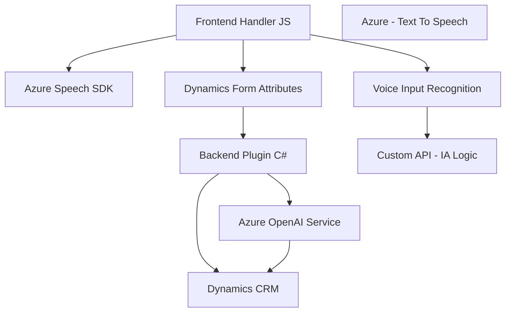

### Breve resumen técnico
El repositorio tiene varios archivos organizados para la integración de diferentes servicios. Los archivos analizados están orientados a la interacción de voz, procesamiento de datos en formularios de Dynamics 365, y comunicación con servicios externos de Microsoft como Azure Speech SDK y OpenAI.

---

### Descripción de arquitectura
La solución se puede clasificar en:
1. **Frontend integrado con Dynamics**: Extracción de datos de formularios con interacción de voz y control dinámico mediante Azure Speech SDK.
2. **Backend como plugin CRM**: Transformación de texto usando Azure OpenAI Service para extender las capacidades de Dynamics.

#### Tipo de arquitectura:
- **Integrado en Dynamics CRM con capas internas desacopladas**:
  - En el frontend, se evidencia **modularidad** y el uso de patrones de responsabilidades únicas para la interacción de SDKs y datos de formularios.
  - La lógica backend sigue el **acoplamiento parcial interno** típico de los plugins de Dynamics CRM, con comunicación externa hacia APIs mediante **servicios desacoplados**.

---

### Tecnologías usadas
1. **Frontend (JavaScript)**:
   - Azure Speech SDK: Para generación de texto a voz y reconocimiento de voz.
   - DOM API: Manipulación dinámica del DOM.
   - Dynamics 365 APIs: Extracción/manipulación de datos de formularios.

2. **Backend (C#)**:
   - Microsoft Dynamics SDK: Conexión directa con los servicios de CRM.
   - Azure OpenAI Service (GPT-4): Para transformación avanzada de texto.
   - HTTP API con `System.Net.Http`: Comunicación con servicios externos.
   - JSON con `System.Text.Json`: Procesamiento y manipulación de respuestas API.

---

### Diagrama Mermaid

---

### Conclusión final
La solución está bien estructurada para un entorno mixto de Dynamics 365, combinando lógica compleja en frontend (interacciones dinámicas basadas en voz) y backend (transformaciones de texto mediante IA). Aunque la arquitectura es modular y compatible con Dynamics, pueden identificarse áreas de mejora como seguridad de claves/API y mayor implementación de pruebas unitarias en el backend.