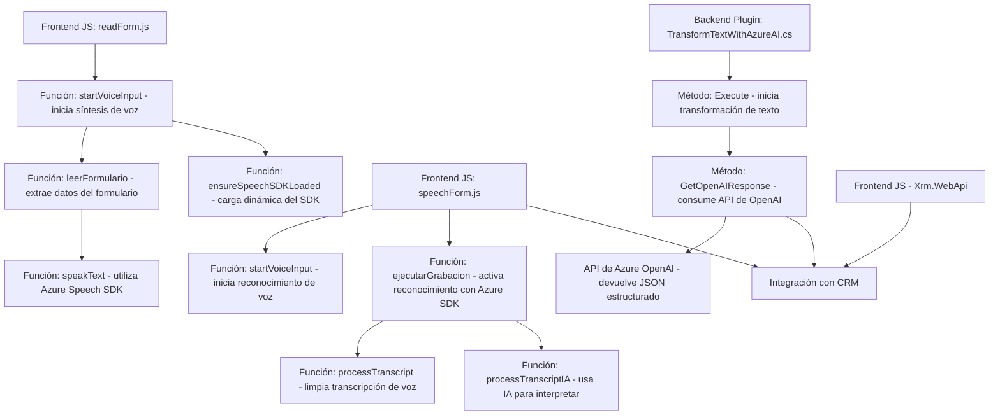

### Resumen técnico
El repositorio describe una solución híbrida, orientada principalmente a la integración de formularios interactivos con capacidades de síntesis y reconocimiento de voz, utilizando herramientas como **Azure Speech SDK** y Microsoft Dynamics CRM. Además, incluye un plugin en .NET que aprovecha la API de **Azure OpenAI** para procesamiento de texto. La solución combina el procesamiento en el frontend (JavaScript) con lógica dinámica del server-side (plugin .NET).

---

### Descripción de arquitectura
La solución presenta una arquitectura **modular en capas**, desglosada en:
1. **Frontend interactivo**:
   - Los archivos JavaScript manejan la interacción con el usuario, la extracción/normalización de datos de formularios y el consumo del SDK de Azure Speech.
   - Modularidad evidente con funciones específicas para distintas tareas.
   
2. **Backend server-side**:
   - El archivo `.cs` implementa un plugin para Dynamics CRM, que consume la API de Azure OpenAI para transformar texto y generar JSON estructurado. Actúa como una capa de procesamiento de datos y comunicación con servicios externos.

3. **Integración por APIs y SDKs**:
   - Interacción directa con servicios de Azure, tanto para voz como para IA (síntesis de voz, reconocimiento de voz y transformación textual).

La arquitectura podría considerarse **multicapa** al integrar frontend y backend, además de una capa intermedia que comunica con servicios de terceros. Esto refuerza la separación de responsabilidades.

---

### Tecnologías usadas
1. **Frontend**:
   - **JavaScript**: Para manejar la lógica del cliente.
   - **Azure Speech SDK**: Para síntesis y reconocimiento de voz.
   - **Web APIs de Microsoft Dynamics CRM**: Para trabajar con formularios interactivos y datos de usuario.
   
2. **Backend**:
   - **.NET Framework**: Para la creación del plugin en C#.
   - **Microsoft Dynamics CRM SDK**: Para la ejecución y manipulación de datos en el contexto del CRM.
   - **Azure OpenAI API**: Para transformar texto en JSON estructurado.

3. **Integración y conectividad**:
   - Uso de HTTP requests para consumir servicios de Azure.
   - Event-driven programming en el backend y frontend mediante callbacks y promesas.

---

### Dependencias externas y componentes
1. **Servicios de Azure**:
   - Speech SDK (síntesis y reconocimiento de voz).
   - OpenAI API (transformación y enriquecimiento de texto).

2. **Microsoft Dynamics CRM**:
   - Dependencia de Xrm.WebApi en el frontend.
   - Interfaces y servicios del SDK en el backend.

3. **SDKs dinámicos cargados en tiempo de ejecución**:
   - Speech SDK cargado dinámicamente en el navegador.

4. **HTTP Requests**:
   - Comunicación con APIs externas, especialmente del servicio OpenAI.

---

### Diagrama Mermaid válido para GitHub Markdown

---

### Conclusión final
La solución presentada integra múltiples capas para la automatización, extracción y procesamiento de datos, alineándose con una **arquitectura modular de capas**. El uso de **Azure Speech SDK**, servicios de **Azure OpenAI**, y la integración profunda con **Microsoft Dynamics CRM** demuestra su diseño orientado hacia sistemas empresariales avanzados. Las prácticas de modularidad y delegación aseguran un código extensible y mantenible.

Sin embargo, la arquitectura no es completamente descentralizada, por lo que no se clasifica como microservicios. Un posible punto de mejora sería desacoplar aún más las piezas para ofrecer mayor granularidad en capacidades y escalabilidad.