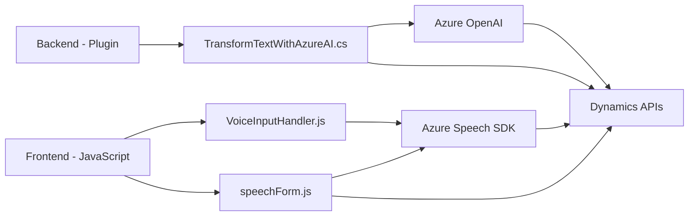

### Breve resumen técnico

El repositorio tiene como objetivo implementar funcionalidades de reconocimiento, síntesis de voz y procesamiento de textos integrando soluciones como Azure Speech SDK y Azure OpenAI. Está dividido en tres principales componentes:
1. **Frontend/JS**: Scripts JavaScript utilizados para interactuar con formularios, facilitar la captura de voz y sintetizar audio.
2. **Plugins/TransformTextWithAzureAI.cs**: Plugin desarrollado para Dynamics CRM que invoca el servicio Azure OpenAI para transformar texto basado en reglas preestablecidas.

---

### Descripción de arquitectura

La arquitectura sigue el enfoque **n capas** y una integración orientada a servicios:
1. **Capa de presentación/cliente**: Scripts JavaScript (`readForm.js`, `speechForm.js`) que interactúan con formularios y servicios como Azure Speech SDK y APIs personalizadas.
2. **Capa de lógica del negocio**: Plugin .NET (`TransformTextWithAzureAI.cs`) que ejecuta funciones específicas relacionadas con Dynamics CRM y Azure OpenAI Service.
3. **Capa de servicios**: La lógica se alimenta de servicios externos como Azure Speech SDK y Azure OpenAI mediante patrones como Service-Oriented Architecture.

Adicionalmente, el uso de SDK y APIs fomenta una arquitectura **adaptativa**, integrada con servicios en la nube.

---

### Tecnologías utilizadas

1. **Frontend**:
   - Lenguaje: JavaScript.
   - SDK: Azure Speech SDK (para síntesis de voz y reconocimiento de audio).
   - Framework: No existe evidencia directa de frameworks frontend específicos como React o Angular.

2. **Backend/Plugin**:
   - Lenguaje: C#.
   - Framework: Dynamics CRM Plugin Framework (Microsoft .NET).
   - Biblioteca JSON: `Newtonsoft.Json`, `System.Text.Json`.
   - Servicios externos: Azure OpenAI, HTTP Client.

3. **Infraestructura**:
   - Integración con servicios en la nube (Azure Speech, Azure OpenAI).
   - Dependencias: REST API endpoint, claves de suscripción de Azure.

---

### Diagrama Mermaid válido para GitHub

---

### Conclusión final

La solución presentada es una arquitectura orientada a servicios (SOA) que integra componentes frontend y backend con servicios en la nube de Azure. Su enfoque modular y la división clara entre las capas la hace flexible y escalable. Aunque está diseñada principalmente para integrarse en escenarios de Dynamics CRM, su uso de APIs externas como Azure Speech y Azure OpenAI indica una tendencia hacia el consumo de microservicios, aunque no contiene una arquitectura como tal basada exclusivamente en dicha estructura.

El flujo general parece adaptado para procesar y transformar datos mediante voz, texto y servicios de IA, lo que la hace viable para aplicaciones relacionadas con automatización de formularios, accesibilidad, y generación de contenido.