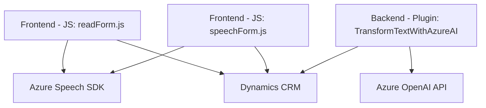

### Breve Resumen Técnico:

El repositorio contiene una solución para interacción por voz en sistemas CRM (DynamicsCRM), donde se procesan formularios y entradas habladas utilizando el **Azure Speech SDK** en el frontend y una integración con la **API de Azure OpenAI** en el backend. Está compuesto por scripts de frontend (JavaScript) para interfaz de usuario y un plugin de backend (.NET) basado en Dynamics CRM.

### Descripción de Arquitectura:

La arquitectura general mezcla un modelo **n capas** y parcialmente **hexagonal**:
1. **Frontend (JavaScript):** Responsable de interacción con formularios, inclusión de entrada/salida de voz y en algunos casos integraciones directas con servicios de IA.
2. **Backend (Dynamics CRM Plugin):** Plugin .NET que ejecuta transformaciones basadas en la API de Azure OpenAI y manipula datos mediante dinámicas del CRM.
3. **Servicios externos desacoplados:** Incluye el **Azure OpenAI** y el **Azure Speech SDK**, delegando procesamiento intensivo fuera de la aplicación principal.

### Tecnologías Usadas:

1. **Frontend:**
   - **Azure Speech SDK:** Reconocimiento y síntesis de voz.
   - **Dynamics CRM APIs (JavaScript):** Manipulación de atributos y contextos de formularios.
   - **JavaScript ES6:** Principios modernos de modularización y promesas.
   
2. **Backend:**
   - **Microsoft Dynamics CRM SDK:** Extensiones para plugins (`IPlugin`).
   - **Azure OpenAI API:** Transformación de texto mediante IA.
   - **.NET Framework:** Desarrollo de plugins para Dynamics CRM.

### Patrones Implementados:
- **Separación de responsabilidades:** Cada función/módulo tiene tareas específicas.
- **Patrón repositorio:** Funciones como `getFieldMap` en el frontend y consultas al CRM en el plugin trabajan como repositorios.
- **Event-driven programming:** En el frontend, la carga dinámica de SDK y entrada por voz están basadas en eventos.
- **Service Integration:** Uso explícito de servicios externos como Azure Speech y OpenAI con gestión de claves de API.

### Diagrama Mermaid:

### Conclusión Final:

La solución en este repositorio implementa un modelo **híbrido n capas** para extender los formularios de Dynamics CRM con interacción por voz y transformación inteligente de datos. La arquitectura está bien diseñada para incorporar servicios externos desacoplados como Azure Speech SDK y Azure OpenAI API permitiendo una escalabilidad adecuada. Sin embargo, debe mejorarse la gestión de credenciales (`api-key`) por seguridad y optimizar las configuraciones en el plugin para facilitar soporte a grandes volúmenes de datos.