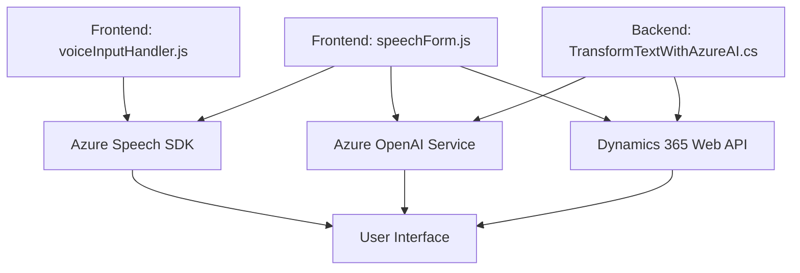

### Análisis técnico

#### Breve resumen técnico
La solución del repositorio consiste en una aplicación que integra funcionalidades de reconocimiento y síntesis de voz mediante **Azure Speech SDK**, facilitando la interacción con formularios en Dynamics 365. También incluye un plugin para procesar texto con **Azure OpenAI**, estructurarlo como JSON, y aplicarlo a dichos formularios mediante la API de Dynamics.

---

#### Descripción de la arquitectura
La arquitectura de la solución puede clasificarse dentro del modelo **n capas** con integraciones externas. Está diseñada en tres componentes primarios:
1. **Frontend**: Implementa lógica de interfaz para síntesis y reconocimiento de voz, además de procesamiento dinámico y asignación de datos en formularios.
2. **Backend**: Define un plugin para Dynamics CRM que ejecuta funciones de transformación de texto con servicios de Azure.
3. **Servicios externos**: Utiliza servicios en la nube como **Azure Speech SDK**, **Azure OpenAI**, y **Dynamics 365 Web API** para integración y manipulación de datos.

El enfoque general es modular, con separación de responsabilidades entre archivos frontend y backend, basado en una composición lógica que favorece cohesión y escalabilidad.

---

#### Tecnologías usadas
1. **Frontend**:
   - Lenguaje: JavaScript.
   - Frameworks/Librerías: Azure Speech SDK, Dynamics XRM API.
   - Patrones: Modularización funcional y Facade Pattern.
   
2. **Backend**:
   - Lenguaje: C#.
   - Framework/Librerías: .NET Framework (Microsoft.Xrm.Sdk), Azure OpenAI, Newtonsoft.Json.
   - Patrones: Plugin Design Pattern, Integration Service, Factory Method.

3. **Servicios externos**:
   - Azure Speech SDK (Síntesis y reconocimiento de voz).
   - Azure OpenAI Service (Transformación de texto a estructuras JSON).
   - Dynamics 365 Web API (Manipulación de datos en formularios y CRM).

---

#### Dependencias
- **Azure Speech SDK**: En frontend para la síntesis y reconocimiento de voz.
- **Azure OpenAI Service**: En el backend para procesado avanzado de texto.
- **Dynamics 365 Web API**: Integración y manipulación de formularios/datos en CRM.
- **Newtonsoft.Json**: Serialización/deserialización de estructuras JSON.
- **System.Text.Json**: Procesamiento de cadenas y JSON.
- **HttpClient**: Comunicaciones HTTP con servicios en la nube.

---

#### Diagrama Mermaid válido:

---

### Conclusión final
Este repositorio implementa una solución integrada orientada a facilitar la interacción con formularios en Dynamics 365 mediante reconocimiento y síntesis de voz, además de procesamiento de texto con IA. Está estructurado como una arquitectura de **n capas**, aprovecha el poder de servicios de Azure, y mantiene buen diseño modular con patrones como **Facade** y **Plugin Design**. A pesar de su clara orientación a una estructura monolítica en la parte de backend (plugin único para CRM), el uso de servicios en la nube y APIs externas amplía su funcionalidad y escalabilidad.