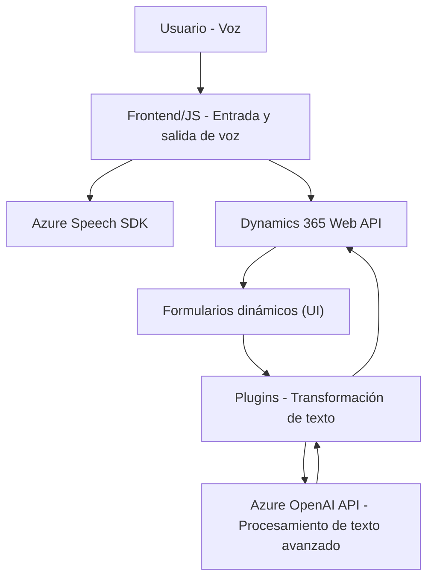

### Breve resumen técnico

El repositorio presenta una solución desarrollada para mejorar la interacción basada en voz en aplicaciones integradas con formularios dinámicos (Dynamics 365). Consta de una capa frontend (JavaScript) y otro componente backend basado en Dynamics plugins (.NET).

---

### Descripción de arquitectura

1. **Tipo de solución:** Integración entre un sistema CRM (Dynamics 365) y servicios en la nube (Azure) mediante funcionalidades de entrada y salida de voz, utilizando el Azure Speech SDK y el servicio Azure OpenAI.
   
2. **Arquitectura:** Se puede clasificar como una solución de **arquitectura de integración** con patrones cliente/servidor. Tiene dos niveles principales:
   - **Frontend:** Implementado en **JavaScript** y enfocado en funcionalidad interactiva (entrada y salida de voz) directamente en formularios de Dynamics.
   - **Plugin backend:** Implementado en **.NET (C#)** como extensibilidad a través de la arquitectura de plugins de Dynamics CRM para transformar datos mediante Azure OpenAI.

3. **Interacción entre capas:** Los scripts JavaScript actúan como controladores en la capa cliente, mientras que el plugin .NET sirve como un procesador de texto avanzado en el servidor.

---

### Tecnologías usadas

1. **Frontend:**
   - **JavaScript:** Lógica para manejar entrada y salida de voz en el navegador.
   - **Azure Speech SDK:** Funcionalidad de síntesis y reconocimiento de voz.
   - **Dynamics 365 WebAPI:** Interacción con formularios CRM para leer, actualizar y manipular datos.
   - **Asynchronous JavaScript (Promesas & async/await):** Manejo de varias operaciones asincrónicas (e.g., llamados al SDK y APIs).
   
2. **Backend (.NET):**
   - **Microsoft.Xrm.Sdk:** API para extensibilidad en Dynamics 365 CRM.
   - **Azure OpenAI API:** Uso del modelo GPT-4 para transformar texto mediante reglas específicas.
   - **System.Net.Http & System.Text.Json:** Realización de solicitudes HTTP y manejo de serialización/deserialización JSON.

---

### Dependencias o componentes externos

1. **Servicios de Azure:**
   - Azure Speech SDK: Para síntesis de voz y reconocimiento de entrada de voz.
   - Azure OpenAI API: Para procesamiento y transformación avanzada de texto en el backend.

2. **Dynamics 365:**
   - WebAPI: Para manipular formularios dinámicos directamente en el navegador.
   - Plugins: Extensión del comportamiento en el backend del CRM.

3. **Dependencias de terceros (opcional):**
   - Framework de comunicación JSON (e.g., `System.Text.Json`, `Newtonsoft.Json.Linq`).
   - Herramientas para búsqueda dinámica de texto (`Regex`, `System.Linq`).

---

### Diagrama Mermaid válido para GitHub Markdown

---

### Conclusión final

Este repositorio implementa una solución integrada para enriquecer la experiencia de usuario en Dynamics 365 mediante voz e inteligencia artificial. Utiliza una arquitectura cliente/servidor dividida en dos niveles: un nivel frontend habilitado con Azure Speech SDK para sintetizar y reconocer voz, y un backend con plugins que hace uso del servicio Azure OpenAI para transformar texto conforme a reglas específicas.

A pesar de estar bien estructurada, hay áreas que podrían mejorarse:
1. **Seguridad:** Los valores sensibles como claves de API y regiones deben ser gestionados con mejores prácticas (e.g., variables de entorno, servicios de configuración).
2. **Optimización:** Algunas dependencias en el backend no son utilizadas y pueden ser eliminadas para simplificar el código.
3. **Modularidad:** Sería beneficioso encapsular algunas funciones en clases para mejorar su escalabilidad.

Esta solución es adecuada para equipos que buscan llevar funciones interactivas avanzadas al flujo de trabajo en un entorno CRM basado en Dynamics.