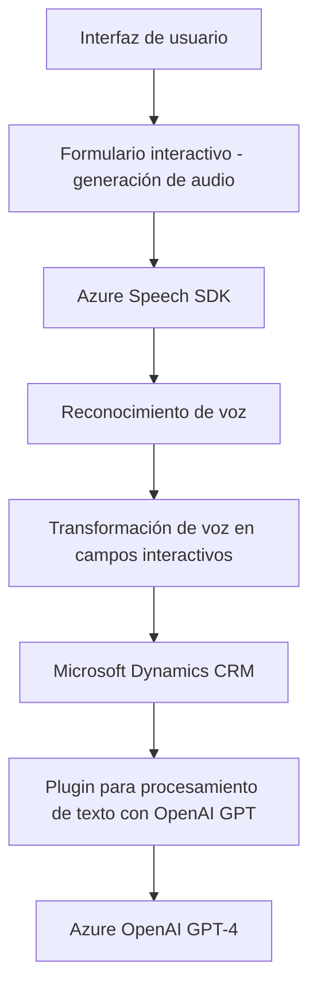

### **Análisis Técnico: Repositorio**

#### **1. Breve resumen técnico**
Este repositorio contiene tres componentes principales que trabajan como parte de un sistema para el manejo de voz, la transformación de texto y la integración con formularios. Los componentes de este sistema son:

- **Frontend/JS/readForm.js**: Extrae información de un formulario visible en la interfaz web y la convierte en texto mediante el procesamiento y síntesis de voz usando Azure Speech SDK.
- **Frontend/JS/speechForm.js**: Implementa la funcionalidad clave para el reconocimiento de voz, codificando los datos reconocidos en pares clave-valor y actualizando formularios en la interfaz.
- **Plugins/TransformTextWithAzureAI.cs**: Plugin de Dynamics CRM para integrar con Azure OpenAI, transformando entradas texto según reglas específicas y devolviendo el formato JSON.

---

#### **2. Descripción de arquitectura**
Este sistema se ajusta a una **arquitectura de servicios conectados** con múltiples capas:
- **Interfaz de Usuario (UI)** que interactúa con el usuario vía el navegador y captura información a través de formularios.
- **Frontend con integración de servicios** que utiliza Azure Speech SDK y una API personalizada.
- **Capa de Servicio de Negocio** implementada en un plugin para Microsoft Dynamics 365 CRM. Este se conecta a través de una integración directa con **Azure OpenAI Service**.

Aunque contiene componentes que interactúan entre sí, (Frontend y Plugins interactúan mediante APIs hacia Dynamics CRM), el diseño no se distribuye completamente usando microservicios. Por lo tanto, el sistema puede considerarse como una arquitectura **n capas con integración de servicios en nube**.

---

#### **3. Tecnologías usadas**
El sistema está desarrollado utilizando las siguientes tecnologías y frameworks:

- **Azure Speech SDK**: Para convertir texto visible en audio y para reconocimiento de voz en los formularios. Se integra dinámicamente en los archivos de frontend mediante carga asíncrona.
- **Microsoft Dynamics 365 CRM SDK and Plugins**: Proporciona la base del componente de negocio, integrándose con el sistema CRM.
- **Azure OpenAI GPT-4**: Implementa el modelo GPT para transformar texto basado en un conjunto de reglas específicas.
- **Frontend**: JavaScript como lenguaje principal. Uso extensivo de programación estructurada, callbacks, y manejo asincrónico (`async/await`) y Promises.
- **Backend para Dynamics CRM Plugin**:
  - **C#** como lenguaje principal.
  - Integración con librerías como `Microsoft.Xrm.Sdk`, `System.Net.Http`, y `System.Text.Json`.

---

#### **4. Dependencias o componentes externos**
1. **Azure Speech SDK**: Manejo de síntesis y reconocimiento de voz.
2. **Azure OpenAI Service (GPT-4)**: Procesamiento inteligente de texto según normas específicas.
3. **Microsoft Dynamics CRM SDK**: Proporciona interacciones nativas con Dynamics para plugins.
4. **Microsoft Dynamics Web API**: Para ejecutar funciones como carga dinámica de campo y gestión de datos en formularios.
5. **System.Net.Http** y **System.Text.Json**: Realizan la integración de APIs externas al servicio Azure OpenAI.

---

#### **5. Diagrama Mermaid válido para GitHub**

---

#### **Conclusión final**
El repositorio implementa una solución que integra el reconocimiento por voz y la síntesis de audio en la interfaz de usuario con procesamiento de texto y lógica avanzada basada en IA en el backend, utilizando principalmente servicios de Azure y Microsoft Dynamics CRM. La arquitectura n-capas del sistema emplea un enfoque modular y extensible para conectar servicios de frontend (UI), middleware (Azure SDKs y APIs), y backend (Dynamics CRM plugins y Azure OpenAI). Esto permite una solución altamente escalable y diseñada para escenarios empresariales modernos de procesamiento automatizado por voz.