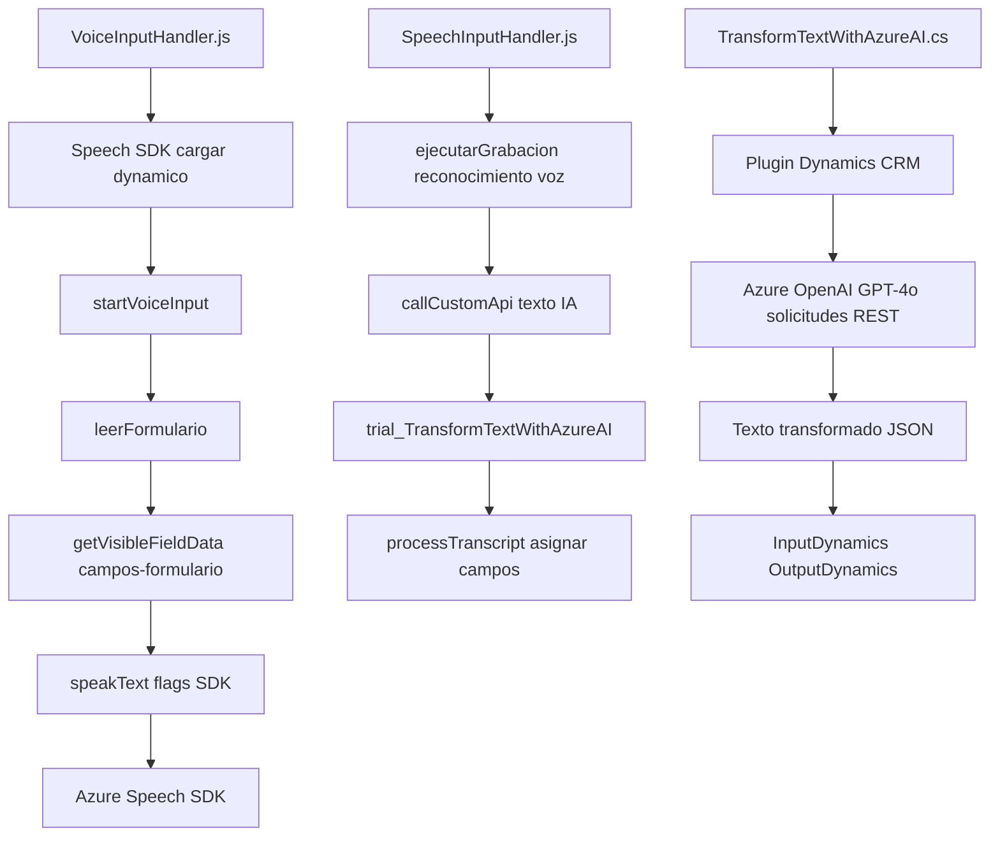

### Resumen técnico
El repositorio contiene tres archivos diferenciados orientados a implementar una solución híbrida que integra funcionalidades de entrada y salida de voz (a través del **Azure Speech SDK**) con el uso de una **API personalizada en Dynamics 365**. Además, incluye un plugin en C# que utiliza **Azure OpenAI GPT-4o** para transformar textos y estructurarlos en formato JSON. 

Los archivos se dividen en:
1. **Frontend (VoiceInputHandler.js, SpeechInputHandler.js)**: Procesa formularios de Dynamics 365 mediante síntesis y transcripción de voz usando Azure Speech SDK.
2. **Backend (TransformTextWithAzureAI.cs)**: Plugin que aplica reglas predefinidas a texto recibido y transforma datos usando Azure OpenAI.

---

### Descripción de arquitectura
La solución utiliza una arquitectura **n-capas** con roles claramente definidos:  
1. **Frontend**: Administración de lógica de voz y formularios, mediante un patrón event-driven y modular.  
2. **Backend**: Plugin que interactúa con Dynamics CRM (uso de `IPlugin`) y se comunica con servicios externos (Azure OpenAI) mediante HTTP REST APIs.  
   
La integración de servicios externos y la modularidad sugieren principios de desacoplamiento pero no llega a ser completamente hexagonal ni microservicio.

---

### Tecnologías usadas
#### Frontend:
- **Azure Speech SDK**: Reconocimiento de voz y síntesis.
- **JavaScript ES6**: Para estructuras y funciones.
- **Dynamics 365 SDK**: Integración con formularios del CRM.
  
#### Backend:
- **Azure OpenAI GPT-4o**: Para procesamiento de textos.
- **Microsoft Dynamics SDK**: Desarrollo del plugin mediante `IPlugin`.
- **C# (.NET Framework)**: Implementación del código backend.
- **Newtonsoft.Json**: Para la gestión de estructuras JSON en la transformación.

---

### Patrones utilizados
- **Modularidad y separación de preocupaciones**: Cada archivo aborda aspectos específicos dentro del flujo completo.
- **Event-driven pattern**: Dependencia de eventos tanto en Dynamics 365 como en la captura de entrada y salida de voz.
- **Singleton**: Uso de un único objeto `SpeechSDK` cargado en el `window`.
- **Dependency Inversion Principle**: Uso de Azure SDK y APIs externas separadas.
- **API-centric Communication**: La solución se basa ampliamente en la interacción con APIs para el reconocimiento y generación de datos.

---

### Dependencias o componentes externos
1. **Azure Speech SDK**: Para síntesis y reconocimiento de voz. Se carga dinámicamente en el frontend.
2. **Azure OpenAI GPT-4o**: Usado para la transformación de texto en el plugin.
3. **Dynamics 365**: CRM central para formularios y datos.
4. **APIs personalizadas**: Endpoint de Dynamics 365 utilizado en `SpeechInputHandler.js`.

---

### Diagrama Mermaid

---

### Conclusión final
Esta solución es una arquitectura **n-capas** híbrida que combina capacidades de frontend centradas en procesamiento de voz y transcripción dinámica (Azure Speech SDK) con un backend basado en Dynamics CRM que utiliza Azure OpenAI para procesar y transformar datos con normas predefinidas. Aunque destaca por su integración modular y la simplicidad de su diseño, no escala directamente hacia arquitecturas distribuidas complejas como microservicios o hexagonal.