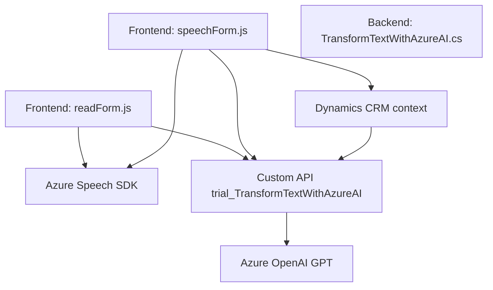

## Resumen técnico
El repositorio parece implementar una solución basada en Microsoft Dynamics CRM, enfocada en mejorar la accesibilidad del usuario y la interacción con formularios mediante entrada y salida de voz, aprovechando servicios de inteligencia artificial como Azure Speech SDK y OpenAI GPT. Además, se integran APIs personalizadas en Dynamics CRM mediante un plugin.

---

## Descripción de la arquitectura
La solución utiliza diferentes componentes:
1. En **Frontend**, los archivos `readForm.js` y `speechForm.js` proporcionan lógica para manejar formularios, realizar síntesis de voz (salida) y transcripciones de texto mediante entrada de voz.
2. En **Backend**, el archivo `TransformTextWithAzureAI.cs` define un plugin para procesar datos utilizando Azure OpenAI GPT y reglas predefinidas dentro del ecosistema de Dynamics CRM.

La arquitectura puede clasificarse como **n capas**:
- **Capa de presentación (Frontend)**: Implementada con JavaScript y Azure Speech SDK en el contexto de Dynamics CRM.
- **Capa lógica de negocio (Backend)**: Usando un plugin (`TransformTextWithAzureAI`) para la integración con APIs externas de Azure.
- **Capa de datos**: Manipulación de formularios y CRM contextualmente en Dynamics.

---

## Tecnologías usadas
1. **Frontend**:
   - **JavaScript**: Lenguaje principal de implementación.
   - **Azure Speech SDK**: Para síntesis de voz y transcripción de entrada vocal.
   - **Custom APIs**: Integradas para transformación de texto.

2. **Backend**:
   - **Microsoft Dynamics CRM SDK**: Para administración de datos y eventos en el ecosistema CRM.
   - **Azure OpenAI Service**: Procesamiento avanzado de texto usando GPT.

3. **Otros**:
   - APIs HTTP (para llamadas al servicio de Azure OpenAI).
   - Manejo de JSON con `System.Text.Json` y `Newtonsoft.Json`.

---

## Dependencias o componentes externos
1. **Azure Speech SDK**: Servicio de entrada y salida de voz (síntesis y transcripción).
2. **Azure OpenAI Service**: Procesamiento avanzado de texto con modelos GPT.
3. **Microsoft Dynamics CRM**:
   - Contexto del formulario (`formContext` y `executionContext`).
   - API personalizada para extensiones.
4. **Bibliotecas de ayuda**:
   - `System.Text.Json` y `Newtonsoft.Json` (serialización/deserialización JSON).
   - `System.Net.Http` (solicitudes HTTP desde el plugin).

---

## Diagrama Mermaid válido para GitHub

---

## Conclusión final
La solución presentada implementa una arquitectura **n capas**, donde cada capa está bien definida y estructurada para realizar su función específica. La integración de APIs de voz y procesamiento de texto inteligente aporta un alto grado de accesibilidad y usabilidad al usuario final. Las tecnologías seleccionadas, como Azure Speech SDK y Azure OpenAI, aseguran una interacción robusta, moderna y acorde a los estándares actuales de aplicaciones empresariales.