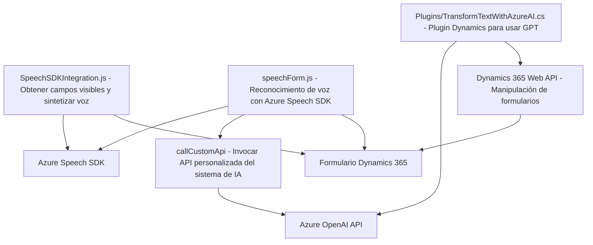

### Breve resumen técnico
El repositorio descrito implementa una solución híbrida centrada en la interacción entre sistemas externos (Azure Speech SDK y Azure OpenAI GPT), procesamiento dinámico de datos en formularios de Dynamics 365, y generación de voz y texto automatizado. Los archivos reflejan una representación modular y separada para gestionar diferentes responsabilidades como reconocimiento de voz, síntesis de voz, manipulación de formularios y transformación textual con inteligencia artificial.

---

### Descripción de arquitectura
La arquitectura es **modular con enfoque en microservicios**:
1. **Frontend**:
   - Se estructura en métodos autónomos que garantizan modularidad y separación de responsabilidades, adaptándose para trabajar con SDKs y APIs externas.
   - Uso dinámico del Azure Speech SDK.
   - Procesamiento de voz y datos (captura y manipulación).
2. **Backend (Plugins)**:
   - Los plugins de Dynamics CRM funcionan como unitarios de acción, invocando servicios externos (Azure APIs) y transformando datos.
   - **Microservicio externo**: Utiliza Azure OpenAI GPT para procesamiento específico de texto, acoplado mediante llamadas RESTful.

**Patrones de Arquitectura**:
- **Hexagonal/Ports and Adapters**: La solución utiliza APIs externas (Azure) como puertos, asegurando que estas integraciones están manejadas de manera independiente del núcleo del sistema Dynamics CRM.
- **Load-on-demand**: Carga dinámica de SDKs mejora el rendimiento y manejo de dependencias.
- **Service-Oriented Architecture (SOA)**: Segmentación que separa la lógica relacionada con voz, texto y procesamiento de formularios, apoyada por servicios externos.

---

### Tecnologías usadas
1. **Frontend**:
   - **JavaScript**, usado para el manejo de SDKs, procesamiento de datos de formularios, reconocimiento y síntesis de voz.
   - **Azure Speech SDK**: Integración para funcionalidades como síntesis y reconocimiento de voz.
2. **Backend (Plugins)**:
   - **C#**:
     - Framework: **Dynamics CRM SDK** para desarrollo de plugins.
   - **Azure OpenAI GPT**:
     - Procesamiento avanzado de texto con AI.
   - HTTP y JSON para comunicación con APIs.
   - **Newtonsoft.Json** y **System.Text.Json**: Parseo de respuestas API.
   - **Regex y LINQ** para manipulación avanzada de datos.

---

### Dependencias y componentes externos
1. **Azure Speech SDK**:
   - Gestión de síntesis y reconocimiento de voz.
   - Cargado dinámicamente desde una URL externa.
2. **Azure OpenAI GPT**:
   - API para generación y transformación de texto.
   - Admite prompts personalizados según reglas definidas por el usuario.
3. **Dynamics CRM SDK**:
   - Manipulación directa del contexto del sistema de formularios.
   - APIs para realizar operaciones CRUD en entidades de Dynamics.
4. **Dynamics Custom API**:
   - Endpoints personalizados para extender funcionalidad en Dynamics 365.
5. **HTTP y JSON Libraries**:
   - Manejadores clave para comunicación RESTful con servicios externos.

---

### Diagrama Mermaid

---

### Conclusión final
La solución descrita aprovecha capacidades avanzadas como reconocimiento y síntesis de voz, así como transformación de texto mediante inteligencia artificial, todas integradas dinámicamente en formularios de Dynamics 365. La arquitectura modular basada en microservicios asegura versatilidad y escalabilidad. Sin embargo, es necesario garantizar medidas de seguridad adecuadas para API keys y la correcta configuración del servicio Azure a fin de evitar vulnerabilidades o latencia excesiva.