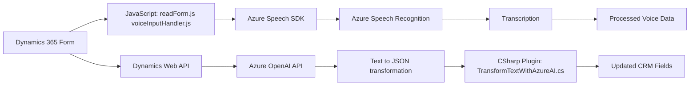

### Breve Resumen Técnico
Este repositorio es una solución modular que combina funcionalidades de frontend y backend para implementar capacidades de interacción por voz con formularios en Dynamics 365. Incorpora dos componentes principales: una integración con el **Azure Speech SDK** para habilitar reconocimiento y síntesis de voz, y un plugin en C# que utiliza **Azure OpenAI (GPT-4)** para transformar texto en objetos JSON estructurados según reglas definidas. 

Es una solución técnica orientada a usuarios que buscan usar entrada y salida de voz, junto con procesamiento avanzado de texto en aplicaciones de negocio sobre Dynamics 365.

---

### Descripción de Arquitectura
La solución usa una arquitectura híbrida con integración de elementos externos. Los módulos JavaScript en el frontend gestionan la comunicación con el usuario a través de voz en los formularios de Dynamics 365, mientras que el backend en C# está diseñado como un Plugin Pattern que conecta Dynamics CRM con el servicio Azure OpenAI. Los datos fluyen entre el frontend, el backend y los servicios en la nube (Azure Speech y Azure OpenAI), posicionando la solución bajo los principios de **event-driven** y **multicapa client-server architectures**:
- **Frontend**: Responsable de interacción directa con el usuario, manejando la entrada y salida de voz con **Azure Speech SDK** y datos de formulario en Dynamics 365.
- **Backend (Plugin)**: Procesa peticiones relacionadas con transformación de texto utilizando el servicio **Azure OpenAI** y actualiza campos de CRM con resultados procesados.

El diseño evidencia modularidad clara, uso de servicios externos (Azure Speech y OpenAI), y separación de responsabilidades (voz ↔ lógica ↔ datos).

---

### Tecnologías Usadas
1. **Frontend**:
   - **JavaScript**: Desarrollo de funciones dinámicas y asincrónicas.
   - **Azure Speech SDK**: Para síntesis y reconocimiento de voz.
   - **Dynamics 365 Web API**: Interacción directa con datos del formulario.
2. **Backend**:
   - **C#**:
     - **Microsoft.Xrm.Sdk**: Para trabajar con el contexto de Dynamics CRM.
     - **System.Net.Http**: Para realizar llamadas REST hacia Azure OpenAI.
     - **System.Text.Json** y **Newtonsoft.Json.Linq**: Manejo avanzado de JSON.
   - **Azure OpenAI (GPT-4)**: Para procesamiento y transformación avanzada de texto.
3. **Servicios Externos**:
   - **Azure Speech Service**: SDK accesible para síntesis y reconocimiento de voz.
   - **Azure OpenAI GPT-4**: Para generación de texto estructurado en formato JSON.

---

### Diagrama Mermaid **VALIDO**

---

### Conclusión Final
Esta solución utiliza una arquitectura moderna e híbrida que aprovecha servicios en la nube (Azure) y conecta tecnologías frontend (JavaScript) con backend (C#) sobre la plataforma Dynamics 365. Es un caso de uso potente para empresas interesadas en integrar entrada/salida por voz y procesamiento avanzado de texto en tiempo real. La utilización de patrones como modularidad, event-driven y servicios externos garantiza buena escalabilidad, claridad en responsabilidades y capacidad de integración futura.