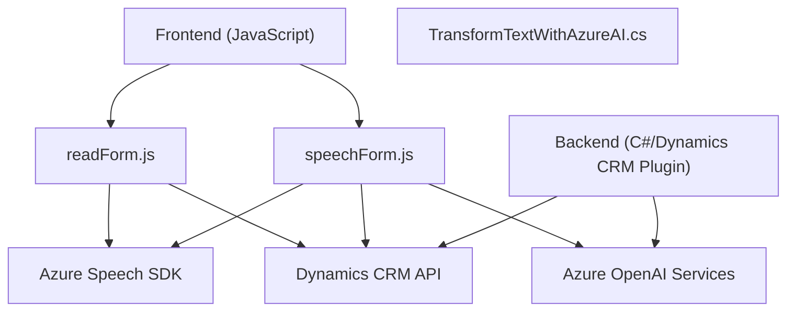

## Breve resumen técnico
El repositorio contiene una solución que integra reconocimiento y síntesis de voz basado en Azure Speech SDK y procesamiento de texto mediante Azure OpenAI dentro de Microsoft Dynamics CRM. Se compone de tres principales componentes: `readForm.js`, `speechForm.js` y `TransformTextWithAzureAI.cs`, orientados a procesar entradas de datos a través de voz y texto, integradas con funcionalidades de API externas y plugins para Dynamics CRM.

---

## Descripción de la arquitectura
La solución tiene una arquitectura híbrida basada en una combinación de patrones de **Cliente-Servicio** para la interacción con Azure Speech SDK y Azure OpenAI Services. También incluye un componente que utiliza el **patrón Plugin** de Dynamics CRM para extender la funcionalidad nativa. En términos de organización, la arquitectura está dividida en:
1. **Front-end**: Archivos JavaScript (`readForm.js` y `speechForm.js`) que procesan formularios y voz, actuando como cliente de los servicios externos.
2. **Back-end**: Plugin en `TransformTextWithAzureAI.cs`, que opera en el contexto de Dynamics CRM, utilizando servicios y configuraciones específicas.

---

## Tecnologías usadas
1. **Frontend**:
   - **JavaScript ES6**: Código modular, funciones asíncronas.
   - **Azure Speech SDK**: Implementación de síntesis y reconocimiento de voz.
   - **Dynamics CRM SDK** (`Xrm`): Interacción con la API y los formularios del sistema CRM.

2. **Backend**:
   - **C# (.NET Framework)**: Desarrollo de plugins para Dynamics CRM.
   - **Azure OpenAI Services (GPT-4)**: Transformación avanzada de texto mediante IA.
   - **Librerías auxiliares**:
     - `Newtonsoft.Json`, `System.Text.Json`: Manejo de datos JSON.
     - `System.Net.Http`: Comunicaciones HTTP/HTTPS.

3. **Otros**:
   - Eventualmente, uso de CDN para cargar dependencias como el Azure Speech SDK.

---

## Diagrama Mermaid válido para GitHub

---

## Conclusión final
La solución presentada está diseñada para maximizar la interacción entre usuarios y Microsoft Dynamics CRM mediante el uso avanzado de reconocimiento y síntesis de voz (Azure Speech SDK) y procesamiento de texto asistido por IA (Azure OpenAI Services). Su arquitectura modular y basada en la integración de API permite desplegar funcionalidades específicas sin afectar la base del sistema CRM. Las tecnologías seleccionadas son modernas y están alineadas con las prácticas recomendadas para soluciones empresariales adaptables y con capacidades de inteligencia artificial. La combinación de JavaScript y C# ofrece eficacia en los flujos de comunicación, mientras que el uso de servicios de Azure proporciona escalabilidad y robustez.