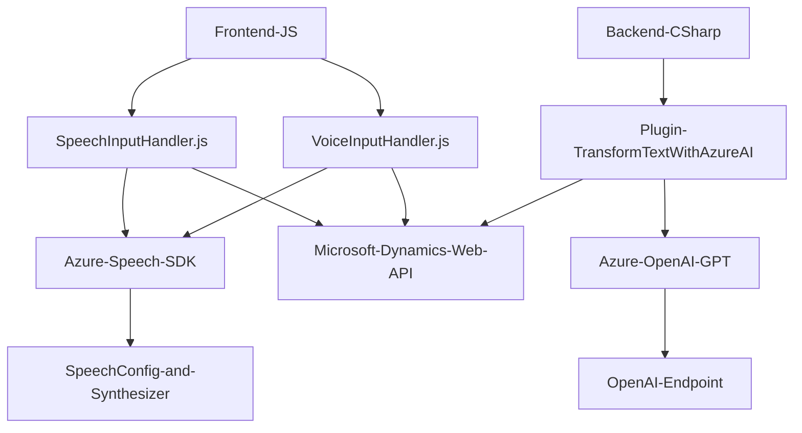

### Breve resumen técnico

El repositorio contiene tres archivos principales, cada uno contribuyendo a funcionalidades específicas centradas en la interacción de voz, procesamiento de texto mediante APIs de inteligencia artificial, y plugins para Microsoft Dynamics. Los archivos indican una solución que se integra con servicios externos como Azure Speech SDK, Azure OpenAI y Microsoft Dynamics, sugiriendo un sistema orientado a la extensibilidad y modularidad.

---

### Descripción de arquitectura

1. **Tipo de solución**: La solución combina una API externa, un frontend compacto para la interacción del usuario (formularios de entrada y salida basados en voz y texto), y un plugin para Dynamics CRM. De forma general, se trata de la integración entre un **plugin de servidor** en Dynamics, un **frontend de voz** y servicios como Azure Speech SDK y OpenAI API.

2. **Arquitectura**:
   - **Backend** (Plugin): La arquitectura del plugin es basada en **n capas** y utiliza una orientación **plugin-based** hacia Microsoft Dynamics CRM. Su objetivo principal consiste en encapsular lógica empresarial para el procesamiento del texto.
   - **Frontend**: La estructura del código del frontend sigue el patrón **modular** con funciones independientes, reutilizables y específicas que manejan entrada/salida de voz. Aplica elementos de **Service-Oriented Architecture (SOA)**, especialmente mediante cargas dinámicas del SDK de Azure Speech.
   - **Enfoque híbrido**: La solución en conjunto utiliza patrones de microservicio basado en la comunicación con servicios externos como APIs de Azure Speech y OpenAI para realizar transformaciones y procesamiento. El concepto de integración con APIs fomenta una estructura desacoplada y extensible.

---

### Tecnologías usadas

#### Lenguajes:
- **JavaScript**: Para el frontend interactivo basado en formularios y funcionalidades de síntesis de voz.
- **C#**: Para el plugin de Dynamics CRM y el procesamiento del texto mediante servicios de OpenAI.

#### Frameworks/Servicios:
- **Microsoft Dynamics CRM**: Contexto y arquitectura del plugin.
- **Azure Speech SDK**: Sintetización y reconocimiento de voz en el frontend.
- **Azure OpenAI Service**: Transformación y generación de texto mediante GPT en el backend.
- **Newtonsoft.Json**: Manejo de JSON en aplicaciones .NET.
- **System.Net.Http**: Comunicaciones HTTP para invocar APIs.

#### Patrones:
- **Carga dinámica de recursos**: SDK cargado bajo demanda en el frontend.
- **Service-Oriented Architecture (SOA)**: Dependencias externas manejadas como servicios (Azure y Dynamics).
- **Integración modular**: Reutilización de funcionalidad mediante entidades independientes en frontend y backend.

---

### Dependencias o componentes externos presentes

1. **Azure Speech SDK**:
   - Utilizado para la entrada de voz, conversión de datos en formularios a texto hablado y viceversa.
   - Componentes importantes: `SpeechSynthesizer`, `SpeechConfig`, `AudioConfig`.

2. **Azure OpenAI Service**:
   - Utilizado para transformación de texto con GPT.
   - Endpoint del servicio: `https://openai-netcore.openai.azure.com/`.

3. **Microsoft Dynamics Web API**:
   - Contexto del formulario, acceso a datos internos y entidades de CRM.

4. **Librerías internas de .NET**:
   - `Newtonsoft.Json` y `System.Text.Json`: Para manipulación y serialización JSON.
   - `System.Net.Http`: Para llamadas a servicios externos.

---

### Diagrama **Mermaid**

---

### Conclusión Final

La solución utiliza una arquitectura orientada a servicios con elementos modulares diseñados para interactuar externamente con APIs avanzadas como Azure Speech y OpenAI. Su diseño enfatiza la reutilización y permite una integración fluida con Microsoft Dynamics CRM e interfaces accesibles basadas en voz. Sin embargo, en el área de seguridad, se recomienda eliminar cualquier instancia de claves API embebidas en el código fuente, refactorizando para utilizar configuraciones seguras (por ejemplo, secretos almacenados en variables de entorno).