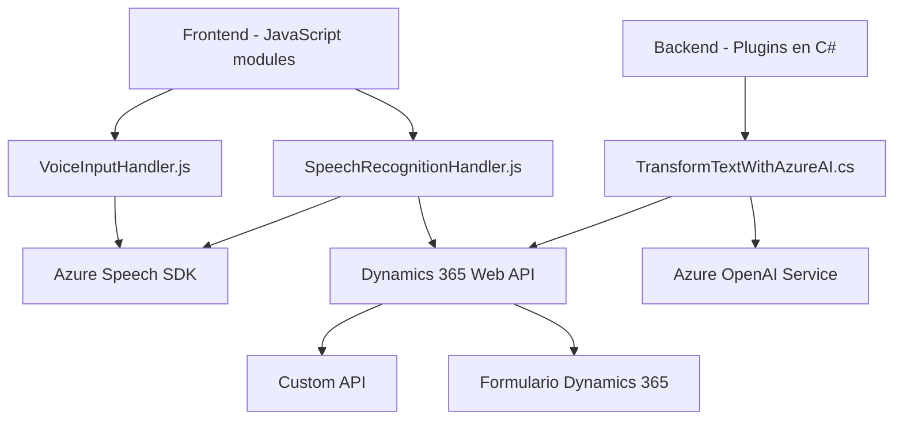

### Resumen Técnico

El repositorio presenta una solución mixta con implementación de frontend, APIs y plugins para Dynamics CRM, que utiliza servicios externos como Azure Speech SDK y Azure OpenAI para procesamiento de datos y texto con inteligencia artificial. Está diseñado para interactuar con formularios, manejar transcripciones de voz y realizar transformaciones avanzadas de texto con soporte de IA.

---

### Descripción de Arquitectura

La arquitectura está distribuida y se fundamenta en patrones como modularidad y eventos. Utiliza una combinación de:
1. **Componentes de frontend** (JavaScript) para iteración con usuarios en formularios y manejo de entrada/salida de voz.
2. **Plugins para Dynamics CRM** en C# que extienden la lógica interna del sistema con procesamiento adicional mediante servicios de terceros.
3. **SDK y API externas** para reconocimiento de voz, transcripción y transformación de texto.

Los módulos presentan una separación clara de responsabilidades, un enfoque basado en eventos y una fuerte integración con servicios externos.

---

### Tecnologías Usadas

1. **Frontend (JavaScript):**
   - Secuencias de comandos modularizadas para formularios.
   - Azure Speech SDK para reconocimiento y síntesis de voz.
   - Dynamics 365 Web API: Manejo de CRUD para datos de formularios.

2. **Backend y Plugins (C#):**
   - Microsoft Dynamics CRM SDK para implementar extensiones personalizadas.
   - Azure OpenAI API para procesamiento y transformación de texto.
   - Uso de HTTP Client para peticiones REST a servicios externos.
   - Librerías como Newtonsoft.Json para manejo de datos JSON.

---

### Diagrama Mermaid (100 % compatible con GitHub Markdown)

---

### Conclusión Final

Este repositorio es parte de una solución híbrida que combina herramientas de frontend (JavaScript) y extensiones backend (plugins en C#) para integrar funcionalidades de Microsoft Dynamics 365 con servicios avanzados de inteligencia artificial y síntesis/reconocimiento de voz mediante Azure Speech SDK y OpenAI API. La arquitectura emplea separación de responsabilidades y una fuerte dependencia de servicios externos para funciones específicas, como el procesamiento de texto. Aunque los componentes están bien estructurados, es crucial garantizar seguridad y escalabilidad, sobre todo para las interacciones con servicios externos que manejan datos sensibles y claves de acceso.