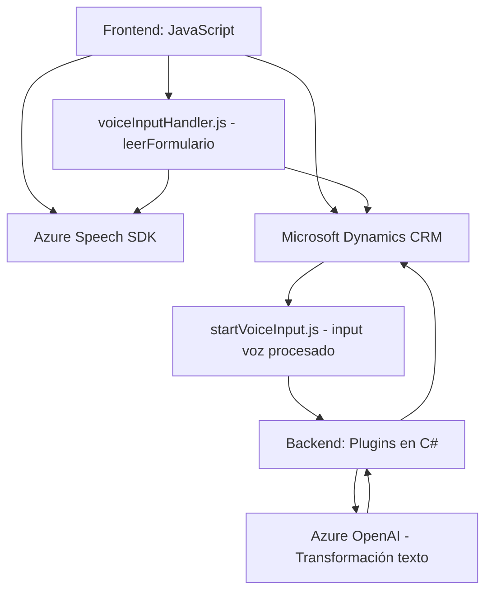

# Análisis Técnico del Repositorio

## Breve Resumen Técnico
Este repositorio contiene una solución que integra funcionalidades avanzadas de reconocimiento de voz y procesamiento de texto, diseñada para operar en un entorno centrado en formularios de Microsoft Dynamics CRM. La lógica se distribuye en diferentes capas: frontend (para capturar entrada de datos y realizar síntesis de voz), backend (plugins y API para integrar servicios de transformación de datos), y servicios externos como Azure Speech SDK y Azure OpenAI.

---

## Descripción de Arquitectura
La arquitectura de esta solución parece estar basada en el patrón **arquitectura multicapa (n-tier)**, distribuyendo la lógica en tres capas principales:
1. **Frontend:** Scripts JS para interacción con los usuarios a través de la interfaz del CRM, permitiendo entrada de datos y síntesis de voz.
2. **Backend:** Un plugin para Microsoft Dynamics CRM que utiliza Azure OpenAI para el procesamiento de datos.
3. **Servicios externos:** Uso intensivo de servicios en la nube para reconocimiento y síntesis de voz (Azure Speech SDK) y para la transformación de texto en JSON estructurado (Azure OpenAI API).

Además, se puede observar que existe integración a nivel microservicio, ya que aquellas funcionalidades más específicas (reconocimiento de voz, IA para texto estructurado) están delegadas a servicios externos, lo que refuerza un diseño descentralizado.

---

## Tecnologías Utilizadas
1. **Tecnologías y frameworks**:
   - **Frontend:** JavaScript con interacciones específicas en entornos Microsoft Dynamics CRM.
   - **Backend:** Plugins desarrollados en C# para Dynamics CRM integrados con servicios REST y APIs externas.
   - **Servicios en la nube:**
     - Azure Speech SDK para síntesis de voz.
     - Azure OpenAI para transformación de texto a JSON estructurado.
   - **Otros:** Uso de librerías como `Newtonsoft.Json` para la manipulación de datos JSON.

2. **Patrones utilizados:**
   - **Event-driven architecture:** Reconocimiento de voz y síntesis basados en eventos y callbacks.
   - **Façade:** Funciones encapsuladas para gestionar peticiones a Azure OpenAI.
   - **Singleton:** Objetos globales compartidos para acciones recurrentes.
   - **Desacoplamiento funcional:** Separación de responsabilidades entre frontend, backend y servicios externos para facilitar mantenibilidad.

---

## Dependencias o Componentes Externos
1. **Azure Speech SDK:** Para reconocimiento y síntesis de voz.
2. **Azure OpenAI Service:** Transformación de texto hablado a texto JSON estructurado mediante modelos GPT.
3. **Microsoft Dynamics CRM API:** Para la integración y actualización de formularios en el contexto del CRM.
4. **Librerías adicionales (Backend):**
   - `Newtonsoft.Json` para manipulación de datos JSON.
   - `System.Net.Http` para la comunicación con servicios REST.
   - `System.Text.Json` para serialización/deserialización.

---

## Diagrama **Mermaid** (100 % compatible con GitHub Markdown)

---

## Conclusión Final
La solución presentada es una combinación de arquitectura **multicapa** y **microservicios predominantemente orientados a eventos**, diseñada para funcionar con entornos empresariales centrados en Microsoft Dynamics CRM. Ofrece capacidades avanzadas de reconocimiento de voz y transformación textual usando servicios de Azure Speech SDK y OpenAI, garantizando alta efectividad en tareas de interacción con usuarios y procesamiento inteligente de datos.

Aunque la estructura parece sólida, sería recomendable revisar aspectos de seguridad, como la correcta gestión de las claves API, y plantear un diseño que optimice el manejo dinámico de configuraciones externas. A largo plazo, la solución podría ser fácilmente escalable al estar integrada con servicios cloud basados en APIs.