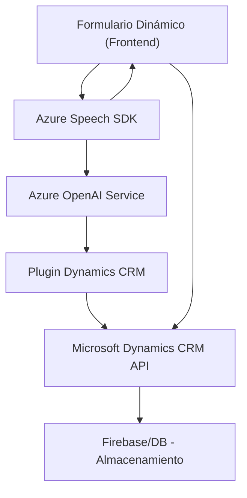

### Breve resumen técnico
El análisis de los archivos muestra un sistema que combina frontend (JavaScript), un plugin en C# para Dynamics CRM, y servicios externos (Azure Speech SDK y Azure OpenAI). El propósito principal es automatizar la interacción con formularios dinámicos mediante la entrada por voz y aprovechar inteligencia artificial de Azure para transformar datos relevantes.

---

### Descripción de arquitectura
#### Tipo de solución:
La solución consta de una **integración entre frontend y backend** con servicios externos. Está diseñado para trabajar en contexto de un ambiente como **Microsoft Dynamics CRM**. Utiliza tecnología en el cliente (frontend) para capturar datos de voz y procesarlos, mientras que el backend utiliza un **plugin orientado a eventos**, que realiza transformaciones avanzadas de texto basadas en IA con Azure OpenAI.

#### Tipo de arquitectura:
Se observa la implementación de una **arquitectura modular en n capas** que emplea:
1. **Frontend**: Encargado de la interacción con el usuario, captura de datos y mapeo a formularios mediante la Azure Speech SDK.
2. **Plugin (backend)**: Implementa la lógica personalizada usando arquitectura basada en eventos de Dynamics CRM y delega procesamiento textual con Azure OpenAI.
3. **Servicios externos**: Comunicación con servicios de Azure para reconocimiento y síntesis de voz, además de procesamiento IA.
   
Esta arquitectura podría considerarse **semihexagonal** en el backend por depender de servicios externos para la entrada y procesamiento. En cambio, el frontend está más cerca de un diseño **n capas**, con modularidad en sus funciones principales y auxiliares.

---

### Tecnologías usadas
1. **Frontend**:
   - **Lenguaje**: JavaScript.
   - **Framework/SDK**: Azure Speech SDK (para síntesis de voz y reconocimiento).
   - **APIs**: Interacción con APIs de Dynamic CRM (Xrm.WebApi).
   
2. **Plugin (backend)**:
   - **Lenguaje**: C#.
   - **Frameworks de Dynamics CRM**: `IPlugin`, `IOrganizationService`.
   - **Servicios de terceros**: Azure OpenAI (para transformación avanzada de texto).

3. **Servicios externos**:
   - Azure Speech SDK (gestión de interacción de audio).
   - Azure OpenAI Service (transformación textual con IA).
   
---

### Dependencias o componentes externos
1. **Azure Speech SDK**:
   - Para la síntesis y reconocimiento de voz.
   - Cargado dinámicamente desde su recurso en la nube.
  
2. **Azure OpenAI Service**:
   - Para transformar texto en datos estructurados como JSON.
   - Interacción mediante solicitudes HTTP POST.

3. **Microsoft Dynamics CRM API**:
   - Xrm.WebApi para realizar búsquedas y actualización de campos.
   - Plugin backend que interactúa directamente con el contexto CRM.

4. **Bibliotecas .NET**:
   - `Newtonsoft.Json`: Manipulación de JSON en C#.
   - `HttpClient`: Para realizar llamadas HTTP al endpoint de Azure.

---

### Diagrama **Mermaid**

---

### Conclusión final
La solución presentada es una integración de frontend (JS) y backend (C# Plugin en Dynamics CRM) con un ecosistema de servicios externos, concretamente los ofrecidos por Azure. La arquitectura evidencia un enfoque modular y distribuido con elementos de **n capas y servicios externos** como Azure Speech SDK y Azure OpenAI para el procesamiento de voz en texto y transformación avanzada. Este diseño es adecuado para sistemas basados en CRM con necesidades de extensión de funcionalidades. 

Sin embargo, la arquitectura puede ser más robusta mediante la adopción explícita de patrones como **hexagonal** o **event-driven architecture**, mejorando desacoplamientos y escalabilidad.