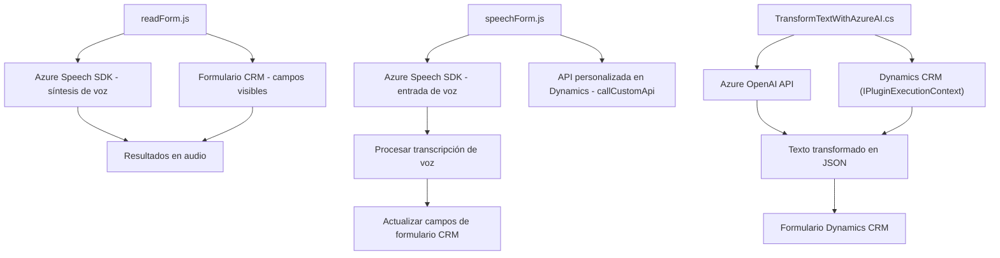

# Análisis Técnico

## Breve Resumen Técnico

Este repositorio incluye archivos con implementación y dependencia de servicios externos (principalmente Azure Speech SDK y Azure OpenAI API) para interactuar con Dynamics 365 CRM. Ofrece funcionalidades orientadas al reconocimiento de voz y síntesis, así como procesamiento y manipulación de datos dinámicos en formularios CRM. Está diseñado para mejorar la interacción y accesibilidad de usuarios en entornos empresariales gestionados por Microsoft Dynamics CRM.

## Descripción de Arquitectura

La solución sigue principalmente una arquitectura **n-capas** combinada con características propias de microservicios y procesamiento modular. Las capas principales identificadas son las siguientes:
1. **Frontend**: Archivos JavaScript como `readForm.js` y `speechForm.js` gestionan la interacción directa con formularios, tanto para la entrada como salida de voz.
2. **Plugin Back-End**: Los plugins (como `TransformTextWithAzureAI.cs`) amplían la funcionalidad de Dynamics CRM, ejecutándose en su ecosistema.
3. **Servicios Externos (API)**: Arquitectura basada en la integración con Azure Speech SDK y Azure OpenAI API, comunicándose mediante HTTP y REST para procesamiento de voz y texto.

El diseño combina modularización y uso de servicios externos para garantizar:
- Escalabilidad: Capacidad de incorporar más funcionalidades en el mismo ecosistema.
- Mantenimiento: Código organizado y modular.
- Reutilización: Métodos y clases independientes permiten reutilización en múltiples casos.

### Arquitectura Identificada
- **Principal:** n-capas.
- **Complementaria:** Microservicios (integraciones Azure SDK/API).
- **Patrones destacados:** Event-Driven Programming, API Gateway, Plugin-Based Architecture.

## Tecnologías, Frameworks y Patrones Usados
### Tecnologías
1. **Azure Speech SDK:**
   - Reconocimiento y síntesis de voz.
   - Dependencia cargada dinámicamente desde URL específica.
2. **Azure OpenAI API:**
   - Transformación de texto y procesamiento avanzado en formato JSON.
   - Integración basada en REST.
3. **Dynamics 365 CRM SDK (para plugins):**
   - Gestión de formularios y entidades CRM.
   - Interfaces como `IPluginExecutionContext`.
4. **JavaScript:**
   - Gestiona eventos y manipula formularios mediante archivos como `readForm.js`.
5. **C# (.NET):**
   - Implementa lógica de servidor para plugins en Dynamics CRM.
   - Utiliza librerías como `Newtonsoft.Json.Linq` y `System.Net.Http`.

### Patrones Observados
1. **Modularización:** Cada archivo define funciones o clases independientes con responsabilidades específicas.
2. **Event-driven programming:** Métodos de reconocimiento y síntesis de voz están desencadenados por eventos.
3. **Plugin-based Architecture:** Personalización del backend mediante la interfaz `IPlugin`.
4. **Asynchronous Callback:** Uso de SDK y APIs externas con gestión de respuestas asíncronas.

## Dependencias o Componentes Externos
1. **Azure Speech SDK**
   - URL: `https://aka.ms/csspeech/jsbrowserpackageraw`.
   - Servicios utilizados:
     - Reconocimiento de voz (entrada).
     - Síntesis de voz (salida).
2. **Azure OpenAI API**
   - Endpoint: `https://openai-netcore.openai.azure.com`.
   - Servicio para transformación y procesamiento de texto en formato JSON.
3. **Dynamics 365 CRM SDK**
   - Proporciona acceso a formularios, atributos y APIs personalizadas.
4. **Librerías de manipulación JSON:**
   - `Newtonsoft.Json.Linq`, `System.Text.Json`.

## Diagrama Mermaid

## Conclusión Final

La solución es una integración avanzada entre tecnologías cloud (Azure) y Dynamics CRM para mejorar la interacción del usuario. Se distingue por modularización, integración API eficiente y enfoque en accesibilidad mediante voz. El diseño arquitectónico de **n-capas** es complementado por microservicios externos (Azure) y plugins que extienden CRM, creando una solución escalable y moderna para empresas que buscan optimizar procesos rutinarios.