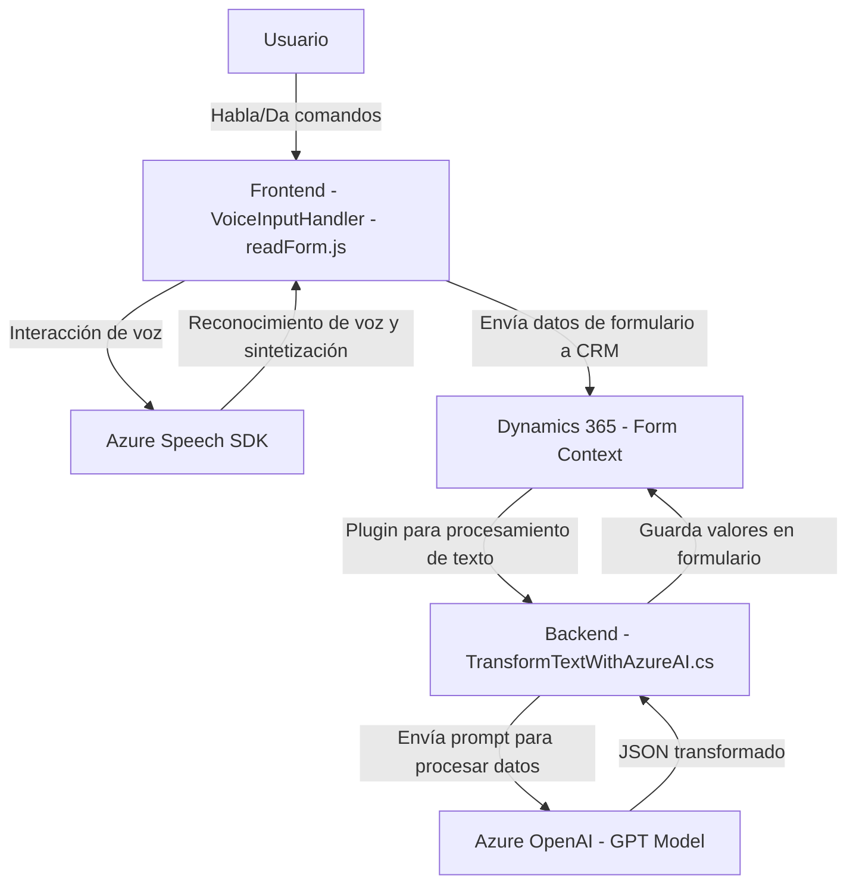

### Breve Resumen Técnico
El repositorio se compone de múltiples archivos que, en conjunto, implementan funcionalidades relacionadas con la integración entre formularios, reconocimiento de voz y sistemas cognitivos de Azure. Los elementos incluyen componentes frontend con JavaScript y un plugin backend en C# para Dynamics CRM. Se utiliza el servicio Azure Speech SDK para operar reconocimiento y síntesis de voz, y Azure OpenAI para la transformación de texto en JSON estructurado.

---

### Descripción de Arquitectura
La solución adopta un diseño **modular cliente-servidor**. Desde el frontend, permite captar y procesar voz mediante la interacción directa con Azure Speech SDK para capturar datos y enviarlos a formularios dinámicos de Dynamics CRM. En el backend, el plugin que utiliza Dynamics CRM se comunica con Azure OpenAI para transformar datos de texto en estructuras JSON.

La arquitectura predominante parece ser de **n capas**:
1. **Capa de presentación (Frontend)**: Implementación con JavaScript para capturar y procesar voz en formularios.
2. **Capa de lógica de negocio (Backend plugin)**: Plugin implementado en C# que gestiona la transformación de datos mediante Azure OpenAI.
3. **Capa de servicios externos**: Integración con Azure Speech SDK y Azure OpenAI.

El sistema no utiliza un enfoque completamente desacoplado como el diseño hexagonal, sino que sigue siendo dependiente directamente de tecnologías de Microsoft.

---

### Tecnologías Usadas
1. **Frontend:**
   - **JavaScript:** Funcionalidades para procesamiento de voz y manipulación de formularios.
   - **Azure Speech SDK:** Reconocimiento y síntesis de voz.
   - **APIs de Microsoft Dynamics 365 (`Xrm.WebApi`)**: Integración con los formularios CRM.

2. **Backend:**
   - **C#:** Desarrolla un plugin para Dynamics CRM.
   - **Microsoft.Xrm.Sdk:** Librerías para el desarrollo de plugins en Dynamics CRM.
   - **Azure OpenAI:** API para transformación de texto.
   - **JSON:** Intercambio de datos estructurados (mediante `System.Text.Json` y `Newtonsoft.Json.Linq`).

3. **Servicios Externos:**
   - Azure OpenAI: Generación y transformación del texto a través de los modelos GPT.
   - Azure Speech SDK: Reconocimiento y síntesis de voz en tiempo real.

---

### Diagrama Mermaid

A continuación se muestra un diagrama que ilustra cómo los distintos componentes del sistema interactúan entre sí:

---

### Conclusión Final
Esta solución es una integración robusta entre frontend y backend utilizando servicios en la nube de Azure. El diseño respeta los principios de modularidad, facilitando la colaboración de los distintos componentes. Sin embargo, dado que existe una fuerte dependencia de tecnologías de Microsoft (como Dynamics 365 y Azure), la arquitectura no es completamente independiente.

La solución se inclina hacia una arquitectura **n capas**, y utiliza patrones como "Facade" en el frontend para facilitar la interacción de diferentes procesos. También implementa un patrón basado en eventos y callbacks para cargar los SDKs necesarios dinámicamente.

Este diseño es adecuado para sistemas empresariales que necesitan una integración directa entre la capa cliente y servicios de nube como Azure. Sin embargo, para escalar o desacoplar aún más los componentes, podría ser útil una migración futura hacia un diseño de microservicios o arquitectura hexagonal.