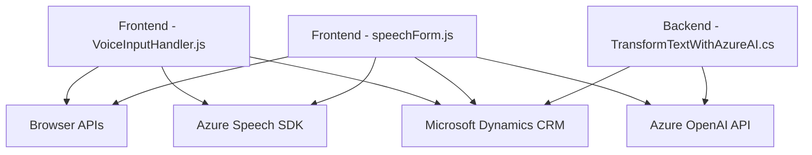

### Breve resumen técnico

El repositorio parece estar diseñado para ser parte de una solución orientada a **Microsoft Dynamics CRM**, añadiendo funcionalidades avanzadas de voz y procesamiento de texto mediante integraciones con **Azure Speech SDK** y **Azure OpenAI API**. Contiene scripts de JavaScript para la manipulación de formularios utilizando SDKs y un plugin en .NET para interaccionar con Dynamics y Azure OpenAI.

---

### Descripción de arquitectura

La solución se organiza en distintos componentes que combinan:
1. **Frontend (JavaScript)**:
   - Manipulación de formularios y síntesis de texto a voz.
   - Integración con Azure Speech SDK para entrada y salida de voz.
   - Modularización estricta con funciones que separan lógicas de captura, procesamiento y actualización de datos en Dynamics CRM.

2. **Plugin (Backend .NET)**:
   - Procesamiento de texto usando Azure OpenAI.
   - Arquitectura basada en servicios para consumir APIs externas desde Dynamics CRM, transformando texto con reglas definidas.

#### **Arquitectura general:**
La arquitectura tiene características híbridas:
- **Arquitectura basada en n capas**:
  - Presentación (manipulación del DOM en JavaScript y entrada/salida de voz).
  - Negocio (procesamiento avanzado en el plugin y funciones de actualización de datos).
  - Datos (interacción directa con Dynamics CRM).
- **Microservicios externos**:
  - Utilización de APIs de Azure (Speech SDK y OpenAI).
- **Modularización fuertemente definida**:
  - Separación de responsabilidades por componentes concretos.

---

### Tecnologías usadas
1. **Lenguajes y frameworks**:
   - JavaScript: Funciones frontend para manejo de formularios y síntesis de voz.
   - C#: Desarrollo backend del plugin para Dynamics CRM.
   
2. **Servicios de Microsoft Azure**:
   - **Azure Speech SDK**: Captura y síntesis de voz.
   - **Azure OpenAI API**: Procesamiento y transformación avanzada de texto.

3. **Dependencias y librerías**:
   - `Newtonsoft.Json.Linq`: Manipulación avanzada de JSON en C#.
   - `System.Net.Http`: Consumo de servicios REST.
   - `System.Text.Json`: Para serialización moderna en C#.
   - **Web APIs**: Manipulación del DOM y carga dinámica de scripts.

---

### Diagrama Mermaid

---

### Conclusión final

La solución combina funcionalidades modernas para extender las capacidades estándar de **Microsoft Dynamics CRM**, utilizando servicios de Microsoft Azure para brindar una experiencia enriquecida de interacción basada en voz y procesamiento de texto. Su arquitectura es modular y sigue principios de **n capas**, incorporando microservicios externos que se integran con APIs y SDKs. Esto hace que el sistema sea flexible, escalable y fácil de consumir por el entorno CRM, aunque se deben tomar medidas de seguridad para manejar correctamente las credenciales de los servicios Azure.