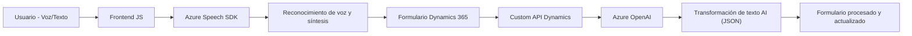

### Breve Resumen Técnico
Este repositorio implementa una solución distribuida para formularios con captura y procesamiento de voz y texto dentro de Dynamics 365. Su funcionalidad está centrada en la interacción del usuario mediante voice-to-text y text-to-AI, integrándose con servicios externos como Azure Speech SDK y Azure OpenAI. La arquitectura incluye múltiples componentes: frontend (procesamiento de formularios y voz), integración API de Dynamics 365, y un backend basado en plugins.

---

### Descripción de Arquitectura
La solución evidencia una arquitectura **multi-capa con integración de microservicios**. Los principales componentes están organizados de la siguiente manera:
1. **Frontend:** 
   - Procesa formularios en Dynamics 365 utilizando Azure Speech SDK para capturar comandos de voz y síntesis de audio.
   - Implementa lógica de cliente modular con interacción directa a través de formularios y voz.
2. **Backend (Plugins):**
   - Un plugin basado en Dynamics CRM intercepta eventos y utiliza Azure OpenAI para transformar el texto en estructuras JSON específicas.
   - El diseño usa **Service-Oriented Architecture (SOA)** para conectarse con APIs externas.

La solución exhibe características de **n capas**:
- **Presentación:** JS para formularios en Dynamics.
- **Lógica de Negocio:** Plugins como puntos de extensión de Dynamics.
- **Persistencia:** CRUD de formularios y entidades dinámicas.

Además, mediante la integración de plataformas como Azure Speech y OpenAI, incluye principios de **microservicios** y **external SDK adaptability**.

---

### Tecnologías Usadas
1. **Frontend:**
   - **JavaScript**: Logística de formularios en Dynamics 365.
   - **Azure Speech SDK**: Captura y síntesis de voz.
   - **Asynchronous Patterns**: Manejo dinámico de SDK y flujos UI.
2. **Backend:**
   - **C#**: Desarrollo de plugins del CRM Dynamics.
   - **Azure OpenAI (GPT-4)**: IA para transformación de texto.
   - **Microsoft Dynamics SDK (`Microsoft.Xrm.Sdk`)**: Extensión de procesos comerciales.
3. **General/Frameworks:**
   - **.NET Framework**: Plataforma para plugins.
   - **System.Net.Http**: Conexión HTTP externa.
   - **Newtonsoft.Json**: Manipulación JSON avanzada.

---

### Dependencias o Componentes Externos Presentes
- **Azure Speech SDK:** Captura y síntesis de voz.
- **Azure OpenAI:** Procesamiento y transformación de texto mediante IA.
- **Dynamics CRM SDK (`Xrm.WebApi`)**: Interacción con datos del sistema.
- **JSON Libraries:**
  - `Newtonsoft.Json` y `System.Text.Json` para manipulación de objetos JSON.
- **HTTP Requests:** Directamente al endpoint de Azure OpenAI para servicio externo.

---

### Diagrama Mermaid (**GitHub Markdown Compatible**)

---

### Conclusión Final
La solución presentada en el repositorio aplica estructuras **n capas** con patrones de integración eficaces gracias al uso de APIs externas (Azure Speech y OpenAI). Usando un diseño modular y dependencias desacopladas, facilita la extensibilidad y mejoras futuras. La arquitectura está orientada a soportar aplicaciones complejas de interacción usuario-formulario con un enfoque inteligente.