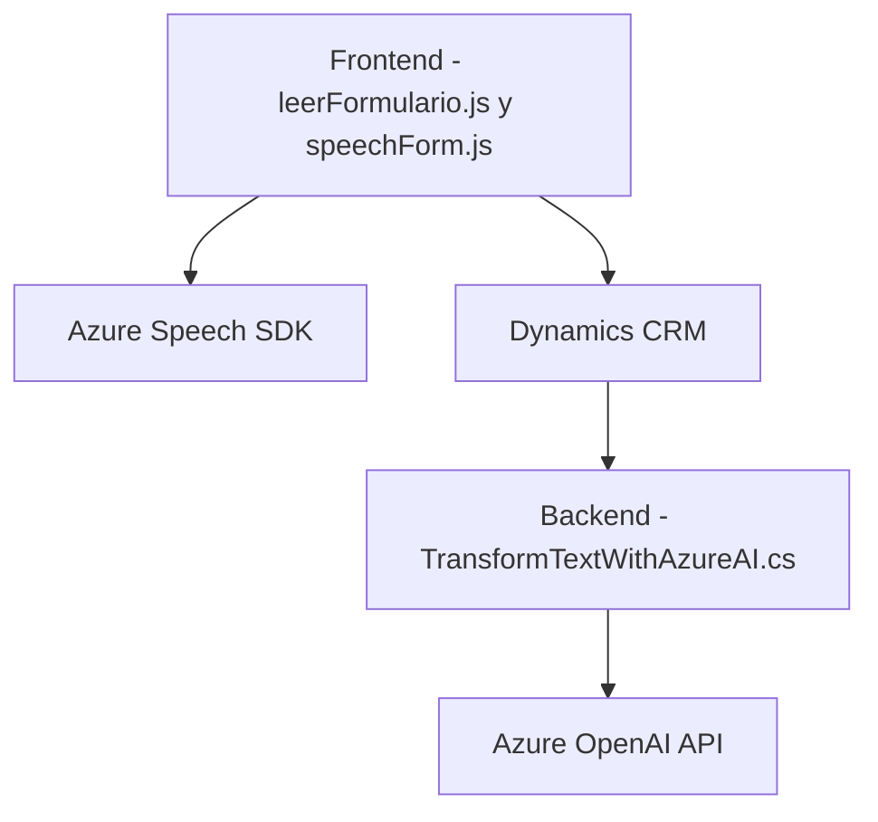

### Breve resumen técnico

El repositorio contiene scripts y plugins diseñados para interactuar con formularios en Dynamics CRM, utilizando tecnologías y servicios externos como Azure Speech SDK y Azure OpenAI. Su objetivo principal es optimizar la interacción entre los usuarios y el sistema CRM, utilizando entradas de voz, síntesis de texto a voz, reconocimiento de voz, y procesamiento de texto con inteligencia artificial. Esta solución mezcla lado cliente (frontend JavaScript) y backend (plugin .NET), lo que amplía su alcance funcional.

---

### Descripción de arquitectura

La arquitectura detectada se corresponde con una implementación de **n-capas** y **orientación a servicios**. Presenta:
1. **Capa de presentación**: Scripts en frontend (`readForm.js`, `speechForm.js`) que interactúan directamente con el usuario y los datos del formulario.
2. **Capa de negocio**: Plugins en backend (`TransformTextWithAzureAI.cs`) que ejecutan lógica de negocio avanzada, incluyendo la interacción con APIs externas.
3. **Capa de integración**: Interacción con servicios de Microsoft Dynamics CRM y Azure de forma modular y desacoplada.

El uso de **SDK dinámico**, patrones de carga única y modularidad en el código refuerzan la orientación a servicios.

---

### Tecnologías usadas

1. **Frontend**:
   - **JavaScript**: Uso extensivo de funciones y módulos para manipulación del DOM y comunicación con APIs.
   - **Azure Speech SDK**: Reconocimiento de voz y síntesis de texto a voz.
   - **Dynamics CRM APIs (`Xrm.WebApi`)**: Integración directa con datos y servicios del sistema CRM.

2. **Backend**:
   - **C# (.NET Framework)**: Desarrollo de plugins para Dynamics CRM.
   - **Azure OpenAI APIs**: Transformación avanzada de texto en JSON mediante AI.
   - **HTTP Client Libraries**: Para integrar servicios externos.

3. **Dependencias notables**:
   - Microsoft Dynamics CRM SDK.
   - Azure AI Services (Speech y OpenAI).
   - Librerías de JSON (`Newtonsoft.Json.Linq`, `System.Text.Json`).

---

### Diagrama Mermaid válido para GitHub

A continuación, se presenta un diagrama que combina las distintas capas y flujos de interacción:

---

### Conclusión final

El repositorio representa una solución híbrida que combina **procesos avanzados de voz**, **inteligencia artificial** y **automatización de formularios**, orientada a mejorar la eficiencia del uso de Dynamics CRM. La arquitectura n-capas permite una clara separación de responsabilidades y facilita futuras extensiones. La integración con servicios de Azure asegura robustez y escalabilidad a través de herramientas modernas.