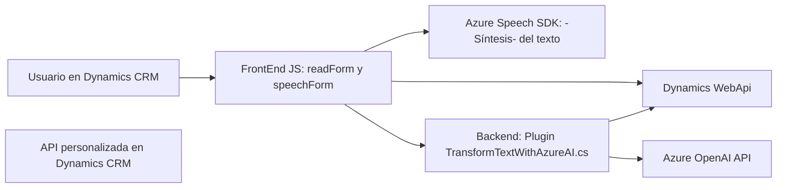

### Breve resumen técnico
Este repositorio contiene funcionalidades orientadas a integrar servicios de inteligencia y reconocimiento de voz mediante el Azure Speech SDK y Azure OpenAI en un entorno CRM. Los archivos son diseñados para conectarse a Dynamics 365 y procesar información desde formularios, aprovechando la inteligencia artificial tanto para sintetizar voz como para estructurar datos textuales.

---

### Descripción de arquitectura
La arquitectura general del proyecto parece ser una **modular en n capas**:
1. **Frontend**: Archivos basados en JavaScript que interactúan con contextos de formularios convencionales (Dynamics 365) y servicios externos como “Azure Speech SDK” y “Web API”. Esta capa forma parte del cliente basado en navegador para los usuarios del sistema.
2. **Backend**: Probablemente basado en el ecosistema de Microsoft Dynamics CRM, el código incluye la creación de plugins del lado servidor que interactúan con Azure OpenAI y CRM APIs para realizar transformaciones de texto.

Los diversos módulos del proyecto están organizados por función: manejo de entrada de voz, síntesis de texto a voz y procesamiento estructural de texto con inteligencia artificial.

---

### Tecnologías, frameworks y patrones usados
1. **Tecnologías y Frameworks**:
   - **Frontend**:
     - Core: JavaScript.
     - SDK: Azure Speech SDK (https://aka.ms/csspeech/jsbrowserpackageraw).
     - Dynamics 365 Framework (manejo de formularios y atributos, e.g., `formContext`).
   - **Backend**:
     - Microsoft Dynamics CRM SDK: Para el desarrollo de plugins y manejo de entidades.
     - Azure OpenAI API y Azure Speech SDK para servicios de inteligencia artificial.
     - Librerías auxiliares en .NET: `Newtonsoft Json`, `System.Net.Http`, `System.Linq`.

2. **Patrones**:
   - Modularidad funcional: Las responsabilidades del código se dividen en funciones y clases específicas con una clara separación de lógica.
   - Plugin Pattern: Seguido por los plugins (`TransformTextWithAzureAI.cs`) diseñados para extender el comportamiento de Dynamics CRM.
   - Integration Patterns: Uso de APIs como Azure Speech y OpenAI para conectividad y funcionalidades externas.
   - Dependency Injection: Aplicado en el plugin para el manejo de servicios.

---

### Dependencias o componentes externos
La solución está diseñada en función de:
1. **Dependencias del Frontend**:
   - Azure Speech SDK: Para entrada de voz y síntesis.
   - Servidor web con capacidad de alojar el JavaScript (probablemente bajo Dynamics 365).
   - APIs personalizadas del CRM (Dynamics WebApi).

2. **Dependencias del Backend**:
   - Dynamics CRM SDK: Para la validación y manipulación de datos en el servidor.
   - Azure OpenAI API: Para procesamiento de texto avanzado.
   - JSON Manipulation Libraries (`Newtonsoft.Json.Linq`, `System.Text.Json`).

3. **Ecosistema Microsoft**:
   - Microsoft Azure y sus servicios (Speech y OpenAI).
   - Dynamics 365 como plataforma principal.

---

### Diagrama Mermaid

---

### Conclusión final
Este repositorio implementa una solución basada en tecnologías de Microsoft para optimizar la interacción mediante reconocimiento de voz y procesamiento inteligente con IA dentro del ecosistema Dynamics CRM. La arquitectura modular con separación de capas permite una integración bien encapsulada de servicios externos, como Azure Speech SDK y OpenAI, además de aprovechar herramientas nativas del CRM para la gestión de formularios y datos.