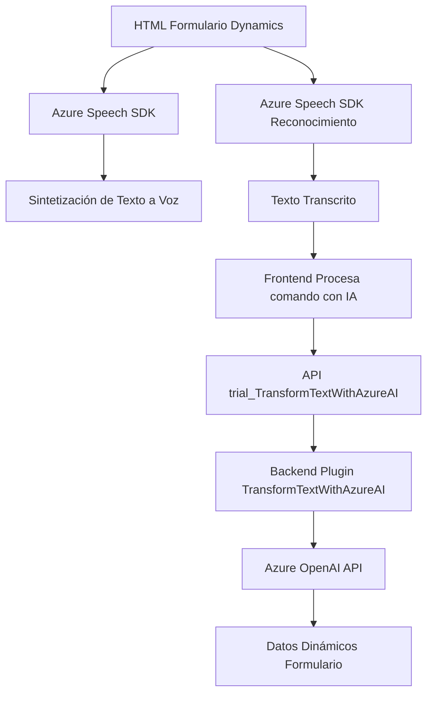

### Breve resumen técnico

El repositorio parece estar orientado a integrar funcionalidades de voz y procesamiento de texto con formulaciones específicas en un entorno de Dynamics 365. Sus principales objetivos son la síntesis y reconocimiento de voz (mediante Azure Speech SDK) y el procesamiento avanzado de texto usando la API de Azure OpenAI. La solución está compuesta por un frontend en JavaScript y plugins (.NET) para Dynamics 365.

### Descripción de arquitectura

La arquitectura general del repositorio combina una aplicación cliente (frontend) basada en JavaScript y un plugin backend para Dynamics CRM realizado en C#. Es un diseño de **arquitectura en capas**:  
1. **Capa de interfase de usuario:** Interacción con formularios/usuarios en el navegador (JavaScript).  
2. **Capa de lógica de negocio:** Plugins que procesan texto transcrito o enviado directamente desde Dynamics CRM.  
3. **Capa de comunicación externa:** Integraciones mediante SDKs o API REST con Azure Speech y Azure OpenAI para análisis de datos y síntesis de voz.

Se identifica además un uso de patrones como el **Repository Pattern** en la relación de datos entre campos visibles y su representación interna en la base de datos de formularios. Los plugins de Dynamics siguen un diseño básico basado en eventos que ejecutan acciones según configuraciones específicas.

### Tecnologías usadas

1. **Frontend:**
   - **JavaScript (Vanilla):** Implementación de funciones para interacción con formularios.
   - **Azure Speech SDK:** Sintetización y reconocimiento de voz.
   - **DOM APIs:** Manipulación de HTML y carga dinámica de scripts.

2. **Backend:**
   - **C# (.NET Framework):** Plugins para Dynamics CRM.
   - **Dynamics 365 SDK:** Extensión de formularios y entidades.
   - **Azure OpenAI API:** Traducción y transformación avanzada de texto usando GPT.

3. **Servicios externos:**
   - **Azure:** Speech SDK, OpenAI API, y posiblemente Active Directory integrado.
   - **Dynamics 365 Web API:** Para manipulación de datos del ERP/CRM.

### Dependencias y componentes externos

1. **Azure Speech SDK:** Para reconocimiento de voz y síntesis de texto a voz en frontend.  
2. **Dynamics 365 Web API:** Consume información y servicios desde formularios.  
3. **Azure OpenAI API:** Generación de JSON estructurado y análisis de texto.  
4. **Librerías de .NET (.NET Framework):** Manejo de HTTP (HttpClient), JSON (Newtonsoft.Json), y regular expression tools.  
5. **HTML DOM:** Para manipulación directa de formularios y elementos mediante JavaScript.

---

### Diagrama Mermaid (100 % compatible)

---

### Conclusión final

Este repositorio está orientado a extender las capacidades de Dynamics 365 mediante una integración con servicios avanzados de Microsoft Azure. La solución se enfoca en proporcionar capacidades automáticas de reconocimiento y síntesis de voz usando el SDK de Azure Speech en el frontend, y en transformar textos mediante tecnologías avanzadas como Azure OpenAI en el backend. La arquitectura es predominantemente en capas, con la división entre una capa de presentación (JavaScript frontend), una capa de lógica de negocio (plugins de Dynamics CRM), y una capa de servicios externos (Azure APIs y Dynamics Web API).

La complejidad mayor proviene del manejo de varios servicios externos simultáneamente y una lógica enriquecida de procesamiento, pero el diseño modular facilita la escalabilidad y mejora la reutilización entre funcionalidades similares.