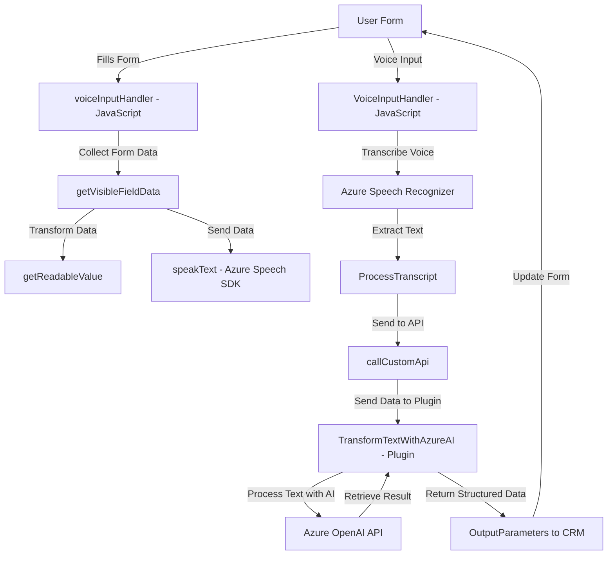

# Análisis Técnico

### Breve Resumen Técnico
El repositorio contiene scripts diseñados para implementar funcionalidades relacionadas con el procesamiento de voz y texto en formularios de Microsoft Dynamics CRM, utilizando servicios de inteligencia artificial y síntesis de voz provistos por Azure.

---

### Descripción de Arquitectura:
El código en el repositorio apunta a una arquitectura **modular** basada en capas que separan claramente las responsabilidades:
1. **Frontend**: Scripts en JavaScript orientados a ejecutar operaciones en registros de formularios del CRM, incluyendo lectura, escritura, y procesamiento de voz mediante SDKs y APIs externas.
2. **Backend**: Plugin en C# que procesa texto mediante la API de Azure OpenAI bajo un patrón "plugin architecture" típico del ecosistema de Microsoft Dynamics CRM.

El diseño general revela una interacción entre dos capas principales:
- **Interfaz de usuario (presentación)**: Ofrecida en el frontend mediante scripts que se integran directamente en los formularios del sistema.
- **Lógica de negocio**: Gestionada en el backend por plugins y servicios externos como Azure APIs.

El código sugiere una arquitectura orientada a servicios con integración parcial de microservicios.

---

### Tecnologías Usadas
1. **Frontend**:  
   - **Lenguaje**: JavaScript.  
   - **Azure Speech SDK**: Permite transformar texto en voz y realizar reconocimiento de voz.  
   - **Microsoft Dynamics CRM Context API**: Utilizado para manipular campos y datos del formulario en el contexto del sistema CRM.

2. **Backend**:  
   - **Lenguaje**: C# con el SDK de Microsoft Dynamics CRM.  
   - **API de Azure OpenAI**: Consumida para procesar documentos de texto y estructurar respuestas.  

3. **Patrones especificados**:  
   - **Cargador Dinámico (Lazy Loading)** para importar dependencias en tiempo de ejecución (`ensureSpeechSDKLoaded`).  
   - **Factory Pattern** para gestionar mapeos entre valores de texto transcrito y atributos del formulario (`applyValueToField`, `getFieldMap`, etc.).  

---

### Dependencias y Componentes Externos
1. **Azure Speech SDK**:
   - Synthesizing text to speech.
   - Recognizing voice input.

2. **Azure OpenAI API**:
   - Consumed by the backend plugin for text transformations.
   - Requires deployment and API key configurations.

3. **Microsoft Dynamics CRM APIs**:
   - Core SDK for interacting with CRM forms and data structures.

4. **Other Libraries**:
   - `Newtonsoft.Json` for JSON manipulation.
   - .NET libraries (`System.Net.Http` and `System.Text.Json`) for API integration in the backend.

---

### Diagrama Mermaid

---

### Conclusión Final
Este repositorio ofrece una solución híbrida con un enfoque modular para habilitar la interacción entre un UI conectado a Microsoft Dynamics y servicios externos de IA y síntesis de voz. La arquitectura es claramente de capas y orientada tanto al uso de servicios externos (SaaS) como al aprovechamiento de las APIs y plugins de la plataforma Dynamics CRM. Aunque no completamente desacoplada, la solución se alinea con un patrón de **Servicios + Plugins**, permitiendo una extensibilidad en entornos de negocio.