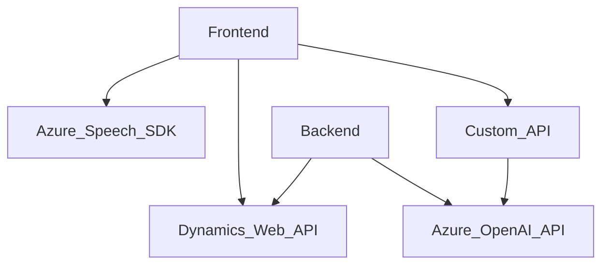

### Análisis: Solución y su Arquitectura

#### **Breve resumen técnico**:
El repositorio es una solución que combina varios elementos: un **frontend** en JavaScript con integración de servicios externos (Azure Speech SDK) y un **backend plugin** desarrollado en C#. Su objetivo principal es proporcionar capacidades avanzadas de reconocimiento de voz, síntesis de texto a voz y procesamiento inteligente de texto, utilizando servicios de Microsoft Dynamics CRM y Azure OpenAI.

---

#### **Descripción de la arquitectura**:
La solución sigue un enfoque client-server que utiliza arquitectura orientada a servicios. Se integra con componentes externos mediante APIs, lo cual sugiere un diseño distribuido. Aunque hay un componente de backend (el plugin en C#) que interactúa con Microsoft Dynamics CRM, la mayor parte de la lógica para la síntesis de voz y reconocimiento parece estar orientada al cliente.

La arquitectura puede clasificarse como **modular de cliente-servidor** con funciones que implementan ciertos patrones como:
- **Facade**: Simplificando el uso de múltiples funciones clave dentro de frontend para iniciar flujos complejos de interacción.
- **Adapter**: Mapeando atributos y transformando datos de manera dinámica entre sistemas (por ejemplo, transcripciones a datos de formularios o reglas de texto hacia JSON).

---

#### **Tecnologías, frameworks y patrones utilizados**:
1. **Tecnologías**:
   - **JavaScript** para el frontend.
   - **Azure Speech SDK**: Reconocimiento y síntesis de voz.
   - **Microsoft Dynamics CRM Web API**: Para la interacción con formularios y servicios CRM.
   - **Azure OpenAI API**: Para procesamiento inteligente del texto en el backend.

2. **Frameworks, librerías y APIs:**
   - `Microsoft.Xrm.Sdk`: Extensión específica para interactuar con la Metadata API y el modelo del CRM.
   - **Newtonsoft.Json** y `System.Text.Json`: Para manejar la serialización/deserialización de JSON.
   - **Azure Speech SDK**: Cargado de manera dinámica en el navegador desde un CDN oficial.

3. **Patrones de diseño:**
   - **Modularidad**: Se usan funciones específicas en archivos separados para encapsular lógica independiente.
   - **Adapter Pattern**: Para conectar datos entre sistemas externos e internos (Dynamics CRM y Azure APIs).
   - **Plugin Architecture**: En el backend se integra bajo el estándar de diseño de plugins de Dynamics CRM.

---

#### **Dependencias externas o componentes externos presentes**:
1. **Azure Speech SDK:** Para la síntesis de texto a voz y reconocimiento de voz desde el frontend.
   - Cargado dinámicamente desde un CDN.
2. **Microsoft Dynamics Web API:** Interacción con formularios y datos de CRM (contextos de ejecución, mapas de campos, etc.).
3. **Azure OpenAI API:** Utilizado en el plugin del backend para procesar texto y generar respuestas en JSON con reglas específicas.
4. **HTTP Clients:** Usados para realizar las solicitudes al servicio OpenAI (por ejemplo, `System.Net.Http` en el plugin backend).
5. **JSON Manipulation Libraries:** Para interpretar y procesar datos JSON.

---

### Diagrama de Arquitectura con **Mermaid**:

---

#### **Conclusión final**:
La solución es un sistema de reconocimiento de voz y síntesis de texto desarrollado principalmente para integrarse con la plataforma Microsoft Dynamics CRM. Aprovecha servicios de Azure, como Speech SDK y OpenAI API, para proporcionar funcionalidades avanzadas de voz y procesamiento de texto. La arquitectura sigue un diseño modular orientado a servicios con una clara división entre el frontend y el backend, permitiendo extensibilidad y una potencial escalabilidad, aunque no implementa patrones complejos de arquitectura como microservicios o hexagonal.

A nivel estructural, sería ideal mejorar la documentación para aclarar algunos aspectos del flujo de datos y las dependencias dentro del código. Sin embargo, ya ofrece una solución concreta utilizable en sistemas CRM con capacidades mejoradas de IA y voz.