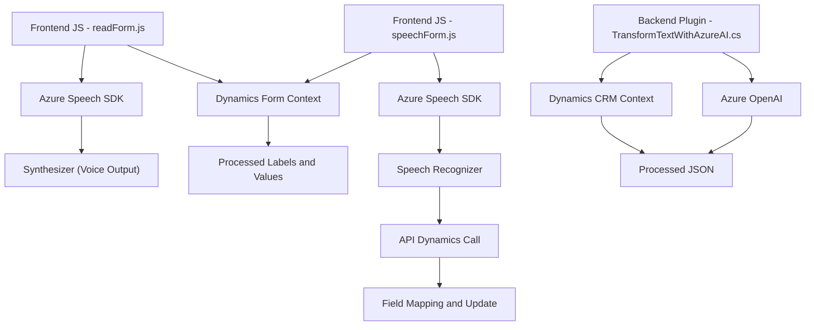

### Breve resumen técnico

El repositorio implementa funcionalidades centradas en el uso de tecnologías como Azure Speech SDK y Azure OpenAI para interactuar con datos de formularios en Microsoft Dynamics CRM. Existen tres componentes principales:

1. **Frontend**: Scripts en JavaScript para gestionar lectura y síntesis de voz, integrándose con formularios y APIs.
2. **Backend Plugin**: Un plugin en .NET/C# para Microsoft Dynamics CRM que transforma texto usando Azure OpenAI.
3. **API de Azure OpenAI**: Se utiliza para procesar y estructurar texto de manera inteligente.

---

### Descripción de arquitectura

El sistema entero opera bajo una arquitectura **híbrida entre SOA y n capas**:
1. **Frontend funcional** centrado en la ejecución de tareas específicas (lectura y procesamiento de voz).
2. **Integración plugins para Dynamics CRM** mediante **Microsoft.Xrm.SDK** que permite la interacción con datos del sistema backend.
3. **Dependencia de servicios externos** como Azure Speech SDK y Azure OpenAI para procesamiento y síntesis.

Este diseño utiliza componentes **modulares**, que están separados de forma lógica por sus funciones (gestión de voz, transformación de texto, interacción con formularios). No emplea una arquitectura avanzada como Hexagonal o Microservicios, dado que todo el flujo depende de una única instancia centralizada de CRM.

---

### Tecnologías usadas

- **Frontend**:
  - JavaScript.
  - Azure Speech SDK (para reconocimiento y síntesis de voz).
  - Microsoft Dynamics APIs (`Xrm.WebApi`) para interactuar con modelos de datos / formularios.
- **Backend**:
  - .NET Framework (probablemente 4.5 o superior).
  - Dynamics CRM SDK (IPlugin).
  - Azure OpenAI (HTTP POST para procesar texto estructurado).
- **Externo**:
  - JSON para transferencia de datos.
  - System.Text.Json para manejo de objetos JSON.

---

### Diagrama Mermaid válido para GitHub

---

### Conclusión final

El repositorio presenta una solución **integrada entre frontend y backend**, diseñada específicamente para extender las capacidades de Microsoft Dynamics CRM. Utiliza **Azure Speech SDK** para reconocimiento y síntesis de voz y **Azure OpenAI** para procesamiento avanzado de texto. La combinación de estos dos servicios permite enriquecer la interacción dinámica con datos de formularios.

Aunque la arquitectura es adecuada para el caso de uso, hay varias áreas de mejora:
1. **Abstracción de claves y configuración**: En lugar de codificar directamente las claves y regiones, estos parámetros pueden gestionarse mediante archivos de configuración seguros.
2. **Errores y alertas**: Actualmente hay poco manejo explícito de errores en el frontend, lo que podría mejorar la experiencia del usuario.
3. **Modularización avanzada**: Migrar hacia una arquitectura más flexible (idealmente Hexagonal o basada en Microservicios) podría ser conveniente para adaptarse a arquitecturas modernas.
4. **Seguridad en dependencias externas**: Es importante minimizar cualquier exposición directa de la clave API, asegurando niveles de seguridad apropiados.

Este diseño destaca por su enfoque práctico y funcional en el uso de Azure como un proveedor de servicios en la nube para tareas específicas de inteligencia artificial y procesamiento de datos.