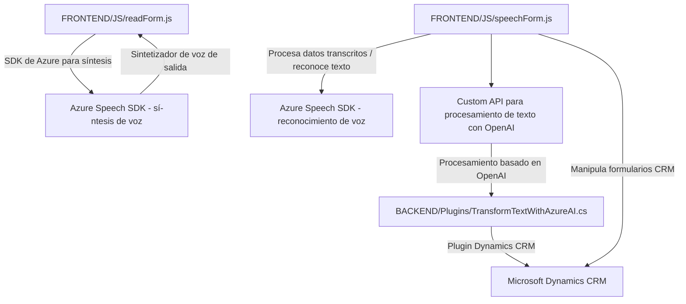

# Análisis técnico del repositorio presentado

### Breve resumen técnico
El repositorio presentado incluye varios archivos que implementan funcionalidades orientadas al uso del **Azure Speech SDK** y **Azure OpenAI Services**. Estas funcionalidades se integran con formularios de Microsoft Dynamics CRM, extendiendo las capacidades del CRM mediante plugins y procesamiento de datos basado en IA. El proyecto puede clasificarse como **backend auxiliar para CRM**, con un enfoque modular y adaptado a la transformación de texto y síntesis de voz.

---

### Descripción de arquitectura
1. **Tipo de solución**:
   - La solución trabaja como un **plugin para Microsoft Dynamics CRM**, extendiendo capacidades nativas al integrar herramientas avanzadas de Azure Speech y OpenAI. También incluye archivos para manejar la integración de la síntesis y el reconocimiento de voz con formularios frontales.

2. **Arquitectura**:
   - Se observa una arquitectura **n capas** que incluye:
     - **Capa de Presentación**: Archivos frontend (`readForm.js`, `speechForm.js`) encargados de manejar los datos de entrada y salida.
     - **Capa de Lógica de Negocio**: Los plugins de CRM y API gestionan las reglas de negocio para transformar y validar datos.
     - **Capa de Acceso a Datos**: Uso de `Microsoft.Xrm.Sdk.Query` y acceso a datos del CRM o integración con bases externas por medio de consultas y servicios web.
   - La arquitectura incorpora principios de diseño **reflectivos** para adaptarse dinámicamente, especialmente mediante la carga dinámica de SDKs y los procesamientos basados en IA.

3. **Patrones de diseño**:  
   - **Facade**: Enmascara la lógica compleja con métodos de entrada simplificados (`startVoiceInput`, `executeRecog`, etc.).
   - **Adapter**: Para mapear y transformar los datos entre formularios CRUD y resultados JSON estructurados de las API externas.
   - **Asynchronous**: Se apoya en operaciones de promesas y asincronía para manejar la carga del SDK de Azure y la comunicación HTTP con las APIs externas.

---

### Tecnologías usadas
- **Frontend**:
  - Lenguaje: **JavaScript**
  - Integraciones principales:
    - **Azure Speech SDK** para síntesis y reconocimiento de voz.
    - **Dynamics CRM UI Context (`executionContext`)** para trabajar con los formularios.
  - Enfoque modular y funciones puramente encargadas.

- **Backend**:
  - Lenguaje: **C#**
  - Frameworks y servicios:
    - **Microsoft Dynamics CRM SDK**: Extensión del CRM mediante plugins.
    - **Azure OpenAI**: Para transformación avanzada de texto con IA.
    - **System.Net.Http** para interacciones REST con servicios externos.
  - Librerías: **Newtonsoft.Json**, **System.Text.Json**.

---

### Dependencias externas y componentes adicionales
1. **Azure Speech SDK**:
   - URL: `https://aka.ms/csspeech/jsbrowserpackageraw`
   - Compatibilidad con síntesis y reconocimiento de voz.

2. **Azure OpenAI**:
   - Integrado para la transformación de texto basado en reglas específicas.
   - Autenticación mediante API Key asociada a una región específica.

3. **Microsoft Dynamics CRM SDK**:
   - `Xrm.WebApi` para consulta y transformación de datos de los formularios del CRM según los resultados procesados por la API.

4. **Custom API**:
   - Extensión de Dynamics CRM con una lógica backend personalizada para interactuar con Azure OpenAI y devolver resultados procesados.

---

### Diagrama Mermaid

---

### Conclusión final
El repositorio se configura como un conjunto de elementos que integran SDKs de Azure y un plugin de Dynamics CRM para ofrecer una solución modular de síntesis y reconocimiento de voz, junto con transformaciones avanzadas de datos mediante Azure OpenAI. La arquitectura está diseñada como una implementación **n capas** que combina componentes frontend, backend y APIs externas. La solución puede desempeñar un papel crítico en la evolución hacia la automatización y la mejora de la experiencia de usuario en el contexto de CRM.