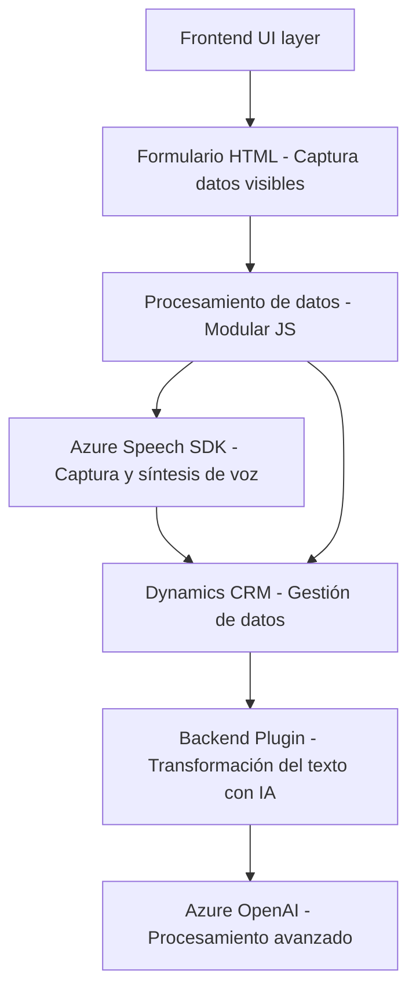

### Resumen técnico
Este repositorio implementa una solución integrada con diferentes componentes, enfocada en la interacción con el usuario a través de formularios, síntesis de voz, reconocimiento de voz y procesamiento avanzado mediante Azure servicios como **Azure Speech SDK** y **Azure OpenAI**. La funcionalidad se extiende mediante plugins en Dynamics CRM para transformar datos de entrada con inteligencia artificial.

---

### Descripción de arquitectura
La solución adopta una arquitectura **modular y orientada a servicios** con integración de servicios externos. Cada módulo encapsula funcionalidades específicas: 
1. **Frontend**: Captura datos del formulario mediante reconocimiento y transformación de voz.
2. **Backend**: Procesa datos con plugins diseñados para Dynamics CRM. Utiliza lógica basada en eventos y comunicación REST con Azure Services.

Aunque la arquitectura está orientada al servicio (Service-Oriented Architecture), es posible distribuir el diseño en capas:
1. **UI/UX layer**: Archivos de frontend como `readForm.js` y `speechForm.js`.
2. **Data processing and transformation**: Plugins servidores como `TransformTextWithAzureAI.cs`.
3. **Service integration layer**: SDKs y APIs de Azure (Speech y OpenAI).

---

### Tecnologías usadas
- **Lenguajes**:
  - **JavaScript**: Frontend (interacción directa con formularios y SDK externo).
  - **C#**: Plugins de backend en Dynamics CRM para transformación de datos con servicios de Azure.
- **Frameworks y SDKs**:
  - **Azure Speech SDK**: Síntesis y reconocimiento de voz.
  - **Azure OpenAI**: Procesamiento de texto transformado por IA.
  - **Newtonsoft.Json**: Manipulación JSON.
- **Integración**:
  - **Dynamics CRM SDK**: Gestión de datos empresariales y tipo de formulario.
  - **REST APIs**: Comunicación con servicios externos de Azure.
- **Estilo arquitectónico**:
  - Modular: Encapsulación por módulos para funciones específicas.
  - SOA: Uso de servicios externos como elementos estratégicos (Azure).

---

### Diagrama Mermaid
Aquí tienes un diagrama Mermaid compatible con GitHub Markdown que representa las conexiones y flujo lógico de los componentes:

---

### Conclusión final
La solución presentada es un sistema integrado que combina:
- **Frontend interactivo** con captura/formulación de datos de voz.
- **Backend orientado a servicios** que amplía la funcionalidad de Dynamics CRM mediante plugins personalizados.
- **Interoperabilidad** con servicios externos de Microsoft Azure, transformando las interacciones del usuario y los datos en una experiencia empresarial más avanzada.

La arquitectura modular y el uso de integraciones con servicios de Azure son ideales para escenarios empresariales de procesamiento y automatización. Sin embargo, en una implementación futura debería evaluarse la escalabilidad completa, la seguridad y la optimización de dependencias externas.