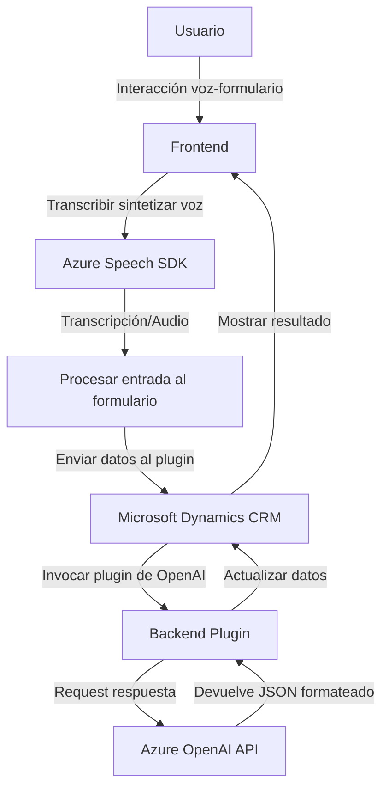

## Breve resumen técnico
El repositorio tiene una arquitectura orientada a la integración de servicios externos (como **Azure Speech SDK** y **Azure OpenAI**) con un sistema basado en **Microsoft Dynamics CRM**, para facilitar interacción mediante voz, síntesis de audio y procesamiento avanzado de texto. Combina el frontend basado en JavaScript y un backend escrito en C# que extiende Dynamics con funciones de transformación a través de plugins.

---

## Descripción de arquitectura
La solución utiliza una **arquitectura de software basada en plugins** con patrones de integración asincrónica y modularización. La organización de los archivos indica claramente separación por responsabilidades:
1. **Frontend:** Proceso y visualización de formularios, manejo de voz y síntesis de audio mediante el SDK de Azure Speech.  
   - Maneja interacciones de usuario como entrada de voz/transcripción.  
2. **Backend Plugin:** Procesamiento de texto usando Azure OpenAI, integrado directamente en el entorno **Microsoft Dynamics CRM** a través de eventos de negocio.

La arquitectura incluye **dos capas principales:**
- **Capa de interfaz y usuario (Frontend):** Presenta funcionalidades con interacción y lógica en el navegador.  
- **Capa lógica empresarial (Backend):** Ejecuta transformaciones basadas en servicios de Azure y manipula datos en Dynamics CRM mediante `IPlugin`.

---

## Tecnologías usadas
1. **Front-end (JavaScript):**
   - **Azure Speech SDK:** Síntesis y transcripción de voz, entrada y salida de datos con el servicio de habla de Azure.
   - **CRM/Dynamics API (Xrm.WebApi):** Recolección de datos y manipulación de atributos del formulario.
   - **JavaScript modular:** Separación de funciones utilizando patrones como callbacks y promesas.

2. **Back-end (C# en Plugins):**
   - **Dynamics CRM SDK (`Microsoft.Xrm.Sdk`):** Extensión de capacidades nativas mediante eventos empresariales.
   - **Azure OpenAI API:** Procesamiento y transformación avanzada de texto (IA).
   - **Bibliotecas estándar de C#:**
     - `System.Net.Http` para peticiones HTTP.
     - `System.Text.Json` y `Newtonsoft.Json.Linq` para manipulación de JSON.

3. **Patrones de diseño empleados:**
   - Modularización.
   - Procesamiento asincrónico con servicios externos.
   - Integración explícita con SDK externos.

---

## Diagrama Mermaid válido para GitHub

---

## Conclusión final
Esta solución combina el poder de la inteligencia artificial, la síntesis de voz y una integración robusta con **Microsoft Dynamics CRM** para mejorar la interacción de usuarios con formularios. La arquitectura modular y la implementación basada en servicios de Azure garantizan escalabilidad y adaptabilidad. Además, el enfoque asincrónico asegura una experiencia fluida y eficiente.