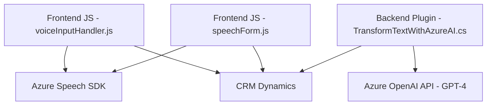

### Breve resumen técnico

El repositorio incluye funcionalidad tanto de frontend (JS) como de backend (.cs). Los archivos analizados están orientados a la integración con servicios externos, como **Microsoft Azure Speech SDK** y **Azure OpenAI API**, para realizar funciones relacionadas con reconocimiento y síntesis de voz, así como transformación de texto. Los módulos de frontend interactúan con formularios dentro de un CRM (Dynamics), mientras que el backend implementa plugins dinámicos para extender funcionalidades del sistema.

---

### Descripción de arquitectura

La arquitectura es **multicapa con orientación a servicios**:
1. **Frontend**:
   - Módulos estructurados que manejan entrada/salida de formularios y se integran con servicios externos.
   - Usa una arquitectura modular siguiendo principios de encapsulación y carga dinámica de scripts.
   - Patrón: "Client-Side Service Integration" para servicios como Azure Speech SDK.

2. **Backend (Plugin)**:
   - Implementación del patrón **Plugin Architecture** de Dynamics CRM.
   - Integración con Azure OpenAI API mediante consumo de REST API.
   - Sigue el patrón **Repository** al interactuar con datos del CRM.

El sistema no es estrictamente hexagonal ni basado en microservicios; sin embargo, aprovecha elementos de integración con APIs como microservicios externos. Es más apropiado categorizarlo como una **arquitectura orientada a capas** dentro del ecosistema CRM, con extensiones para capacidades de voz y texto.

---

### Tecnologías usadas

**Frontend**:
- **Azure Speech SDK**: Para síntesis y reconocimiento de voz.
- **JavaScript**: Modular y asincrónico, con carga dinámica de SDK externo.
- **API Dynamics CRM**: Interacción con formularios y datos en el CRM.

**Backend**:
- **Microsoft Dynamics CRM SDK** (`Microsoft.Xrm.Sdk`): Gestión de datos del CRM.
- **C#**: Usado para implementar plugins.
- **Azure OpenAI API**: Procesamiento avanzado de texto mediante GPT-4.
- **Newtonsoft.Json** y **System.Text.Json**: Manejo de objetos JSON.

---

### Dependencias o componentes externos

1. **Azure Speech SDK**:
   - Interface para reconocimiento y síntesis de voz con configuración mediante región y clave de Azure.

2. **Azure OpenAI API**:
   - Servicio externo para procesamiento avanzado de texto con modelos como GPT-4.

3. **CRM Dynamics SDK**:
   - `Microsoft.Xrm.Sdk` para acceso y manipulación de datos en el sistema CRM.

4. **HTTPClient**:
   - Realiza operaciones REST para interactuar con servicios externos (e.g., OpenAI).

---

### Diagrama Mermaid

---

### Conclusión final

El repositorio describe un sistema diseñado para interactuar con formularios del CRM Dynamics, usando tecnologías avanzadas como **Azure Speech SDK** y **Azure OpenAI API**. Utiliza una arquitectura orientada a capas, fusionando elementos de modularidad en frontend con extensiones de funcionalidad por medio de plugins en backend. Esto crea un sistema accesible y robusto que combina reconocimiento/transformación de voz con procesamiento inteligente de datos.