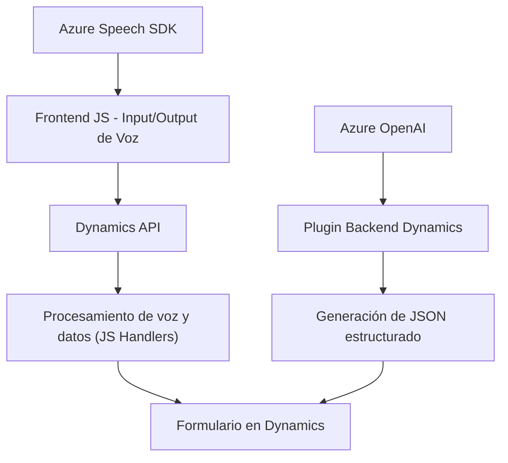

### Breve resumen técnico:
El repositorio incluye funcionalidades relacionadas con la entrada y salida de voz para formularios en un sistema conectado a Dynamics 365, además de plugins que interactúan con Azure OpenAI y APIs de reconocimiento de voz, como Azure Speech SDK. Está orientado a mejorar la interacción con usuarios mediante voz y texto procesado por inteligencia artificial.

---

### Descripción de arquitectura:
1. **Tipo de solución**:  
   - Este repositorio constituye una solución **híbrida** formada por un **frontend** orientado a mejorar la interacción por voz, y **plugins backend** (Dynamics CRM). Incluye manejo de inputs de formularios, asignación dinámica de valores y enriquecimiento mediante servicios externos (Azure Speech SDK y OpenAI).  

2. **Patrones y diseño**:  
   - **Modular Monolith** para el frontend: Organización funcional y modular.
   - **Service-Oriented Architecture (SOA)**: Integración con servicios en la nube (Azure Speech SDK, Azure OpenAI).
   - **Event-Driven Architecture** para la ejecución de plugins y reconocimiento de voz basado en eventos.  

3. **Dependencias externas**:  
   - Azure Speech SDK (entrada y salida de texto sintetizado).  
   - Dynamics CRM Web API (`Xrm.WebApi.online`), usado en los plugins y frontend.  
   - Azure OpenAI para generación de JSON estructurado basado en textos procesados por GPT.  

---

### Tecnologías usadas:
- **Frontend**:  
  - JavaScript.  
  - Azure Speech SDK (texto a voz y reconocimiento de voz).  
  - Dynamics Web API (`Xrm.WebApi.online`).  

- **Backend/Plugins (Dynamics)**:  
  - C#.  
  - Microsoft.Xrm.Sdk: Administración de eventos en CRM.  
  - Newtonsoft.Json / System.Text.Json: Manejo JSON.  
  - System.Net.Http: Comunicación HTTP con Azure OpenAI.  

---

### Diagrama **Mermaid** válido para GitHub Markdown:

---

### Conclusión final:
Este repositorio implementa una solución robusta para mejorar la interacción con formularios en Dynamics 365 mediante inputs de voz, sintetización de texto y enriquecimiento por inteligencia artificial.  
- **Arquitectura híbrida orientada a API y eventos**: Patrones como SOA y Event Driven respaldan la integración de servicios como Azure Speech SDK y OpenAI.  
- **Frontend modular y plugins extensibles**: El diseño facilita mantenimiento y escalabilidad.  
- La combinación de voz, IA, y CRM fomenta una experiencia de usuario altamente interactiva y adaptable.