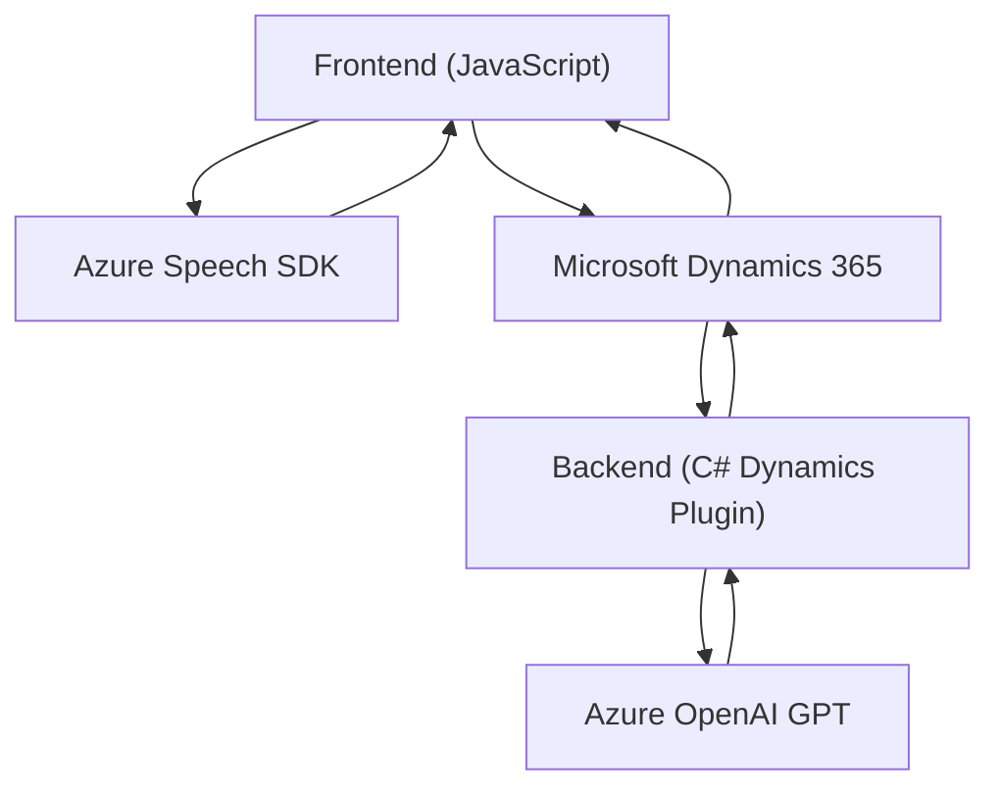

### Breve resumen técnico
El repositorio se compone de tres componentes principales que interactúan para combinar el reconocimiento de voz, la síntesis de voz y el procesamiento de texto mediante servicios en la nube (Azure Speech SDK y Azure OpenAI GPT). Su propósito principal parece relacionado con mejorar la interacción y la entrada de datos en formularios de Dynamics 365, utilizando voz como medio de entrada y salida.

---

### Descripción de arquitectura
La arquitectura sigue un modelo de **arquitectura orientada a servicios** basado en SDK externos y un plugin para Dynamics 365.

1. **Capas**: 
   - **Frontend**:
     - Implementa en JavaScript dos módulos principales:
       1. Reconocimiento de voz (VoiceInputHandler.js)
       2. Generación de voz a partir de valores de formularios (SpeechFormReader.js)
   - **Backend (Plugins)**:
     - Implementación en C#. Define un plugin para Dynamics CRM que usa Azure OpenAI GPT mediante solicitudes HTTP.
2. **Interacción**:
   - Los módulos de frontend interactúan con Dynamics 365 para realizar operaciones como extracción/mapeo de datos desde formularios.
   - El plugin proporciona procesamiento adicional de texto usando el modelo GPT de Azure.

La arquitectura puede clasificarse como **n-capas**:
- **Presentación**: Frontend en JavaScript, operando en el navegador y conectado al formulario.
- **Aplicación**: Plugins que gestionan la lógica empresarial y procesan datos mediante servicios en la nube.
- **Servicios externos**: Servicios proporcionados por Azure (Speech SDK y OpenAI API).

---

### Tecnologías usadas
1. **Lenguajes**:
   - JavaScript: Para la interfaz y lógica en el navegador.
   - C#: Usado en la plataforma de Dynamics CRM mediante el framework .NET.

2. **Frameworks y SDKs**:
   - **Azure Speech SDK**:
     - Síntesis de texto a voz.
     - Reconocimiento de voz con transcripción a texto.
   - **Azure OpenAI GPT**:
     - Procesamiento avanzado de texto.
   - **Microsoft Dynamics CRM SDK**:
     - Integración con la plataforma de datos y servicios de Dynamics.
     
3. **Patrones**:
   - Delegación de responsabilidades.
   - Modularidad (Micro-modules en el frontend para diferentes funciones y clases/plugin en el backend).
   - Orientación a servicios externos (Azure API y Dynamics CRM API).
   - Gestión de flujo asíncrono con Promesas en JavaScript y manejo de servicios en C#.

---

### Dependencias y componentes externos
1. **Azure Speech SDK**:
   - Cargado dinámicamente desde una CDN (JavaScript).
   - `https://aka.ms/csspeech/jsbrowserpackageraw`.

2. **Azure OpenAI API**:
   - Endpoint para interactuar con GPT (por ejemplo, para transformar mensajes y aplicarlos).

3. **Dynamics 365**:
   - Dependencia fundamental del sistema, incluido el acceso a formularios y otra data contextual mediante `formContext`.

4. **Bibliotecas en .NET**:
   - `Microsoft.Xrm.Sdk`: Para integración directa con Dynamics CRM.
   - `System.Net.Http`: Para comunicación con Azure APIs.
   - `Newtonsoft.Json.Linq`: Manejo de JSON estructurado.

---

### Diagrama **Mermaid** válido para GitHub

---

### Conclusión final
El repositorio describe una solución basada en la interacción entre tres módulos clave:
1. **Frontend**: Dos componentes en JavaScript para interactuar con formularios en Dynamics 365, realizar síntesis de voz y convertir audio en texto.
2. **Backend plugin**: Desarrollado en C#, capaz de hacer uso de servicios de IA generativa en Azure OpenAI para procesamiento avanzado de texto.
3. **Servicios externos**: Dependencias críticas incluyen el Azure Speech SDK y Azure OpenAI, ambos utilizados desde ambientes en la nube. También existe una dependencia directa de los servicios y APIs de Dynamics 365.

El diseño sigue la arquitectura n-capas, con dos capas principales (frontend y backend) que solicitan datos y comandos a servicios externos alojados en la nube. La solución está diseñada para operar en escenarios específicos del ecosistema Dynamics 365 y optimiza la experiencia de usuario al permitir la interacción con formularios mediante reconocimiento de voz y procesamiento de texto a través de herramientas basadas en inteligencia artificial.