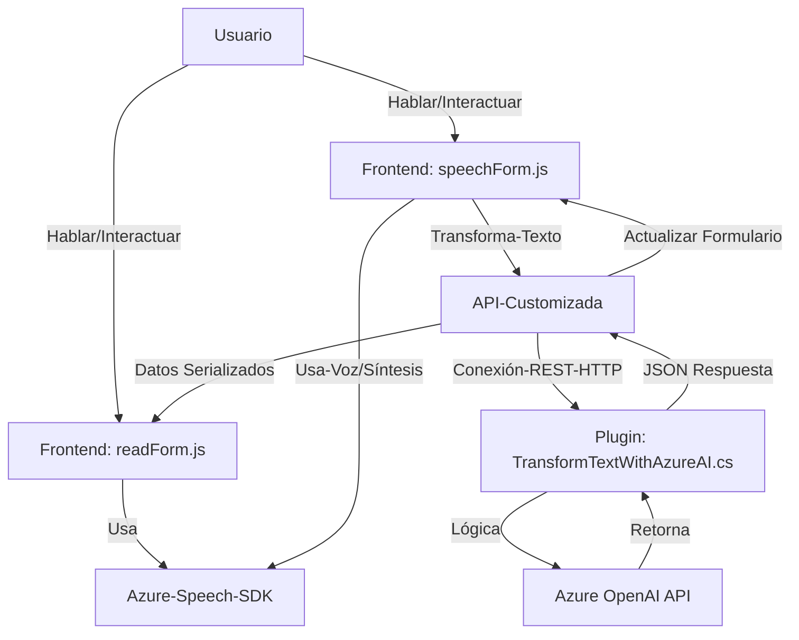

### Breve Resumen Técnico
El repositorio contiene tres archivos clave que involucran la integración de voz y texto a través de Azure Speech SDK y Azure OpenAI. La solución combina funcionalidad de interacción visual con formularios, reconocimiento de voz, síntesis de voz, y transformación avanzada mediante servicios de inteligencia artificial.

### Descripción de Arquitectura
La solución implementa una arquitectura distribuida con servicios orientados a eventos y API, conectando aplicaciones frontend (JavaScript) y backend (C# Plugin en Dynamics CRM). Se identifican patrones de integración con servicios externos (Azure Speech SDK y Azure OpenAI), modularidad en la lógica y una aproximación multicapa.

1. **Frontend**:
   - Procesamiento dinámico de datos en formularios vía Azure Speech SDK.
   - Modularización a través de funciones especializadas (e.g., entrada de voz, síntesis de texto, manipulación de formularios, etc.).
   - Dependencias externas como SDKs y APIs para reconocimiento y síntesis de voz.

2. **Backend Plugin**:
   - Plugin construido bajo la arquitectura de Dynamics CRM, donde se procesan eventos del sistema.
   - Delegación a servicios externos (**Azure OpenAI**) para transformación de texto con reglas predefinidas.

### Tecnologías Usadas
- **Frontend**:
  - **JavaScript**, orientado a interacción dinámica con formularios.
  - **Azure Speech SDK**, usado para reconocimiento y síntesis de voz.
  - **Microsoft Dynamics CRM Context API**, se manipulan datos de formularios del sistema.

- **Backend**:
  - **Microsoft Dynamics CRM Plugin Framework** (C#): para extensibilidad de eventos y operaciones.
  - **Azure OpenAI API**, para generación de texto basado en lenguaje natural y procesamiento de IA.
  - **HttpClient** (C#) para integración con servicios externos.
  - **Newtonsoft.Json** para la manipulación de respuestas JSON.

### Tipo de Arquitectura
La solución no es monolítica. Se clasifica como **arquitectura multicapa** con integración de servicios externos (con cerca de tres capas: presentación, lógica de negocio, servicio externo). Además, adopta patrones de diseño modular, donde cada componente tiene responsabilidades definidas, y utiliza servicios externos como parte de su catálogo de APIs integradas.

### Dependencias o Componentes Externos
- **Azure Speech SDK**: Reconocimiento y síntesis de voz.
- **Azure OpenAI API**: Procesamiento de texto con IA.
- **Dynamic CRM Context**: Manipulación y evento del sistema Dynamics CRM.
- **HTTP Libraries**: Para comunicación REST.
- **Serialización JSON**: Debido al formato de entrada y salida del servicio OpenAI.

### Diagrama Mermaid Válido para **GitHub Markdown**

### Conclusión Final
Este repositorio presenta una solución híbrida diseñada para manejar interacción entre interfaces visuales (formularios de Dynamics CRM) y servicios avanzados basados en inteligencia artificial y síntesis de voz en la nube (Azure technologies). La arquitectura modular facilita su mantenimiento y escalabilidad, mientras que la delegación de tareas a servicios externos reduce la complejidad y asegura integraciones modernas y robustas para operativas críticas.

Es una solución bien estructurada y adecuada para entornos empresariales que necesitan combinar experiencia de usuario multimedia y procesamiento basado en IA. Se recomienda complementar la seguridad mediante cifrado y almacenamiento seguro de las credenciales de Azure, así como realizar pruebas detalladas para evitar fallos en la síntesis de voz y la transformación textual.