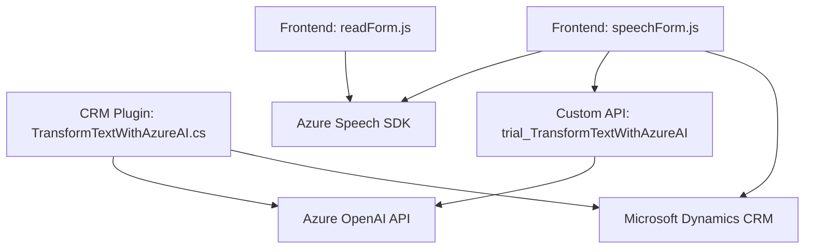

### Breve resumen técnico
El repositorio presenta una solución orientada a integrar funcionalidades de reconocimiento de voz, síntesis de voz, y transformación de texto aplicando servicios de Azure Speech y OpenAI en el ecosistema de Microsoft Dynamics CRM. Estas operaciones están organizadas en tres componentes: manejo de entrada de voz, salida de voz y transformación del texto en un plugin CRM.

---

### Descripción de arquitectura
La solución sigue una **arquitectura Service-Oriented (SOA)**, dado que utiliza servicios externos como Azure Speech SDK y Azure OpenAI para implementar las funcionalidades de voz y texto. El código muestra un diseño modular compuesto por múltiples archivos estructurados para roles y responsabilidades específicas:
1. **Frontend modular JS:** Modularización en funciones específicas que delegan tareas como reconocimiento de voz y síntesis de voz a SDKs externos (Azure Speech).
2. **Backend (Plugin CRM):** Implementa un patrón de **Arquitectura de Plugins** en Dynamics CRM para transformar texto mediante servicios OpenAI.
3. **Flujo desacoplado:** El manejo de dependencias se realiza mediante carga dinámica de scripts, integración con APIs y abstracción lógica para operaciones en CRM.

---

### Tecnologías usadas
1. **Frontend**:
   - Azure Speech SDK para síntesis y reconocimiento de voz.
   - Microsoft Dynamics CRM SDK para la interacción con formularios y datos.
   - JavaScript (módulos personalizados).  
   - HTTP/REST y APIs personalizadas.

2. **Backend** (con `.NET Framework`):
   - Azure OpenAI Service para transformación de texto.
   - Microsoft Dynamics CRM SDK para desarrollo de plugins.
   - Newtonsoft.Json para manipulación de datos JSON.
   - HttpClient para realizar peticiones HTTP hacia Azure OpenAI API.
   - Sistema de Evento de Plugins propio de Dynamics CRM.

---

### Diagrama Mermaid válido para GitHub

---

### Conclusión final
La solución presentada en este repositorio utiliza una **Service-Oriented Architecture (SOA)** con componentes desacoplados y modularizados que interactúan con servicios externos como Azure Speech SDK y Azure OpenAI. Esto proporciona robustez, reutilización y ampliación del sistema en el contexto de la integración con Microsoft Dynamics CRM, que actúa como la base del modelo de negocio. El diseño es eficiente para aplicaciones CRM que requieren funciones avanzadas de procesamiento y síntesis de voz, generación de JSON y estructuración de datos.