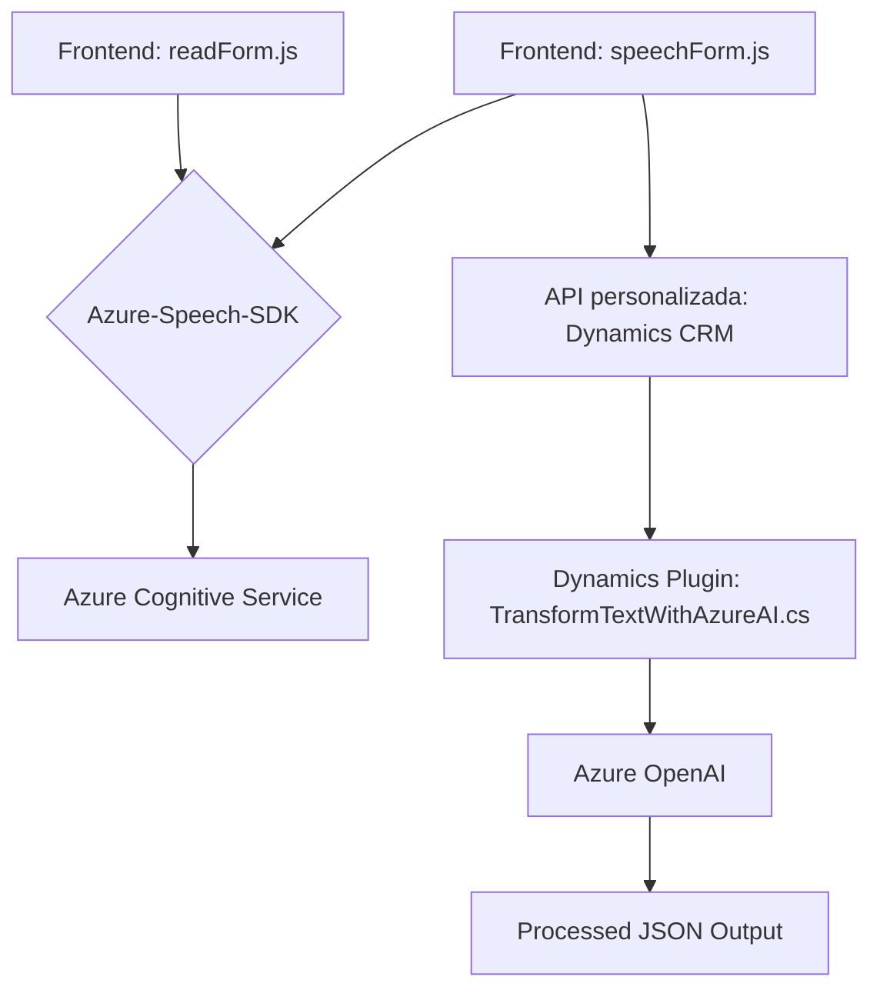

### Breve resumen técnico

El proyecto se compone de tres partes principales:
- Implementación de lógica del frontend (`readForm.js` y `speechForm.js`) para interacción con formularios, síntesis de voz y reconocimiento de voz.
- Integración de Dynamics 365 y servicios de la nube (Azure Speech SDK, API OpenAI en la extensión `Plugins/TransformTextWithAzureAI.cs`) para el procesamiento avanzado de voz y texto.
- Uso de plugins en Dynamics CRM para extender funcionalidades con un enfoque server-side.

### Descripción de la arquitectura

El sistema implementado sigue una **arquitectura de múltiples capas** orientada al aspecto funcional:
1. **Frontend:** Código JavaScript que interactúa directamente con usuarios, proporcionando reconocimiento de voz y síntesis.
2. **Middleware:** Conexión con APIs personalizadas y Azure Speech SDK para el procesamiento de datos en frontend.
3. **Backend:** API y lógica de plugins (de Dynamics CRM con Azure OpenAI) que procesan los datos del frontend y los convierten en un formato estructurado.

Adicionalmente, exhibe elementos de **arquitectura basada en servicios externos** gracias a la integración con Azure Speech SDK y Azure OpenAI. El componente `TransformTextWithAzureAI.cs` actúa como una fachada para los servicios externos, procesando inputs y devolviendo outputs estructurados.

### Tecnologías usadas

- **Frontend:**
  - **JavaScript:** Para la lógica cliente.
  - **Azure Speech SDK:** Implementa síntesis de voz y reconocimiento de voz en el navegador.
  - **Dynamics 365 WebAPI:** Manipulación de formularios y datos en el sistema backend (CRM).

- **Backend:**
  - **Microsoft Dynamics SDK (`IPlugin`)**: Plugin de Dynamics para extender la funcionalidad y   conectar con servicios externos.
  - **Azure OpenAI Service:** Procesamiento de texto basado en inteligencia artificial.
  - **Newtonsoft.Json y System.Net.Http:** Librerías utilizadas para serialización de datos y consumo de servicios web.

- **Infraestructura y servicios externos:**
  - **Azure Speech SDK:** Sustentado en la API de Cognitive Services para síntesis/reconocimiento de voz.
  - **API personalizada en Dynamics CRM:** Extensa comunicación backend con servicios Microsoft.

### Diagrama **Mermaid** válido para GitHub

### Conclusión final

El sistema está diseñado para ser modular y extensible, integrando un frontend dinámico con tecnologías modernas (SDK de Azure y API personalizada). Usa una arquitectura multicapa con conexiones a servicios de la nube (Azure Cognitive Services) y manejos de datos en backend mediante Dynamics CRM.

#### Ventajas detectadas:
1. **Escalabilidad:** La estructura permite extender el uso de reconocimiento de voz y síntesis en distintos contextos.
2. **Cloud-first:** Utiliza servicios nativos de Azure para una interacción optimizada.
3. **Modularidad:** Cada componente tiene responsabilidades claras (frontend, middleware y backend).

#### Mejoras sugeridas:
1. Introducir un manejo de errores más robusto en el backend (excepciones del SDK).
2. Mejorar la documentación detallada acerca del uso de claves y configuración en Azure.
3. Modularización más fina en frontend (p.ej., dividir lógica de voz y manipulación del DOM).

En resumen, este proyecto es ideal para aplicaciones con dependencia en la nube, especialmente dentro de plataformas empresariales como Dynamics 365, ofreciendo una gran cantidad de integración con servicios externos para transformar y manejar datos usando IA.