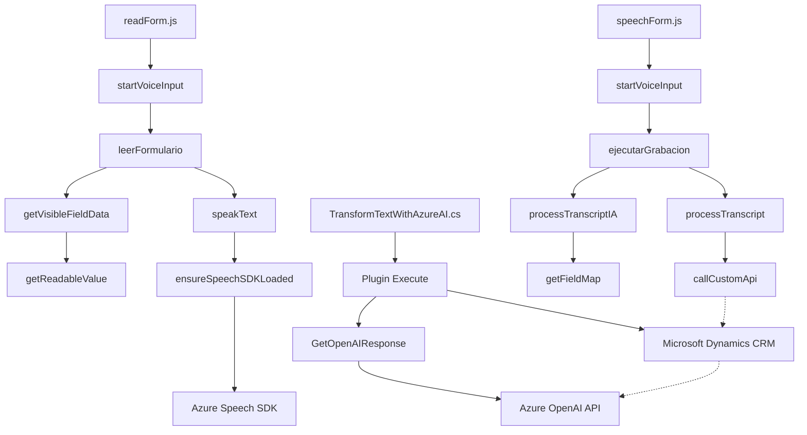

### Breve resumen técnico

El repositorio contiene tres componentes principales: dos archivos de JavaScript (`readForm.js`, `speechForm.js`) para un frontend que interactúa con formularios dinámicos en Dynamics 365 utilizando el **Azure Speech SDK**, y un archivo de C# (`TransformTextWithAzureAI.cs`) que implementa un plugin para extender la funcionalidad en Dynamics CRM mediante **Azure OpenAI API**. El sistema presenta capacidades avanzadas de interacción por voz y procesamiento inteligente de texto integrado en el ecosistema de Microsoft.

---

### Descripción de arquitectura

La arquitectura de la solución combina:
- **Aplicación n-capas**: Separación de interacción frontend (JavaScript) y backend (C# plugin).
- **Integración con servicios externos**: Uso de APIs de Azure (Speech y OpenAI).
- **Extensibilidad**: Utilización de plugins en Dynamics CRM para responder a eventos específicos del sistema, acoplándose al flujo normal sin modificar el monolito base de CRM.
- **Dominio específico**: La lógica está diseñada especialmente para integrarse con formularios gestionados por Dynamics 365 y tratar datos contextuales asociados.

---

### Tecnologías usadas
1. **Frontend (JavaScript)**
   - **Frameworks/librerías**:
     - Azure Speech SDK para síntesis de texto y reconocimiento de voz.
     - DOM API para manipulación de scripts y documentos.
   - **Patrones utilizados**:
     - Modularización a través del diseño de funciones especializadas.
     - Delegación para gestionar dinámicamente el SDK remoto mediante `ensureSpeechSDKLoaded`.

2. **Backend (C# Plugin)**
   - **Frameworks/librerías**:
     - **Newtonsoft.Json.Linq** y **System.Text.Json** para manipulación JSON.
     - **System.Net.Http** para realizar llamadas REST a Azure OpenAI API.
     - **Microsoft.Xrm.Sdk** para acceso al servicio de Dynamics CRM.
   - **Patrones utilizados**:
     - Evento-observador, a través del plugin de Dynamics CRM (interfaz `IPlugin`).
     - API Integration para la interacción con Azure REST endpoints.

---

### Dependencias y componentes externos
1. **Externas**:
   - Azure Speech SDK: Para síntesis y reconocimiento de voz.
   - Azure OpenAI API: Servicio de generación de texto con inteligencia artificial.
   - Dynamics 365 Web API: Para consultas y manipulación de formularios.
2. **Internas**:
   - Contextos de `Xrm.WebApi` y `formContext` manejados en frontend.
   - Plugins `TransformTextWithAzureAI.cs` activados por eventos CRM.

---

### Diagrama **Mermaid** (100 % compatible con GitHub Markdown)

---

### Conclusión final

La solución presentada es una arquitectura híbrida diseñada para mejorar y extender las capacidades de interacción humano-computadora en el ecosistema de Microsoft Dynamics 365 mediante tecnología Azure. En el frontend, se encapsulan funciones específicas y altamente modulares para procesamiento de entrada y salida de voz. En el backend, los plugins CRM aprovechan los eventos del sistema y capacidades REST de Azure OpenAI API para realizar transformaciones dinámicas en datos de usuario. Aunque es funcional y avanzado, podría beneficiarse de mejores prácticas en la gestión de configuración externa (como claves para APIs) y seguridad en los scripts frontend.