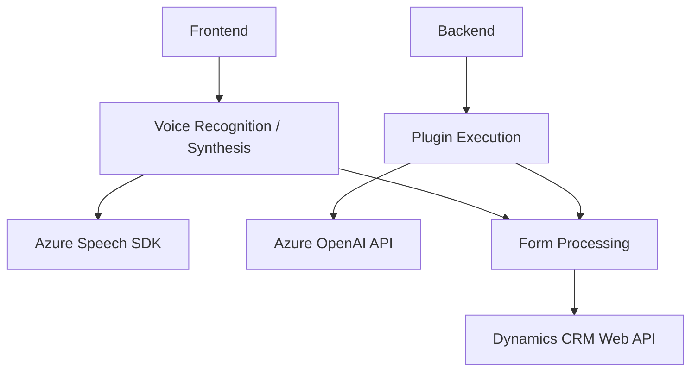

### Breve resumen técnico

El repositorio contiene tres archivos principales: 
1. `readForm.js` para entrada y síntesis de voz utilizando Azure Speech SDK.
2. `speechForm.js` que integra reconocimiento de voz con APIs externas, adaptando transcripciones a formularios de Dynamics CRM.
3. `TransformTextWithAzureAI.cs` que implementa un plugin de Dynamics CRM para transformar texto en JSON estructurado mediante Azure OpenAI.

La solución parece combinar tecnologías de frontend (JavaScript) y backend (.NET/C#), integrando APIs externas y servicios en la nube (Azure).

---

### Descripción de arquitectura

La arquitectura general puede clasificarse como híbrida:
- **Modular:** Los archivos están diseñados con funciones independientes para responsabilidades específicas.
- **Integración con servicios externos:** Gran dependencia de APIs externas como Azure Speech SDK y Azure OpenAI para funcionalidades de síntesis de voz y transformación de datos.
- **Servicio-Oriented Architecture (SOA):** El diseño permite a los componentes comunicarse mediante APIs (como OpenAI y Dynamics CRM Web API), dejando el procesamiento intensivo a servicios dedicados.
- **Event-driven:** En el caso del plugin `TransformTextWithAzureAI.cs`, utiliza eventos disparados en Dynamics CRM para ejecutar su lógica y transformación de texto.

El repositorio está dividido en módulos que pueden ser considerados como parte de una arquitectura de **n capas** con diferenciación de responsabilidades entre presentación (frontend), lógica de aplicación (backend y API calls) y lógica de datos (manipulación directa en Dynamics CRM).

---

### Tecnologías usadas

1. **Frontend (JavaScript):**
   - Azure Speech SDK para síntesis y reconocimiento de voz.
   - Asynchronous programming con Promises.
   - Modularidad a través de funciones específicas.
   - Integración con APIs externas (Azure y Dynamics CRM).

2. **Backend (.NET/C#):**
   - Dynamics CRM SDK para integración directa con el contexto de ejecución CRM.
   - Azure OpenAI API para transformar texto en JSON estructurado.
   - Patrón de diseño `Plugin Design Pattern`.

3. **Servicios y APIs**
   - **Azure Speech SDK:** Síntesis y reconocimiento de voz.
   - **Azure OpenAI API:** Procesamiento avanzado de texto.
   - **Dynamics CRM Web API:** Manipulación de datos y eventos CRM.

4. **Patrones de diseño:**
   - **Dependency Injection:** En el archivo `readForm.js`, parámetros relacionados con Azure SDK (`azureKey`, `azureRegion`) se inyectan explícitamente.
   - **Encapsulación:** Métodos como `ensureSpeechSDKLoaded` y `callCustomApi` separan detalles internos de cargas del SDK o llamados a APIs externas.
   - **Event-driven architecture:** Implementado en el plugin de Dynamics CRM.

---

### Diagrama Mermaid válido para GitHub

---

### Conclusión final

1. Se trata de una solución híbrida, con componentes frontend (JavaScript) responsables de la interacción entre usuarios y formularios mediante entrada y síntesis de voz. Además, hay un backend (C#/Dynamics CRM) que aplica lógica avanzada para normalización de datos y procesamiento con Azure OpenAI.
   
2. Usa una arquitectura de **n capas**, donde:
   - La primera capa (frontend) integra un SDK de Azure en la interfaz de usuarios.
   - La segunda capa (backend, como plugin Dynamics CRM) gestiona eventos y se conecta a servicios externos (APIs y Azure OpenAI).

3. Tecnologías destacadas incluyen Azure Speech SDK, Dynamics CRM SDK y Azure OpenAI. Se observan también patrones de diseño orientados a módulos, encapsulación y dependencia de servicios en la nube.

4. Esta solución apunta a integrar capacidades avanzadas de IA y voz en un flujo de trabajo basado en formularios de Dynamics CRM, facilitando una experiencia interactiva y un procesamiento inteligente de datos. Es una implementación escalable y efectiva dentro de un ecosistema corporativo, plataforma en la nube y arquitectura basada en eventos.