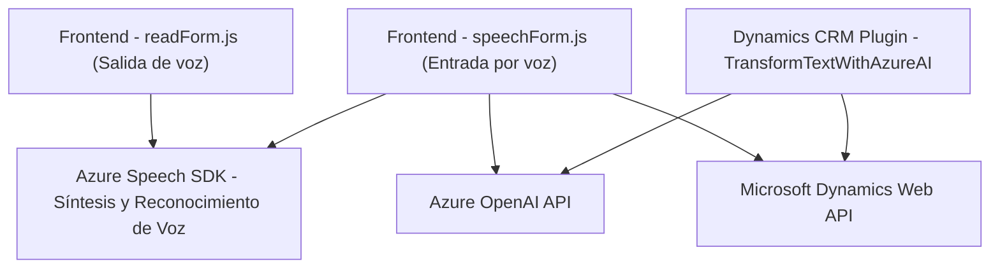

### Breve resumen técnico
El repositorio contiene tres archivos que implementan funcionalidades específicas relacionadas con la interacción entre formularios de Microsoft Dynamics CRM y los servicios de Azure AI. Estas funcionalidades se dividen en:

1. **Frontend/JS/readForm.js:** Captura y reproduce los datos visibles de un formulario mediante síntesis de voz.
2. **Frontend/JS/speechForm.js:** Gestiona la entrada por voz, transcribe comandos, realiza operaciones en formularios y, opcionalmente, envía datos a una API externa para procesamiento avanzado con Azure AI.
3. **Plugins/TransformTextWithAzureAI.cs:** Plugin de Dynamics CRM que utiliza Azure OpenAI para transformar texto según reglas predefinidas y devuelve una respuesta JSON.

---

### Descripción de arquitectura:
La solución presenta una arquitectura **híbrida entre n capas y servicios**. Es una combinación de varias capas:
- **Capa de presentación (Frontend)**: Funciones en JavaScript para interactuar con la interfaz web de formularios de Dynamics CRM, enfocadas en entrada/salida por voz.
- **Capa de lógica empresarial**: Implementada como un plugin en Dynamics CRM, separada físicamente del frontend y conectada a Azure AI. Actúa como un controlador del flujo de datos entre Dynamics CRM y el procesamiento en la nube.
- **Capa de datos**: Interacción con APIs internas de Dynamics CRM (`Xrm.WebApi`) para operaciones CRUD en las entidades del CRM.

Por tanto, la solución no puede considerarse completamente un **monolito**, sino más bien una arquitectura híbrida con características de **arquitectura n capas** y **servicios externos.**

---

### Tecnologías y frameworks:
1. **Frontend:**
   - Lenguaje de programación: JavaScript (ES6).
   - Framework y servicios:
     - Azure Speech SDK: Para síntesis y reconocimiento de voz.
     - Dynamics Web API (`Xrm.WebApi`): Para comunicación con formularios y entidades CRM.

2. **Backend (plugin):**
   - Lenguaje de programación: C#.
   - Framework .NET: Usado para compilar el plugin.
   - Librerías utilizadas:
     - `Newtonsoft.Json`: Manejo de JSON para la transformación y deserialización de datos.
     - `System.Net.Http`: Para enviar solicitudes a servicios externos.
   - Externos:
     - **Azure OpenAI API**: Servicio externo basado en GPT para transformación de texto.
     - **Dynamics CRM SDK**: Extensiones propias del sistema CRM.

---

### Diagrama Mermaid:

---

### Conclusión final
La solución representa una integración avanzada de tecnologías para ampliar las capacidades de Microsoft Dynamics CRM mediante IA y servicios en la nube. El enfoque arquitectónico combina patrones n-capas y servicios externos, con el frontend manejando las interacciones del usuario y el backend mediante plugins personalizados de Dynamics actuando como intermediarios hacia un servicio de AI en Azure. Esta estructura permite el uso de inteligencia artificial tanto en la interfaz como en la lógica del sistema. La arquitectura habilita escalabilidad y modularidad al separar las responsabilidades en capas y facilitar la integración con APIs externas para procesamiento avanzado.