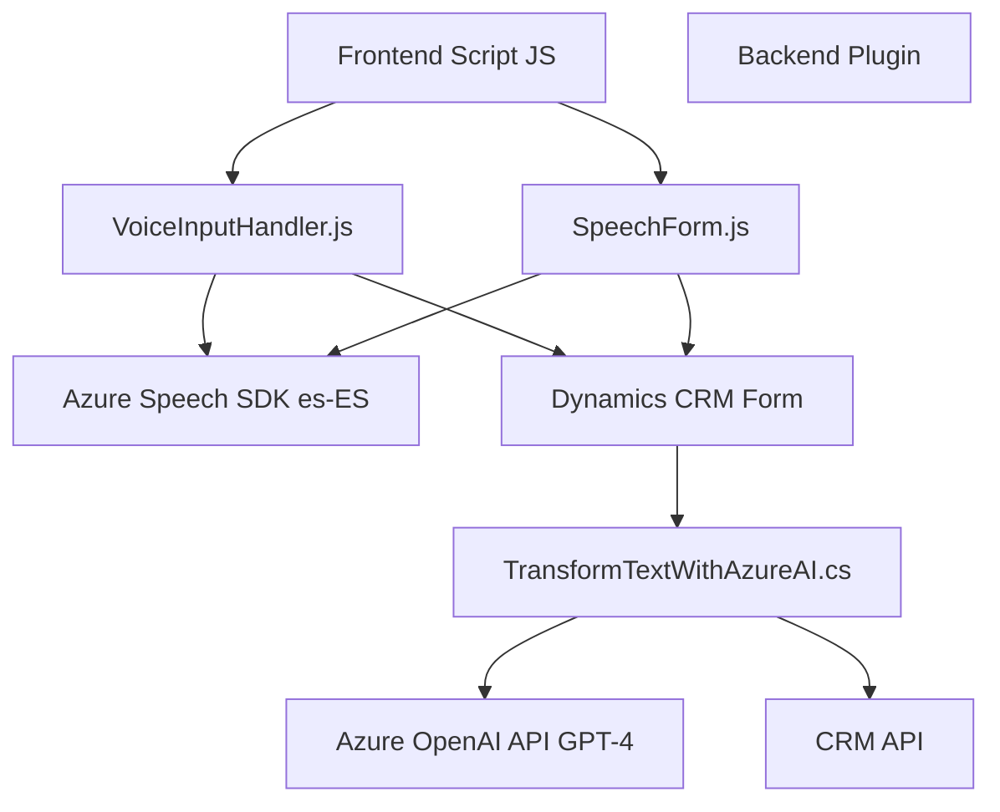

### Breve resumen técnico:
El repositorio parece ser parte de una aplicación destinada a integrarse con Microsoft Dynamics CRM y aprovechar funcionalidades avanzadas que involucren la interacción con Microsoft Azure Speech SDK y Azure OpenAI API. Incluye componentes que gestionan entrada de voz, lectura y síntesis de datos de formularios, utilizando tecnologías avanzadas de inteligencia artificial y servicios en la nube.

---

### Descripción de arquitectura:
La arquitectura del sistema tiene componentes que sugieren una estructura **modular con integración de servicios externos**. A nivel global, se puede percibir:
1. **Frontend:** Scripts JavaScript para interactuar con formularios del CRM y comunicar las entradas procesadas con servicios como Azure Speech SDK y APIs personalizadas para transformar datos.
   - Implementación de patrones como *Fachada de servicios*.
   - Modularidad para dividir responsabilidades entre datos, interacciones y API externas.
2. **Backend:** Plugins para extender la funcionalidad de Dynamics CRM. Facilitan la interacción directa con APIs externas como Azure OpenAI para ejecutar transformaciones basadas en inteligencia artificial.

La solución presenta características de una arquitectura de **n capas** dentro de un sistema CRM extendido:
- Capa de presentación: Scripts para formularios dinámicos.
- Capa de lógica empresarial: Plugins que procesan datos y los envían a servicios externos.
- Capa de datos: Uso de parámetros de entrada y salida en Dynamics CRM para transportar información procesada.
  
Además, **integración con API externa** y servicios en la nube permiten extender esa arquitectura hacia una estructura híbrida que aprovecha capacidades avanzadas como síntesis y reconocimiento de voz.

---

### Tecnologías usadas:
1. **Microsoft Azure Speech SDK**:
   - Síntesis y entrada de voz. Integración dinámica mediante scripts preconfigurados.
   - Idioma configurado ("es-ES") para español.
2. **Microsoft Dynamics CRM SDK**:
   - Acceso a APIs internas del CRM para manipulación de formularios y datos.
   - Ejecución de operaciones específicas (como actualización de campos) y llamada de plugins.
3. **Azure OpenAI API**:
   - Modelo GPT-4o específico para transformar texto en JSON estructurado, aplicado en lógica de backend.
4. **JavaScript** (Frontend):
   - Modular, orientado a eventos y generado para interactuar con APIs y SDK externos.
5. **C#** (Backend):
   - Lógica de procesamiento y conexión a servicios externos, empleando librerías como `Newtonsoft.Json.Linq` para manejo de JSON.
6. **HTTP calls**:
   - Conexiones entre el plugin y servicios externos mediante POST.
7. **Patrones usados**:
   - **Fachada de servicios** en frontend.
   - **Integración externa** en arquitectura híbrida.
   - **Modularidad** en la organización funcional.

---

### Diagrama Mermaid:
Este diagrama representa el flujo y dependencias principales del sistema.

---

### Conclusión final:
El repositorio representa una solución extendida para un sistema CRM que integra tecnologías de inteligencia artificial y servicios de Microsoft Azure. Tiene elementos de arquitectura de múltiples capas con módulos diseñados para interacción entre sistemas, procesamiento de datos y gestión de eventos. Aunque funcional, sería útil mejorar ciertos aspectos como seguridad en las claves de servicios y aplicar una separación más detallada de responsabilidades en el código como mover lógica del plugin a clases utilitarias para temas como transformación de texto. 

La arquitectura es adecuada para soluciones empresariales, pero puede extenderse hacia una implementación más orientada a microservicios si el crecimiento del sistema lo exige, por ejemplo, dividiendo procesamiento de voz y transformación en servicios aislados.